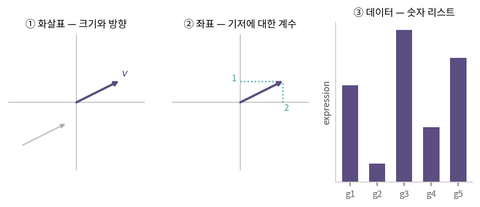
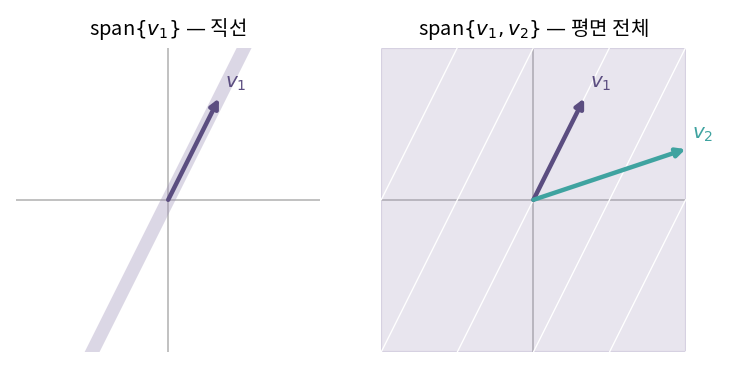
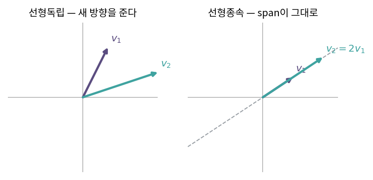

::: {.callout-note collapse="true"}
## 🎯 학습목표

- 벡터를 화살표 · 좌표 · 데이터 세 시각으로 설명
- 좌표계가 바뀔 때 **무엇이 변하고 무엇이 변하지 않는지** 구분
- 상수배와 덧셈이 "기본" 연산인 이유 → 선형성과의 연결
- 선형결합과 span의 정의, 주어진 벡터들이 생성하는 공간 판정
- 선형독립·종속을 정의로 판정
- 기저와 차원의 구분, 기저가 유일하지 않은 이유
- ⚠️ "벡터 = 원점에서 출발하는 화살표"가 불완전한 설명인 이유
:::

> 🤔 **출발 질문**
>
> 칠판 위의 화살표, `c(3, 1)`이라는 숫자 두 개, 세포 하나의 유전자 발현 프로파일 2만 개.
> 왜 이 셋을 모두 **벡터**라고 부를까?

------------------------------------------------------------------------

## 1. 벡터란 무엇인가 {#s1}

### 1) 두 가지 정의 {#s1-1}

- **물리학의 정의**: 크기와 방향으로 정의되는 값
  - 정확히는 **유클리드 벡터**(Euclidean vector)
  - 직관적이지만 2·3차원에 갇힘 → 2만 차원 발현 프로파일의 "방향"은 가리킬 수 없음
- **수학의 정의**: **벡터공간**(vector space)의 원소
  - 벡터공간의 규칙만 지키면 무엇이든 벡터 … 숫자 목록, 다항식, 함수
  - 훨씬 넓은 정의

> 이 교재의 전략 — 2·3차원에서는 ①로 그림을 그리고, 일반 차원으로 넘어갈 때 ②로 갈아탄다.

{fig-align="center" width="100%"}


### 2) 좌표계가 변해도 벡터는 불변 {#s1-2}

- 같은 화살표 + 좌표축 회전 → **적는 숫자는 달라짐**
- 그러나 화살표 자체는 아무 일도 겪지 않음 (길이·방향 그대로)

| | 성질 |
|---|---|
| **벡터** | 좌표계와 무관한 대상 · **불변** |
| **성분(좌표)** | 특정 좌표계에 대한 설명 · **가변** |

- ⟹ 좌표는 벡터가 아니라 **벡터를 기저에 대해 설명한 설명서**
- 🔗 이 구분은 [5장](05_change_of_basis.qmd)에서 정면으로 다루고, [12장](12_evd.qmd)에서는 이 책의 주제가 됨

### 3) 벡터공간의 세 요소 {#s1-3}

- 벡터공간 $= (V, +, \cdot)$
  - $V$ … 집합
  - $+$ … 덧셈 법칙
  - $\cdot$ … 스칼라 곱셈 법칙
- ⟹ "무엇이 들어 있느냐"가 아니라 **"어떤 연산이 정의되어 있느냐"** 가 벡터공간을 규정

------------------------------------------------------------------------

## 2. 기본 연산: 상수배와 덧셈 {#s2}

### 1) 허용되는 연산은 둘뿐 {#s2-1}

- **상수배** — 임의의 집합 $V(\neq \phi)$의 벡터 $x$, 스칼라 $k \in \mathbb{R}$에 대하여
  $$x \in V, \; k \in \mathbb{R} \;\Rightarrow\; kx \in V$$
  - 기하: 길이가 $k$배
  - $k<0$ … 방향 뒤집힘 / $k=0$ … 영벡터
- **덧셈** — 임의의 벡터 $x, y \in V$에 대하여
  $$x, y \in V \;\Rightarrow\; x + y \in V$$
  - 기하: 두 벡터가 만드는 평행사변형의 대각선

### 2) 두 연산이 곧 선형성 {#s2-2}

- "상수배와 덧셈에 대해 닫혀 있다" = **선형성**(linearity)
- 선형대수가 이렇게 좁은 대상만 다루는 이유
  - 두 연산만 허용 → 엄청나게 많은 것을 **계산할 수 있음**
  - 곱셈·제곱까지 허용 → 대부분의 문제는 손으로 풀 수 없게 됨

::: {.callout-tip collapse="true"}
## 계산 확인

::: {.panel-tabset}
## R

```{r}
v <- c(3, 1)
w <- c(-1, 2)

2 * v          # 상수배
v + w          # 덧셈
2 * v - 3 * w  # 둘의 조합
```

## Python

```{python}
import numpy as np

v = np.array([3, 1])
w = np.array([-1, 2])

2 * v
v + w
2 * v - 3 * w
```
:::
:::

------------------------------------------------------------------------

## 3. 선형결합과 생성(span) {#s3}

### 1) 선형결합 {#s3-1}

- 상수배 + 덧셈을 섞은 것 = **선형결합**(linear combination)
  $$c_1 v_1 + c_2 v_2 + \cdots + c_n v_n, \qquad c_i \in \mathbb{R}$$
- 예: $v_1 = (1,0)$, $v_2 = (0,1)$
  - $c_1, c_2$를 실수 전체에서 고르면 → **평면 위의 모든 점**

### 2) 생성(span) {#s3-2}

- 정의: 선형결합으로 만들 수 있는 모든 벡터의 집합
  $$\text{span}\{v_1, \dots, v_n\} = \{c_1 v_1 + \cdots + c_n v_n \mid c_i \in \mathbb{R}\}$$
- 무엇을 생성하는지는 벡터들이 **서로 어떻게 놓여 있느냐**에 달림

| 벡터 | span |
|---|---|
| $\{(0,0)\}$ | 원점 하나 |
| $\{(1,2)\}$ | 원점을 지나는 직선 |
| $\{(1,2), (2,4)\}$ | **여전히 직선** — 두 번째가 첫 번째의 2배 |
| $\{(1,2), (3,1)\}$ | 평면 전체 $\mathbb{R}^2$ |

- ⟹ 벡터를 하나 더 준다고 공간이 넓어지지 않음. **새 방향**을 주어야 넓어짐

{fig-align="center" width="82%"}


------------------------------------------------------------------------

## 4. 선형독립과 종속 {#s4}

### 1) 정의 {#s4-1}

- 벡터 $v_1, \dots, v_n$에 대하여
  $$c_1 v_1 + c_2 v_2 + \cdots + c_n v_n = 0$$
- **선형독립**(linearly independent): 위 식이 $c_1 = \cdots = c_n = 0$일 때 **뿐**
- **선형종속**(linearly dependent): $c$ 중 하나라도 0이 아닌 해가 존재

### 2) 정의가 말하는 것 {#s4-2}

- 선형종속 식을 옮겨 쓰면 ($c_1 \neq 0$)
  $$v_1 = -\frac{c_2}{c_1}v_2 - \cdots - \frac{c_n}{c_1}v_n$$
- ⟹ **어떤 벡터 하나가 나머지의 선형결합으로 표현됨**
  - 그 벡터는 새 방향을 못 줌 → 빼도 span이 줄지 않음
- 한 줄 요약: **선형독립 = 군더더기가 없다.** 하나라도 빼면 생성공간이 줄어든다

{fig-align="center" width="82%"}


### 3) 판정 {#s4-3}

- 정의대로: $c_1 v_1 + \cdots + c_n v_n = 0$을 풀어 자명해만 있는지 확인
- 🔗 기계적 방법(소거법)과 rank는 [7장](07_gauss_elimination.qmd)

::: {.callout-important}
## ⚠️ 흔한 오해 — "벡터는 원점에서 출발하는 화살표다"

- 이것은 벡터가 아니라 **벡터를 그리는 관습**
- 벡터는 크기와 방향만 가짐 → 평면 어디에 놓아도 같은 벡터
- 원점에 붙여 그리는 이유: 성분을 좌표로 읽기 편해서
- 문제가 되는 지점
  - 점(point)과 벡터를 섞어 쓸 때
  - 평행이동을 다룰 때 → 🔗 평행이동이 왜 선형변환이 아닌지는 [부록 B](../appendix/b_affine.qmd)
:::

------------------------------------------------------------------------

## 5. 기저와 차원 {#s5}

### 1) 정의 {#s5-1}

- **부분공간**(subspace) $W$ … 벡터공간 $V$의 부분집합이면서 그 자체로 벡터공간 → 🔗[4장](04_subspaces.qmd)
- **기저**(basis) … 공간을 생성 + 서로 선형독립 = **최소한의 생성 집합**
- **차원**(dimension) … 기저 벡터의 개수

- 기저의 두 조건은 서로 반대 방향으로 조임
  - "생성한다" … **충분히 많아야** 한다
  - "선형독립" … **군더더기가 없어야** 한다
  - ⟹ 둘을 동시에 만족하는 지점이 기저

### 2) 기저는 유일하지 않다. 그런데 개수는 유일하다 {#s5-2}

- $\mathbb{R}^2$의 기저는 무수히 많음
  $$\{(1,0),(0,1)\}, \quad \{(1,1),(1,-1)\}, \quad \{(3,1),(-1,2)\}, \quad \cdots$$
  - 모두 평면 전체를 생성 + 모두 선형독립
- 그러나 **어느 것을 골라도 벡터는 항상 2개**
  - 당연해 보이지만 증명이 필요한 사실
  - 증명되기 때문에 "차원"이라는 말이 의미를 가짐
  - 개수가 기저마다 달라진다면 "2차원 평면"이라는 말 자체가 성립 불가

> 기저를 고르는 것 = **좌표계를 고르는 것.** 문제에 따라 좋은 좌표계가 따로 있다.
> 이 교재 Part V 전체가 "그 좋은 좌표계를 어떻게 찾는가"에 관한 이야기.

### 3) 벡터로 표현되는 것들 {#s5-3}

| 대상 | 표현 |
|---|---|
| 점 | 기저 벡터의 상수배 하나 |
| 축 | 기저 벡터 상수배의 집합 |
| 직선 | 한 벡터가 생성하는 공간 |
| 평면 | 두 개의 선형독립 벡터가 생성하는 공간 |
| $\mathbb{R}^n$ | $n$개의 선형독립 벡터가 생성하는 공간 |

::: {.callout-tip collapse="true"}
## 계산 확인 — 기저가 맞는지 보기

::: {.panel-tabset}
## R

```{r}
B <- matrix(c(3, 1, -1, 2), nrow = 2)  # 열이 각각 기저 후보

qr(B)$rank          # 2 이면 선형독립 → R^2의 기저
det(B)              # 0이 아니면 선형독립 (정사각행렬일 때)
solve(B, c(5, 4))   # (5,4)를 이 기저로 표현한 좌표
```

## Python

```{python}
import numpy as np

B = np.array([[3, -1],
              [1,  2]])

np.linalg.matrix_rank(B)
np.linalg.det(B)
np.linalg.solve(B, np.array([5, 4]))
```
:::

- 마지막 줄이 🔗[5장](05_change_of_basis.qmd)에서 다룰 **좌표 변환**
- 같은 벡터라도 기저가 달라지면 숫자가 달라짐
:::

------------------------------------------------------------------------

::: {.callout-important collapse="true"}
## 🧬 생물정보학에서는 — 데이터로서의 벡터

- scRNA-seq에서 **세포 하나 = 벡터 하나**
  - 유전자 2만 개 → 세포는 $\mathbb{R}^{20000}$의 한 점
  - 발현 행렬 = 이런 벡터를 수만 개 쌓은 것
- 차원이 커지면 이 장의 개념들이 다른 무게를 가짐

| 개념 | 오믹스에서의 의미 |
|---|---|
| **선형독립** | 세포 3만 개가 2만 차원에 있어도 실제 데이터가 놓인 방향은 수십 개 → 🔗[4장](04_subspaces.qmd) rank, 🔗[13장](13_pca.qmd) PCA |
| **span** | 어떤 세포가 두 세포 유형의 선형결합으로 설명됨 → doublet 또는 중간 상태. deconvolution의 출발점 |
| **좌표계의 임의성** | UMAP 좌표에는 물리적 의미 없음 → 축 값 자체를 해석하면 안 됨 |

- ⚠️ 고차원에서는 **거리 감각이 무너짐**
  - 차원이 커질수록 임의의 두 점 사이 거리가 서로 비슷해짐 (차원의 저주)
  - 유클리드 거리를 그대로 쓰기 어려움
  - 🔗 대안(코사인 유사도·상관계수)은 [3장](03_inner_product.qmd)
:::

------------------------------------------------------------------------

## ✅ 정리와 연습 {#s6}

### 한 줄 요약 {#s6-1}

> 벡터는 좌표계와 무관한 대상, 우리가 적는 숫자는 **어떤 기저에 대한 설명**.
> 허용된 연산은 상수배와 덧셈 둘뿐 → 그 조합(선형결합)으로 만들 수 있는 전체가 span.
> 군더더기 없는 최소 생성 집합이 기저, 그 개수가 차원.

### 체크리스트 {#s6-2}

- [ ] 좌표계를 회전시켰을 때 변하는 것과 변하지 않는 것을 구분할 수 있다
- [ ] 벡터 두 개의 span이 직선인지 평면인지 판단할 수 있다
- [ ] 선형독립을 정의식으로 쓸 수 있다
- [ ] 기저와 생성 집합의 차이를 말할 수 있다

### 연습문제 {#s6-3}

1. $v_1=(1,2)$, $v_2=(2,4)$, $v_3=(1,0)$일 때 다음 각각의 span을 구하라.
   - (a) $\{v_1\}$
   - (b) $\{v_1, v_2\}$
   - (c) $\{v_1, v_3\}$
   - (d) $\{v_1, v_2, v_3\}$
2. (d)에서 빼도 span이 그대로인 벡터는? 선형종속의 정의로 설명하라.
3. $\{(1,1),(1,-1)\}$이 $\mathbb{R}^2$의 기저임을 정의에 따라 보여라.
4. 벡터 $(5,4)$를 위 기저로 표현한 좌표를 구하고, 표준기저에서의 좌표와 비교하라.
5. **생각해 볼 것.** 2차 이하 다항식 전체 $\{a + bx + cx^2\}$는 벡터공간이다.
   - 기저를 하나 제시하고 차원을 말하라
   - 다른 기저도 하나 더 만들어 보라

------------------------------------------------------------------------

## 🔗 다음 장

- [2. 행렬과 선형변환](02_linear_transformation.qmd)
  - 이 장 … 벡터를 **만드는** 법
  - 다음 장 … 벡터를 **바꾸는** 법 (행렬은 계산 규칙이 아니라 함수다)

::: {.callout-note collapse="true"}
## 참고 자료

- [벡터의 기본 연산 (상수배, 덧셈)](https://angeloyeo.github.io/2020/09/07/basic_vector_operation.html) — 공돌이의 수학정리노트
:::
