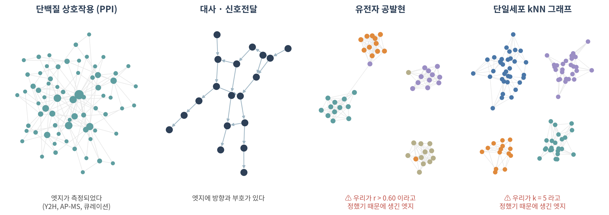
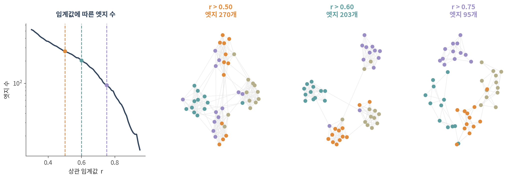

::: {.callout-note collapse="true"}
## 🎯 학습 목표

이 챕터를 마치면 다음을 할 수 있습니다.

-   그래프가 무엇이고 무엇을 일부러 버리는지 말할 수 있다
-   엣지가 **측정된** 생물학 네트워크와 우리가 **만든** 네트워크를 구분할 수 있다
-   ⚠️ 상관 임계값 하나, *k* 값 하나가 네트워크의 모습을 어떻게 결정하는지 설명할 수 있다
-   그래프 분석이 답하는 네 가지 질문과, 각각이 이 강의 어디에서 다뤄지는지 말할 수 있다
-   ⚠️ 그림이 아무리 그럴듯해도 네트워크가 말해줄 수 없는 것을 말할 수 있다
:::

> 🤔 **생각해볼 질문**
>
> 발현 행렬은 표입니다. 그것을 네트워크로 바꾸는 순간 무언가를 얻고 무언가를 가정하게 됩니다. 각각 무엇일까요?

------------------------------------------------------------------------

## 1. 네트워크와 그래프 🕸️ {#c01-s1}

### 1) 같은 그림, 두 개의 단어 {#c01-s1-1}

-   **네트워크(network)** — 세상에 있는 대상. 결합하는 단백질, 변환되는 대사물, 맞닿은 세포
-   **그래프(graph)** — 그것의 수학적 모델. 노드의 집합과 엣지의 집합, **그리고 그것뿐**

우리가 신경 쓰는 모든 것 — 유전자 기호, 발현값, 조직 종류, confidence score — 은 *그 뼈대에 걸어둔 주석*입니다. 그래프 자체는 그중 아무것도 모릅니다.

**이 구분이 값을 하는 이유:**

-   단백질 상호작용 네트워크와 친구 관계 네트워크에 같은 알고리즘이 돌아갑니다. 알고리즘은 생물학을 보지 않기 때문입니다
-   ✅ 그것이 장점입니다 — 100년치 그래프 이론이 공짜로 내 데이터에 적용됩니다
-   ⚠️ 동시에 위험입니다 — 잡음으로 만든 네트워크에서도 알고리즘은 커뮤니티와 허브와 최단경로를 아무렇지 않게 돌려줍니다

### 2) 자연 그래프와 정보 그래프 {#c01-s1-2}

|  | 자연 그래프 | 정보 그래프 |
|------------------|---------------------------|---------------------------|
| 엣지의 의미 | 물리적 관계가 실재함 | 우리가 관계를 부여함 |
| 예 | 대사 반응, 단백질 결합, 시냅스 연결, 접촉 추적 | 공발현, 의미 유사도, 인용, 세포의 kNN |
| 잘못된 엣지의 출처 | 측정 오차 | **측정 오차 + 우리의 선택** |
| 데이터를 더하면 | 빠진 엣지가 채워짐 | *모든* 엣지가 바뀔 수 있음 |

💡 요즘 오믹스 논문에 나오는 네트워크는 대부분 **정보 그래프**입니다. 이 챕터의 나머지는 그 대가에 관한 이야기입니다.

------------------------------------------------------------------------

## 2. 생물학 데이터는 언제 그래프가 되는가 🧬 {#c01-s2}

{fig-align="center"}

### 1) 측정된 엣지 {#c01-s2-1}

-   **단백질 상호작용(PPI)** — yeast two-hybrid, 친화성 정제–질량분석, 수작업 큐레이션
    -   무방향이며, 실제로는 결합 세기가 아니라 *confidence로 가중*되는 경우가 많음
-   **대사·신호전달 네트워크** — 기질 ➡️ 산물, 인산화효소 ➡️ 기질
    -   **방향이 있고**, 종종 **부호(활성/억제)도** 있음
    -   ⚠️ 방향은 이후 모든 것을 바꿉니다. "도달 가능하다"가 더 이상 대칭이 아닙니다
-   **물리적 접촉 네트워크** — 조직 내 세포–세포 접촉, Hi-C의 염색질 접촉

### 2) 우리가 만든 엣지 {#c01-s2-2}

| 네트워크 | 엣지를 만드는 규칙 | 손잡이 |
|------------------|-----------------------------|-------------------------|
| 유전자 공발현 | 샘플 간 상관계수가 기준을 넘음 | 기준값 (또는 soft power β) |
| 단일세포 kNN 그래프 | PCA 공간에서 *k*개 최근접 이웃 안에 있음 | *k*, 그리고 PC 개수 |
| 공간 이웃 그래프 | 반경 안에 있거나 Delaunay 이웃임 | 반경 |
| 환자 유사도 네트워크 | 특징 공간에서의 거리 | 특징 선택, 거리 척도 |

-   ⚠️ 이들은 측정된 네트워크와 **완전히 동일한** 도구로 들어갑니다 — 같은 클러스터링, 같은 중심성, 같은 그림
-   ⚠️ 이후 어떤 단계도 "이 엣지는 당신의 결정이었다"고 알려주지 않습니다

### 3) 지식 그래프 {#c01-s2-3}

-   여러 종류의 노드(유전자, 약물, 질병, 표현형)와 여러 종류의 엣지(치료한다, 유발한다, 결합한다)
-   문헌과 데이터베이스에서 조립됨 → **문헌이 과하게 또는 적게 연구한 것을 그대로 물려받음**
-   07에서 다시 다룹니다. 거기서는 이 편향이 주된 문제가 됩니다

------------------------------------------------------------------------

## 3. ⚠️ 임계값이 곧 분석이다 {#c01-s3}

{fig-align="center"}

### 1) 파라미터 하나, 다른 네트워크 {#c01-s3-1}

실제로 모듈 구조를 가진 유전자 48개에서 상관 기준값만 바꿔봅니다.

| 기준값 | 엣지 수 | 내리게 될 결론 |
|-----------|-----------|-------------------------------------|
| r \> 0.30 | 521 | 거대한 털뭉치 하나. 모듈 없음 |
| r \> 0.50 | 270 | 모듈이 맞닿아 경계가 불분명 |
| r \> 0.60 | 203 | ✅ 깔끔한 네 개의 모듈 |
| r \> 0.75 | 95 | 모듈이 조각남 |
| r \> 0.90 | 24 | 흩어진 몇 쌍 |

-   **바탕의 생물학은 전혀 바뀌지 않았습니다.** 숫자만 바뀌었습니다
-   ⚠️ 앞으로 여섯 챕터에서 다룰 모든 양 — 차수, 뭉침 계수, 중심성, 모듈, 최단경로 — 이 **이 선택 위에서** 계산됩니다
-   ⚠️ 그리고 그 선택은 좀처럼 보고되지 않습니다

### 2) 현장에서는 어떻게 다루는가 {#c01-s3-2}

-   **WGCNA**는 *soft* 임계값을 씁니다 — 상관계수를 자르는 대신 β 제곱을 취해 약한 엣지가 사라지지 않고 옅어지게 합니다
    -   ✅ 매끄럽고 임의의 절벽이 없습니다
    -   ⚠️ 선택을 없앤 것이 아니라 β로 **옮긴** 것입니다
-   **단일세포 파이프라인**은 그 손잡이를 조용히 대신 정해줍니다
    -   `scanpy.pp.neighbors()`의 기본값은 `n_neighbors=15`
    -   Seurat `FindNeighbors()`의 기본값은 `k.param = 20`
    -   ⚠️ → 내 세포 클러스터는 내가 설정한 적 없는 숫자 위에 서 있고, 그 숫자는 두 도구에서 서로 다릅니다
-   **STRING**은 통합 점수를 제공하며 흔히 0.4(medium), 0.7(high)을 기준으로 씁니다
    -   ⚠️ 이 점수는 실험적 근거에 **문헌 텍스트마이닝과 계산 예측**을 섞은 값입니다. "high-confidence" 엣지가 관찰된 상호작용이라는 뜻은 아닙니다

### 3) ✅ 고민하는 대신 할 일 {#c01-s3-3}

-   ✅ **파라미터를 보고하세요.** 임계값, *k*, β, PC 개수, DB 버전
-   ✅ **안정성을 확인하세요** — r ± 0.05에서도, *k* ∈ {10, 15, 30}에서도 결론이 살아남나요? *k* = 20에서 사라지는 모듈은 애초에 발견이 아니었습니다
-   ✅ 직관이 아니라 **null model**과 비교하세요 — 04 전체가 이 이야기입니다
-   ❌ 그림이 제일 예뻐 보이는 임계값을 고르지 마세요. 네트워크판 p-hacking입니다

::: {.callout-warning collapse="true"}
### "네트워크를 구축했다"의 정직한 버전

독자가 재현할 수 있는 methods 문장은 이렇게 생겼습니다.

> 변동이 큰 상위 5,000개 유전자로 필터링한 뒤 84개 샘플에 대해 Spearman 상관계수를 계산했고, ρ \> 0.60인 엣지를 유지했다. ρ = 0.55와 0.65에서도 결과를 확인했다.

그렇지 않은 문장은 이렇습니다.

> 공발현 네트워크를 구축하고 모듈을 도출하였다.

→ 두 번째 문장이 아주 흔하고, 그 분석은 검증할 수 없게 됩니다.
:::

------------------------------------------------------------------------

## 4. 네 가지 질문 🗺️ {#c01-s4}

### 1) 그래프 분석은 무엇에 쓰는가 {#c01-s4-1}

| 내 질문 | 과제 | 이 강의에서의 위치 |
|--------------------|------------------|----------------------------------|
| 기능이 밝혀지지 않은 이 유전자는 무엇을 하나? | **노드 분류** | 06, 12 |
| 이 두 단백질은 상호작용하나? | **링크 예측** | 06 |
| 어떤 유전자들이 같이 움직이나? | **커뮤니티 검출** | 05 |
| 조건 사이에 네트워크가 달라졌나? | **네트워크 비교** | 04 |

-   Part 1의 나머지는 이 네 가지에 답하고, 그 답을 방어할 수 있게 만들기 위해 존재합니다
-   Part 2는 손으로 만든 규칙을 학습된 규칙으로 바꿉니다 — 그리고 새로운 실패 방식을 함께 가져옵니다

### 2) ⚠️ 네트워크가 말해줄 수 없는 것 {#c01-s4-2}

-   **엣지는 메커니즘이 아닙니다.** Y2H에서 결합한 두 단백질이 세포 안에서는 만나지 않을 수 있습니다
-   **엣지는 인과가 아닙니다.** 공발현은 대칭이고, 조절은 대칭이 아닙니다
-   **없는 엣지는 부재가 아닙니다.** 대개는 아직 아무도 보지 않았다는 뜻입니다
-   **레이아웃은 데이터가 아닙니다.** 노드가 그림 어디에 놓이는지는 레이아웃 알고리즘의 산물입니다. 종이 위의 거리를 절대 해석하지 마세요

💡 Part 1 전체를 관통하는 점검 질문: *규칙을 조금 바꿔 이 네트워크를 다시 만들어도, 나는 같은 문장을 말할 수 있는가?*

::: {.callout-tip collapse="true"}
## 🐍 실습 — 표를 네트워크로 바꿔보기

Colab에서 실행합니다. 설치는 [90. Colab 환경 설정](90_colab_setup.qmd) 참고.

```python
import numpy as np, pandas as pd, networkx as nx
import matplotlib.pyplot as plt

# ── 1. 표준 예제로 감 잡기 ────────────────────────────────────────────
G = nx.karate_club_graph()
print(G.number_of_nodes(), G.number_of_edges())
nx.draw_spring(G, node_size=220, with_labels=True)

# ── 2. 발현 행렬 → 상관 → 네트워크 ──────────────────────────────────
#    expr: 유전자 × 샘플 DataFrame (실습 데이터는 90 참고)
corr = expr.T.corr(method="spearman")
np.fill_diagonal(corr.values, 0)

def build(corr, thr):
    A = (corr.abs() > thr).astype(int)
    return nx.from_pandas_adjacency(A)

# ── 3. 임계값을 바꿔가며 무슨 일이 일어나는지 직접 보기 ──────────────
rows = []
for thr in np.arange(0.3, 0.95, 0.05):
    g = build(corr, thr)
    rows.append({
        "threshold": round(thr, 2),
        "edges": g.number_of_edges(),
        "components": nx.number_connected_components(g),
        "isolated": sum(1 for _, d in g.degree() if d == 0),
    })
pd.DataFrame(rows)
```

**보면서 확인할 것:**

-   엣지 수가 임계값에 대해 **선형이 아니다** — 어디서 급격히 꺾이는가
-   임계값을 올리면 component가 늘다가, 어느 지점부터는 고립 노드만 늘어난다
-   ⚠️ "적당한" 임계값을 고르는 통계적 기준은 없습니다. 이 표를 논문 supplement에 넣는 것이 정직한 대응입니다

**단일세포와 연결해보기** — `adata.obsp['connectivities']`는 지금 만든 것과 **같은 종류의 물건**입니다.

```python
import scanpy as sc
sc.pp.neighbors(adata, n_neighbors=15)     # ← 이 15가 §2의 그 숫자
K = adata.obsp["connectivities"]           # 희소 인접 행렬
G_cells = nx.from_scipy_sparse_array(K)
print(G_cells.number_of_nodes(), G_cells.number_of_edges())
```

`n_neighbors`를 5, 15, 50으로 바꿔 엣지 수와 component 수가 어떻게 달라지는지 확인해보세요. 05에서 이 그래프에 클러스터링을 돌립니다.
:::

------------------------------------------------------------------------

## 📝 요약

-   그래프는 노드와 엣지일 뿐이며, 생물학은 그 옆에 들고 다니는 주석입니다
-   어떤 생물학적 엣지는 **측정된** 것이고(PPI, 대사, 접촉), 오믹스 논문의 대부분은 우리가 **만든** 것입니다
-   ⚠️ 만들어진 네트워크는 임계값·*k*·β에 의존하고, 이후의 모든 숫자가 그 의존성을 물려받습니다
-   ⚠️ `scanpy`와 Seurat이 그 손잡이를 기본값(15, 20)으로 대신 정하므로, 대부분의 단일세포 그래프는 검토되지 않은 숫자 위에 있습니다
-   ✅ 파라미터를 보고하고, 안정성을 확인하고, null model과 비교하세요
-   그래프 분석은 네 가지 질문에 답합니다: 노드 분류, 링크 예측, 커뮤니티 검출, 네트워크 비교
-   ⚠️ 엣지는 메커니즘도 인과도 아니며, 없는 엣지는 부재가 아닙니다

------------------------------------------------------------------------

## ➕ 더 읽을거리

### 개괄

Barabási AL, Oltvai ZN. [*Network biology: understanding the cell's functional organization.*](https://doi.org/10.1038/nrg1272) Nat Rev Genet. 2004.\
Newman M. *Networks.* 2nd ed. Oxford University Press; 2018. (표준 교과서)

### 오믹스 데이터로 네트워크 만들기

Langfelder P, Horvath S. [*WGCNA: an R package for weighted correlation network analysis.*](https://doi.org/10.1186/14702105-9-559) BMC Bioinformatics. 2008.\
Wolf FA, Angerer P, Theis FJ. [*SCANPY: large-scale single-cell gene expression data analysis.*](https://doi.org/10.1186/s13059-017-1382-0) Genome Biol. 2018.

### 이 챕터에서 쓴 데이터 출처

[STRING](https://string-db.org/) · [BioGRID](https://thebiogrid.org/) · [Reactome](https://reactome.org/)
