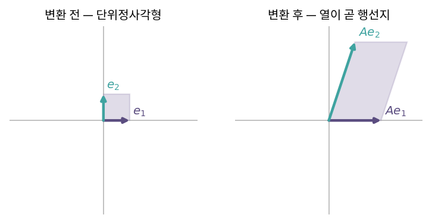
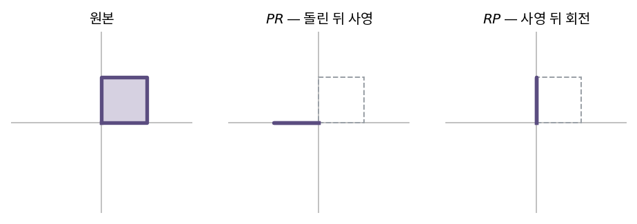
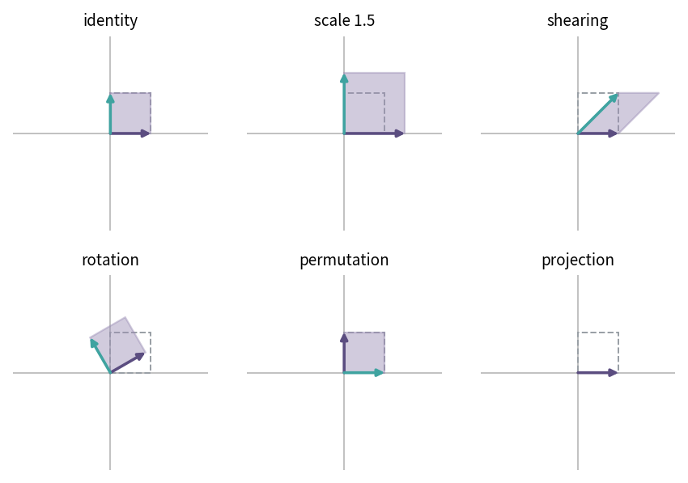

::: {.callout-note collapse="true"}
## 🎯 학습목표

- 선형변환의 정의 → 주어진 사상이 선형인지 판정
- 행렬의 **열**이 무엇을 담고 있는지 설명
- 행렬곱 = 변환의 합성 → 교환법칙이 성립하지 않는 이유
- 하다마드 곱·크로네커 곱과 행렬곱의 구분
- 대표적인 행렬·변환을 보고 기하학적으로 무슨 일이 일어나는지 서술
- ⚠️ 같은 결과를 주는 곱셈 순서라도 계산량이 다를 수 있음을 인지
:::

> 🤔 **출발 질문**
>
> `A %*% x`는 계산 규칙일 뿐인가, 아니면 공간에 무슨 일이 일어나는 것인가?

------------------------------------------------------------------------

## 1. 선형변환의 정의 {#s1}

### 1) 두 조건 {#s1-1}

- 임의의 벡터 $x, y$와 스칼라 $c$에 대하여 사상 $T$가
  $$T(x+y) = T(x) + T(y), \qquad T(cx) = cT(x)$$
  - 🔗[1장](01_vector.qmd)의 두 기본 연산이 그대로 조건이 됨
- ⟹ **선형변환은 "연산을 통과시키는" 사상**
  - 더한 뒤 보내나, 보낸 뒤 더하나 같음

### 2) 기하학적으로 무엇이 보존되는가 {#s1-2}

- 직선 → 직선 (휘지 않음)
- 원점 → 원점 (고정)
- 격자 간격 → 균등 유지 (평행선은 평행선으로)

| 사상 | 선형? | 이유 |
|---|---|---|
| $T(x) = 3x$ | ○ | 두 조건 모두 만족 |
| $T(x) = Ax$ | ○ | 행렬은 언제나 선형 |
| $T(x) = x + b$ (평행이동) | ✕ | $T(0) = b \neq 0$ → 🔗[부록 B](../appendix/b_affine.qmd) |
| $T(x) = x^2$ | ✕ | $T(2x) = 4x^2 \neq 2T(x)$ |
| $T(x) = \|x\|$ | ✕ | $T(-x) = T(x)$ |

------------------------------------------------------------------------

## 2. 행렬의 두 얼굴 {#s2}

### 1) 얼굴 ① 데이터 — 직사각형 배열 {#s2-1}

- 수·다항식 등을 (행 × 열)로 배열한 것
- 오믹스에서 익숙한 얼굴 … 행 = 샘플, 열 = feature (또는 그 반대)
- 이 얼굴만 보면 행렬곱은 그냥 외우는 규칙이 됨

### 2) 얼굴 ② 연산자 — 기저벡터의 행선지를 적어둔 표 {#s2-2}

- 표준기저 $e_1 = (1,0)$, $e_2 = (0,1)$
- 선형변환 $T$가 정해지면 $T(e_1)$, $T(e_2)$만 알면 **모든 벡터의 행선지가 결정됨**
  $$T(x) = T(x_1 e_1 + x_2 e_2) = x_1 T(e_1) + x_2 T(e_2)$$
- ⟹ $T(e_1)$, $T(e_2)$를 **열로 세워 놓은 것**이 행렬

$$A = \begin{bmatrix} | & | \\ T(e_1) & T(e_2) \\ | & | \end{bmatrix}, \qquad Ax = x_1 a_1 + x_2 a_2$$

- 예: $A = \begin{bmatrix} 2 & 1 \\ 0 & 3 \end{bmatrix}$
  - $e_1 \to (2,0)$ … 첫 열
  - $e_2 \to (1,3)$ … 둘째 열
  - $(1,1) \to (2,0) + (1,3) = (3,3)$

> 행렬의 열을 읽으면 그 변환이 공간에 무슨 짓을 하는지 바로 보인다.

{fig-align="center" width="85%"}


------------------------------------------------------------------------

## 3. 행렬곱 {#s3}

### 1) 행렬곱 = 변환의 합성 {#s3-1}

- $(AB)x = A(Bx)$
  - $B$ 먼저, $A$ 나중 … **오른쪽부터 적용**
- $AB$의 $j$번째 열 $= A \cdot (B\text{의 } j\text{번째 열})$
  - ⟹ "$B$가 보낸 기저벡터를 $A$가 다시 보낸 것"
- 행렬곱의 정의가 그 이상한 모양인 이유 = **합성이 그렇게 되기 때문**

### 2) ⚠️ 교환법칙은 성립하지 않는다 {#s3-2}

- $AB \neq BA$ … 순서를 바꾸면 다른 변환
- 예: 회전 $R$(90°) 과 $x$축 사영 $P$
  - $PR$ … 돌린 뒤 $x$축으로 누름
  - $RP$ … $x$축으로 누른 뒤 돌림
  - 두 결과는 완전히 다름
- 직사각행렬이면 순서를 바꾸는 것 자체가 정의되지 않기도 함
  - $(m\times n)(n\times p)$는 되지만 $(n\times p)(m\times n)$은 $p \neq m$이면 불가

{fig-align="center" width="100%"}


### 3) 행렬곱이 아닌 곱들 {#s3-3}

| 연산 | 기호 | 정의 | 결과 크기 |
|---|---|---|---|
| 행렬곱 | $AB$ | 행 × 열의 내적 | $(m\times n)(n\times p) \to m \times p$ |
| 하다마드 곱 | $A \circ B$ | 동일 위치 원소끼리 | 같은 크기 유지 |
| 크로네커 곱 | $A \otimes B$ | 두 행렬의 텐서곱 | $(m\times n)\otimes(p\times q) \to mp \times nq$ |

- 하다마드 곱 … R의 `A * B`, NumPy의 `A * B`
  - ⚠️ R에서 `*`는 행렬곱이 **아님**. 행렬곱은 `%*%`
- 크로네커 곱 … 데이터가 늘어남. 혼합모형의 분산구조 등에서 등장
- 텐서(tensor) … 행렬의 다차원 일반화. 이 교재 범위 밖

### 4) ＋ 결합법칙은 성립하지만 계산 비용은 다르다 {#s3-4}

- $A(BC) = (AB)C$ … 결과는 같음
- 그러나 곱셈 횟수는 다름

| 순서 | 곱셈 횟수 | $A_{1000\times1000}, B_{1000\times1000}, C_{1000\times1}$ |
|---|---|---|
| $(AB)C$ | $mnp + mp$ | 약 $10^9$ |
| $A(BC)$ | $np + mn$ | 약 $2\times10^6$ |

- ⟹ 같은 답인데 **500배 차이**
- 실무 원칙: **행렬 × 행렬보다 행렬 × 벡터를 먼저**
  - 큰 사영행렬 $H = A(A^\top A)^{-1}A^\top$를 만들지 말고 $A((A^\top A)^{-1}(A^\top b))$로 → 🔗[9장](09_least_squares.qmd)

------------------------------------------------------------------------

## 4. 특이한 행렬 갤러리 {#s4}

| 이름 | 정의 | 메모 |
|---|---|---|
| 대칭 symmetric | $A = A^\top$ | 고유벡터가 직교 → 🔗[12장](12_evd.qmd) |
| 반대칭 skew-symmetric | $-A = A^\top$ | 대각 성분은 모두 0 |
| 항등 identity | $I_n = \text{diag}(1,\dots,1)$ | 아무것도 하지 않는 변환 |
| 역행렬 inverse | $AB = BA = I_n$ | $B = A^{-1}$, 되돌리는 변환 → 🔗[6장](06_determinant.qmd) |
| 삼각 triangular | 대각선 한쪽이 모두 0 | 방정식을 쉽게 풀게 함 → 🔗[8장](08_lu_cholesky.qmd) |
| 멱등 idempotent | $A^2 = A$ | 두 번 해도 같음 … 사영. 회귀의 hat matrix → 🔗[9장](09_least_squares.qmd) |
| 양정치 positive definite | 모든 $x \neq 0$에 대해 $x^\top A x > 0$ | $\ge 0$이면 준정치 → 🔗[12장](12_evd.qmd) |
| **＋ 직교** orthogonal | $Q^\top Q = I$, 즉 $Q^{-1} = Q^\top$ | 길이·각도 보존 = 회전과 반사 → 🔗[14장](14_qr.qmd) |

- 대각합(trace) $\text{tr}(A) = \sum a_{ii}$
  - 대칭행렬에서 특히 자주 쓰임
  - 🔗[11장](11_eigen.qmd) 고윳값의 합과 같음

------------------------------------------------------------------------

## 5. 선형변환 갤러리 {#s5}

- 모두 2×2 … 열을 보면 기저벡터의 행선지가 보임

| 변환 | 행렬 | $e_1 \to$ | $e_2 \to$ | 기하 |
|---|---|---|---|---|
| 항등 | $\begin{bmatrix}1&0\\0&1\end{bmatrix}$ | $(1,0)$ | $(0,1)$ | 그대로 |
| 확대 | $\begin{bmatrix}k&0\\0&k\end{bmatrix}$ | $(k,0)$ | $(0,k)$ | $k$배 팽창 |
| 전단 shearing | $\begin{bmatrix}1&1\\0&1\end{bmatrix}$ | $(1,0)$ | $(1,1)$ | 위쪽을 옆으로 밀기 |
| 회전 rotation | $\begin{bmatrix}\cos\theta&-\sin\theta\\\sin\theta&\cos\theta\end{bmatrix}$ | | | $\theta$만큼 회전 · 길이 보존 |
| 치환 permutation | $\begin{bmatrix}0&1\\1&0\end{bmatrix}$ | $(0,1)$ | $(1,0)$ | 두 축 교환 |
| $x$축 사영 | $\begin{bmatrix}1&0\\0&0\end{bmatrix}$ | $(1,0)$ | $(0,0)$ | $y$ 성분 소멸 → 차원 붕괴 |
| $(1,2)$ 위로 사영 | $\frac{1}{5}\begin{bmatrix}1&2\\2&4\end{bmatrix}$ | | | 두 기저 모두 $(1,2)$ 방향으로 |

- 사영행렬의 두 가지 특징
  - **멱등** … 이미 눌린 것을 또 눌러도 그대로
  - **비가역** … 사라진 성분은 복구 불가 ⟹ $\det = 0$ → 🔗[6장](06_determinant.qmd)

{fig-align="center" width="92%"}


::: {.callout-tip collapse="true"}
## 실습 — 단위정사각형은 어떻게 변하는가

::: {.panel-tabset}
## R

```{r}
square <- cbind(c(0,0), c(1,0), c(1,1), c(0,1), c(0,0))  # 닫힌 사각형

draw <- function(A, title) {
  out <- A %*% square
  plot(t(square), type = "l", asp = 1, col = "grey70",
       xlim = c(-1, 3), ylim = c(-1, 3), xlab = "", ylab = "", main = title)
  lines(t(out), col = "#5B4D80", lwd = 2)
}

par(mfrow = c(1, 3))
draw(matrix(c(1, 0, 1, 1), 2), "shearing")
draw(matrix(c(0, 1, -1, 0), 2), "rotation 90°")
draw(matrix(c(1, 0, 0, 0), 2), "projection")
```

## Python

```{python}
import numpy as np, matplotlib.pyplot as plt

square = np.array([[0,1,1,0,0],
                   [0,0,1,1,0]])

mats = {"shearing":  np.array([[1,1],[0,1]]),
        "rotation":  np.array([[0,-1],[1,0]]),
        "projection":np.array([[1,0],[0,0]])}

fig, ax = plt.subplots(1, 3, figsize=(9,3))
for a, (name, A) in zip(ax, mats.items()):
    out = A @ square
    a.plot(*square, color="grey")
    a.plot(*out, color="#5B4D80", lw=2)
    a.set_aspect("equal"); a.set_title(name)
```
:::

- 넓이가 어떻게 변하는지 눈으로 확인 → 🔗[6장](06_determinant.qmd) 행렬식
- projection에서 정사각형이 **선분으로 납작해지는 것**이 차원 붕괴
:::

::: {.callout-important}
## ⚠️ 흔한 오해

- **"행렬곱은 행과 열을 곱해 더하는 규칙이다"**
  - 규칙 자체는 맞지만, 그렇게만 외우면 왜 그 모양인지 영영 모름
  - ⟹ 정의를 외우기 전에 **합성**이라는 사실을 먼저
- **"$A$의 행을 보면 변환이 보인다"**
  - 변환을 읽는 단위는 **열**. 행은 다른 역할(선형함수)을 맡음 → 🔗[3장](03_inner_product.qmd)
- **R의 `A * B`가 행렬곱이라고 생각하기**
  - `*`는 하다마드 곱. 행렬곱은 `%*%`
  - 크기가 같으면 오류 없이 **틀린 답**이 나오므로 특히 위험
:::

------------------------------------------------------------------------

::: {.callout-important collapse="true"}
## 🧬 생물정보학에서는 — 희소행렬(sparse matrix)

- scRNA-seq count 행렬 … 원소의 90–95%가 0
  - 대부분의 유전자는 대부분의 세포에서 검출되지 않음
- 3만 세포 × 2만 유전자를 dense double로 저장하면
  - $3\times10^4 \times 2\times10^4 \times 8\,\text{byte} \approx 4.8\ \text{GB}$
  - 희소 형식(`dgCMatrix`)은 0이 아닌 값 + 위치만 저장 → 수백 MB
- ⟹ Seurat·SingleCellExperiment 객체 내부는 기본이 `dgCMatrix`
  - ⚠️ `as.matrix()` 한 줄이 세션을 죽이는 가장 흔한 원인

- 어떤 연산이 희소성을 유지하는가

| 연산 | 희소성 |
|---|---|
| 희소행렬 × 벡터 | 유지 |
| 희소행렬 × 희소행렬 | 대체로 유지 |
| log1p 등 0을 0으로 보내는 변환 | 유지 |
| **중심화(centering)** | **파괴** … 0이 전부 $-\bar{x}$가 됨 |

- 중심화가 희소성을 깨는 것이 PCA에서 실제 문제가 됨
  - `irlba`·Seurat `RunPCA`는 중심화를 명시적으로 수행하지 않고 **암묵적으로 처리**해 희소성을 살림
  - 🔗[15장](15_svd.qmd) truncated SVD
:::

------------------------------------------------------------------------

## ✅ 정리와 연습 {#s6}

### 한 줄 요약 {#s6-1}

> 행렬의 열 = 기저벡터의 행선지. 행렬곱 = 변환의 합성, 그래서 오른쪽부터 읽고 순서를 바꿀 수 없다.

### 체크리스트 {#s6-2}

- [ ] 주어진 사상이 선형인지 두 조건으로 판정할 수 있다
- [ ] 2×2 행렬을 보고 기저벡터의 행선지를 말할 수 있다
- [ ] $AB$와 $BA$가 다른 예를 하나 들 수 있다
- [ ] 사영행렬이 멱등이면서 비가역인 이유를 말할 수 있다

### 연습문제 {#s6-3}

1. 다음 사상이 선형인지 판정하고 근거를 쓰라.
   - (a) $T(x,y) = (2x, x+y)$
   - (b) $T(x,y) = (x+1, y)$
   - (c) $T(x,y) = (xy, 0)$
2. $e_1 \to (1,2)$, $e_2 \to (-1,1)$인 선형변환의 행렬을 쓰고, $(3,1)$의 행선지를 구하라.
3. $R$ = 90° 회전, $P$ = $x$축 사영일 때 $PR$과 $RP$를 각각 계산하고 기하학적으로 설명하라.
4. $A = \begin{bmatrix}1&0\\0&0\end{bmatrix}$이 멱등임을 보이고, 역행렬이 없는 이유를 설명하라.
5. $A$가 $1000\times1000$, $B$가 $1000\times1000$, $x$가 $1000\times1$일 때 `A %*% B %*% x`와 `A %*% (B %*% x)`의 계산량을 비교하라.
6. **생각해 볼 것.** 회전행렬 $R_\theta$는 $R_\theta^\top R_\theta = I$를 만족한다. 이것이 "회전은 길이를 보존한다"와 어떻게 연결되는가? → 🔗[3장](03_inner_product.qmd)에서 확인

------------------------------------------------------------------------

## 🔗 다음 장

- [3. 행렬곱과 행벡터](03_inner_product.qmd)
  - 이 장 … 행렬을 **열**로 읽음 (변환의 행선지)
  - 다음 장 … 행렬을 **행**으로 읽음 (행벡터는 함수다)

::: {.callout-note collapse="true"}
## 참고 자료

- [행렬과 선형변환](https://angeloyeo.github.io/2019/07/15/Matrix_as_Linear_Transformation.html) — 공돌이의 수학정리노트
:::
