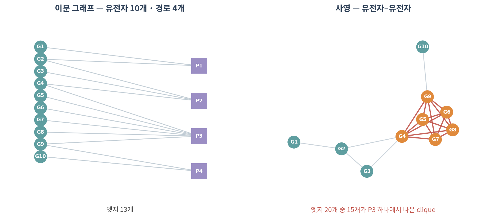
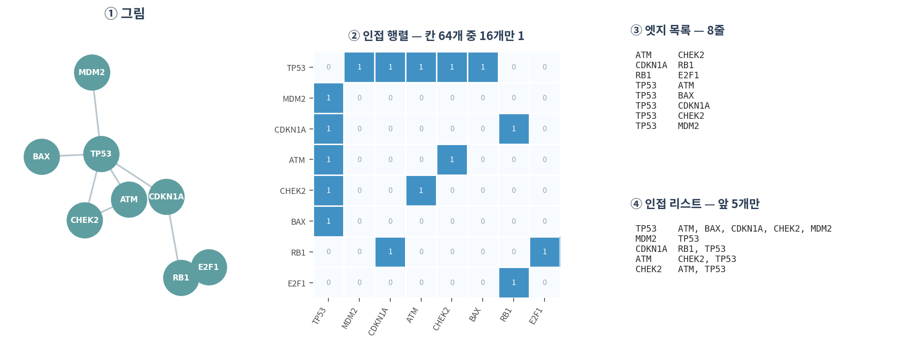
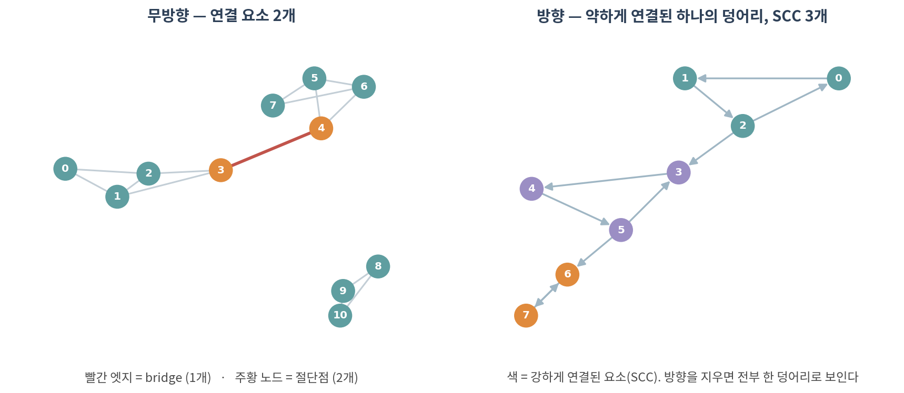

::: {.callout-note collapse="true"}
## 🎯 학습 목표

이 챕터를 마치면 다음을 할 수 있습니다.

-   무방향·방향·가중·부호·이분 그래프를 구분하고, 내 데이터가 어디에 해당하는지 말할 수 있다
-   ⚠️ 이분 그래프를 사영할 때 무엇이 과장되는지 설명할 수 있다
-   인접 행렬 / 엣지 목록 / 인접 리스트를 상황에 맞게 고를 수 있다
-   ⚠️ 왜 유전자 2만 개 네트워크를 밀집 행렬로 만들면 안 되는지 숫자로 말할 수 있다
-   연결 요소, bridge, 절단점을 찾고 그 생물학적 의미를 해석할 수 있다
-   방향 그래프에서 SCC와 WCC를 구분할 수 있다
:::

> 🤔 **생각해볼 질문**
>
> 유전자 2만 개짜리 네트워크를 `matrix(0, 20000, 20000)`으로 만들면 메모리가 얼마나 필요할까요? 그리고 그중 실제로 1인 칸은 몇 개일까요?

------------------------------------------------------------------------

## 1. 그래프의 종류 🧩 {#c02-s1}

### 1) 다섯 가지 구분 {#c02-s1-1}

| 구분 | 무엇이 다른가 | 생물학 예시 |
|-------------|--------------------------|--------------------------------|
| **무방향 / 방향** | 관계가 대칭인가 | PPI(무방향) vs 전사조절(방향) |
| **가중** | 엣지에 숫자가 붙는가 | STRING confidence, 상관계수 |
| **부호** | 엣지가 +/− 를 갖는가 | 활성화 vs 억제 |
| **이분** | 노드가 두 종류인가 | 유전자–경로, 환자–표현형 |
| **다중 / 자기 루프** | 같은 쌍에 엣지가 여럿인가, 자기 자신과 연결되는가 | 여러 증거 채널, 자가조절 |

-   ⚠️ **방향은 나중에 전부 바뀝니다** — 방향 그래프에서는 "A에서 B로 갈 수 있다"가 "B에서 A로 갈 수 있다"를 뜻하지 않습니다
-   ⚠️ **부호를 버리는 실수** — 활성화와 억제를 같은 엣지로 취급하면, 신호전달 경로의 결론이 뒤집힐 수 있습니다
-   💡 `networkx`에서는 `nx.Graph` / `nx.DiGraph` / `nx.MultiGraph`로 명시합니다. 잘못 고르면 조용히 틀린 답이 나옵니다

### 2) 이분 그래프와 사영 {#c02-s1-2}

**이분 그래프(bipartite graph)** — 노드가 두 집단으로 나뉘고, 엣지는 집단 **사이에만** 있습니다.

-   유전자 ↔ 경로, 환자 ↔ 표현형, 약물 ↔ 표적, 시료 ↔ 미생물 종

**사영(projection)** — 한쪽 집단만의 그래프로 접는 것. "같은 경로에 있는 유전자끼리 연결"

{fig-align="center"}

::: {.callout-warning collapse="true"}
## 사영은 정보를 잃고, 동시에 부풀립니다

-   경로 하나에 유전자 *k*개가 들어 있으면, 사영하면 **k(k−1)/2개의 엣지**가 한꺼번에 생깁니다
-   위 그림에서 P3(유전자 6개) 하나가 만든 엣지가 15개 — 전체 20개 중 **75%**
-   → 리보솜이나 스플라이소좀처럼 구성원이 많은 복합체 하나가 네트워크를 지배하게 됩니다

**어떻게 할 것인가:**

-   ✅ 가능하면 이분 그래프 상태로 분석하세요 (사영하지 않는 방법이 있습니다)
-   ✅ 사영이 꼭 필요하면 **가중치를 남기세요**. `weighted_projected_graph`는 공유 경로 수를 weight로 줍니다
-   ✅ 구성원이 지나치게 많은 경로(예: \> 200개)는 제외하는 것이 관례입니다 — GSEA에서 유전자 집합 크기를 제한하는 것과 같은 이유
:::

------------------------------------------------------------------------

## 2. 표현 3종 📦 {#c02-s2}

{fig-align="center"}

### 1) 무엇을 언제 쓰는가 {#c02-s2-1}

| 표현 | 쓰기 좋은 곳 | 비용 |
|--------------|---------------------------|-------------------------------|
| **인접 행렬** | 행렬 연산, 스펙트럴 방법(05), 네트워크 전파(06) | 메모리 O(n²) |
| **엣지 목록** | 저장, 전달, Cytoscape import, DB | 이웃 찾기가 느림 |
| **인접 리스트** | 큰 sparse 네트워크 순회, BFS/DFS | 행렬 연산 불가 |

-   💡 셋은 **같은 그래프**입니다. 상황에 따라 변환해 쓰는 것이 정상입니다
-   실무에서는 보통 **엣지 목록으로 받아서 → 인접 리스트(networkx)로 분석하고 → 필요할 때만 희소 행렬로 변환**합니다

### 2) ⚠️ 실제 네트워크는 극단적으로 sparse하다 {#c02-s2-2}

유전자 20,000개, 엣지 500,000개인 현실적인 PPI 네트워크를 담아봅니다.

| 담는 방법 | 메모리 | 배수 |
|-----------------------------|-----------|---------------------------|
| 밀집 행렬 (float64) | **2.98 GB** | 기준 |
| 밀집 행렬 (int8) | 381 MB | 1/8 |
| **희소 행렬 (CSR, float64)** | **11.5 MB** | **1/265** |
| 희소 행렬 (CSR, bool) | 4.8 MB | 1/635 |
| 엣지 목록 (int32 두 컬럼) | 3.8 MB | 1/800 |

-   이 네트워크의 **밀도는 0.25%** — 칸 400개 중 1개만 1입니다
-   ⚠️ R에서 `matrix(0, 20000, 20000)`은 약 3GB를 잡습니다. 노트북에서 세션이 죽는 흔한 이유입니다
-   ✅ R은 `Matrix::sparseMatrix`, Python은 `scipy.sparse`를 쓰세요

::: {.callout-tip collapse="true"}
## 왜 하필 0.25%인가

생물학 네트워크가 sparse한 것은 우연이 아닙니다.

-   단백질 하나가 물리적으로 접촉할 수 있는 상대의 수에는 한계가 있습니다
-   대사 반응은 효소가 정해진 기질에만 작용합니다
-   → **차수(degree)는 노드 수가 늘어도 비례해서 늘지 않습니다.** 03에서 다시 다룹니다

⚠️ 예외: 상관 기반 네트워크는 임계값을 낮추면 얼마든지 dense해집니다. 이것은 생물학이 아니라 우리의 선택입니다(🔗 01).
:::

### 3) 차수(degree) {#c02-s2-3}

-   **차수** = 한 노드에 붙은 엣지 수. 인접 행렬에서는 그 행의 합
-   방향 그래프에서는 **in-degree**와 **out-degree**로 나뉩니다
    -   in-degree = 0 → **source** (전사인자처럼 조절만 하는 노드)
    -   out-degree = 0 → **sink** (조절만 받는 노드)
-   무방향 그래프에서 차수의 총합 = 2 × 엣지 수 (모든 엣지가 두 번 세어지므로)

------------------------------------------------------------------------

## 3. 연결성 🔗 {#c02-s3}

{fig-align="center"}

### 1) 연결 요소와 거대 요소 {#c02-s3-1}

-   **연결 요소(component)** — 서로 도달할 수 있는 노드들의 묶음
-   **거대 요소(giant component)** — 대부분의 노드를 품는 하나의 큰 덩어리
-   찾는 방법은 **BFS(너비 우선 탐색)** — 아무 노드에서 시작해 이웃을 차례로 방문하고, 남은 노드에서 다시 시작

⚠️ 실무에서 자주 겪는 일:

-   PPI를 임계값으로 자르면 거대 요소 + 고립 노드 수천 개가 나옵니다
-   대부분의 분석(최단경로, 중심성, 전파)은 **거대 요소 안에서만** 의미가 있습니다
-   ✅ 그래서 관례적으로 거대 요소만 남기고 분석합니다 — **그리고 몇 개를 버렸는지 보고해야 합니다**

### 2) Bridge와 절단점 {#c02-s3-2}

-   **Bridge** — 제거하면 연결 요소가 늘어나는 **엣지**
-   **절단점(articulation node)** — 제거하면 연결 요소가 늘어나는 **노드**

생물학적 해석:

-   두 기능 모듈을 잇는 유일한 연결 → 신호전달의 병목 지점 후보
-   ✅ 03의 **매개 중심성(betweenness)**과 통하는 개념입니다
-   ⚠️ 하지만 "bridge니까 중요하다"는 **네트워크가 완전하다는 가정** 위에서만 성립합니다. 아직 발견되지 않은 엣지 하나가 bridge를 없앨 수 있습니다(🔗 07)

### 3) 방향이 있으면 '연결'이 둘로 갈라진다 {#c02-s3-3}

| | 뜻 | 비유 |
|-------------|-------------------------------|---------------------------|
| **강한 연결(SCC)** | 양방향 모두 도달 가능 | 왕복 가능한 도로망 |
| **약한 연결(WCC)** | 방향을 무시하면 연결됨 | 일방통행만 있는 동네 |

-   위 그림 오른쪽: 방향을 지우면 한 덩어리지만, **SCC는 3개**입니다
-   신호전달 네트워크에서 SCC는 **되먹임 고리(feedback loop)**를 뜻합니다 — 04의 모티프와 직결됩니다
-   ⚠️ `nx.connected_components()`는 방향 그래프에 쓰면 **에러가 납니다**. `strongly_` 또는 `weakly_`를 명시해야 합니다

::: {.callout-tip collapse="true"}
## 🐍 실습 — STRING 네트워크를 읽고 구조 파악하기

Colab에서 실행합니다. 설치는 [90. Colab 환경 설정](90_colab_setup.qmd) 참고.

```python
import pandas as pd, numpy as np, networkx as nx
import scipy.sparse as sp

# ── 1. 엣지 목록 읽기 ────────────────────────────────────────────────
# STRING에서 유전자 목록을 검색해 TSV로 내려받은 파일
df = pd.read_csv("string_interactions.tsv", sep="\t")
G = nx.from_pandas_edgelist(df, "node1", "node2", edge_attr="combined_score")
print(f"노드 {G.number_of_nodes()}개, 엣지 {G.number_of_edges()}개")

# ── 2. 얼마나 sparse한가 ─────────────────────────────────────────────
n, m = G.number_of_nodes(), G.number_of_edges()
print(f"밀도 {2*m/(n*(n-1)):.4%}")

A_sparse = nx.to_scipy_sparse_array(G)                    # CSR
dense_gb = n * n * 8 / 1024**3
sparse_mb = (A_sparse.data.nbytes + A_sparse.indices.nbytes
             + A_sparse.indptr.nbytes) / 1024**2
print(f"밀집이면 {dense_gb:.2f} GB / 희소면 {sparse_mb:.1f} MB")

# ── 3. 연결성 ────────────────────────────────────────────────────────
comps = sorted(nx.connected_components(G), key=len, reverse=True)
print(f"연결 요소 {len(comps)}개, 거대 요소 {len(comps[0])}개 "
      f"({len(comps[0])/n:.1%})")

giant = G.subgraph(comps[0]).copy()          # ← 이후 분석은 여기서만
print("bridge:", len(list(nx.bridges(giant))))
print("절단점:", len(list(nx.articulation_points(giant))))

# ── 4. 이분 그래프와 사영 ────────────────────────────────────────────
#    gene2pathway: gene, pathway 두 컬럼
B = nx.Graph()
B.add_nodes_from(g2p["gene"].unique(), bipartite=0)
B.add_nodes_from(g2p["pathway"].unique(), bipartite=1)
B.add_edges_from(g2p.itertuples(index=False, name=None))

P = nx.bipartite.weighted_projected_graph(B, g2p["gene"].unique())
print(f"이분 엣지 {B.number_of_edges()} → 사영 엣지 {P.number_of_edges()}")

# 경로 크기별로 몇 개의 엣지를 만들었는지 (⚠️ 큰 경로가 범인)
sizes = g2p.groupby("pathway").size().sort_values(ascending=False)
(sizes * (sizes - 1) // 2).head(10)
```

**확인할 것:**

-   ⚠️ 거대 요소가 전체의 몇 %인가 — 절반도 안 되면 임계값이 너무 높습니다
-   ⚠️ 사영 엣지의 몇 %가 상위 경로 3개에서 나왔는가
-   방향 그래프(예: 전사조절)를 쓴다면 `nx.strongly_connected_components()`로 되먹임 고리 찾아보기
:::

------------------------------------------------------------------------

## 📝 요약

-   무방향/방향, 가중, 부호, 이분, 다중 — ⚠️ 방향과 부호를 버리면 결론이 뒤집힐 수 있습니다
-   ⚠️ 이분 그래프 사영은 큰 경로 하나가 clique을 만들어 네트워크를 지배합니다. 가중치를 남기고 큰 경로는 제외하세요
-   인접 행렬 / 엣지 목록 / 인접 리스트는 같은 그래프의 다른 담는 법 — 필요에 따라 변환하는 것이 정상
-   ⚠️ 유전자 2만 개 네트워크는 밀집 3GB, 희소 12MB. **밀도 0.25%**. 밀집 행렬을 만들지 마세요
-   연결 요소 중 거대 요소만 분석하는 것이 관례 — ✅ 단, 몇 개를 버렸는지 보고할 것
-   bridge와 절단점은 모듈 사이 병목 후보. ⚠️ 네트워크가 완전하다는 가정 위에서만 성립
-   방향 그래프에서 SCC는 되먹임 고리를 뜻함. `connected_components`를 그대로 쓰면 에러

------------------------------------------------------------------------

## ➕ 더 읽을거리

### 교과서

Newman M. *Networks.* 2nd ed. Oxford University Press; 2018. (2–6장: 표현과 연결성)

### 도구

[NetworkX — Graph 자료구조 문서](https://networkx.org/documentation/stable/reference/classes/index.html)\
[scipy.sparse 행렬 형식 안내](https://docs.scipy.org/doc/scipy/reference/sparse.html)\
[Matrix 패키지 (R의 희소 행렬)](https://cran.r-project.org/package=Matrix)

### 이분 그래프와 사영

Zhou T, Ren J, Medo M, Zhang YC. [*Bipartite network projection and personal recommendation.*](https://doi.org/10.1103/PhysRevE.76.046115) Phys Rev E. 2007.
