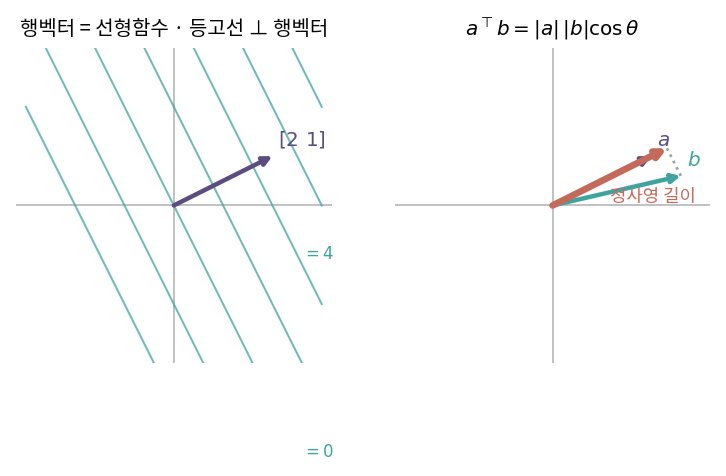
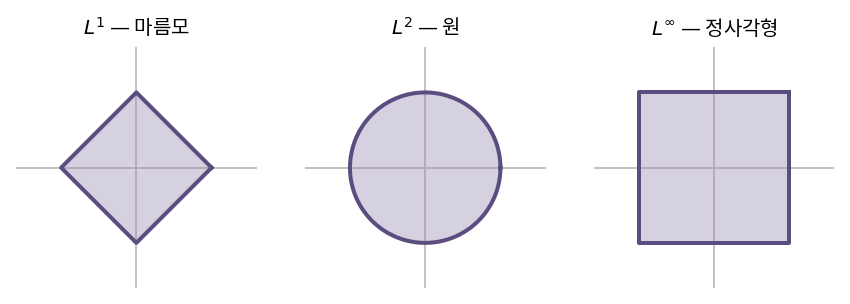

::: {.callout-note collapse="true"}
## 🎯 학습목표

- 행렬곱을 세 시각으로 각각 설명 → 상황에 맞는 시각 선택
- 행벡터가 왜 '함수'인지 설명 + 등고선으로 시각화
- 내적을 정사영으로 해석
- $L^1$·$L^2$·$L^\infty$·프로베니우스 노름을 정의하고 상황에 맞게 선택
- 직교와 정규직교를 구분, 직교행렬의 성질 서술
- ⚠️ "직교 = 상관 0"이 언제 참인지 정확히 말하기
:::

> 🤔 **출발 질문**
>
> 행벡터와 열벡터는 왜 서로 다른 역할을 맡는가?

------------------------------------------------------------------------

## 1. 행렬곱을 보는 세 가지 시각 {#s1}

- 🔗[2장](02_linear_transformation.qmd)에서 행렬곱 = 변환의 합성
- 같은 연산을 어떻게 **쪼개어 보느냐**에 따라 세 가지 읽기가 나옴
- 셋 다 같은 답 … 그러나 각각 다른 문제를 쉽게 만듦

### 1) 시각 ① 원소 = 내적 {#s1-1}

$$(AB)_{ij} = (A\text{의 } i\text{행}) \cdot (B\text{의 } j\text{열})$$

- 행벡터와 열벡터의 기능이 분리되어 있기 때문에 가능한 읽기
- 대표 예: **공분산행렬** $\frac{1}{n}X^\top X$ (중심화된 $X$)
  - $(i,j)$ 원소 = feature $i$의 편차 벡터 · feature $j$의 편차 벡터
  - ⟹ "두 feature의 변동이 얼마나 닮았는가" → 🔗[11장](11_eigen.qmd)·[13장](13_pca.qmd)
- **쓸모** … 유사도·거리 행렬을 만들 때

### 2) 시각 ② 결과 = 열벡터의 선형결합 {#s1-2}

$$Ax = x_1 a_1 + x_2 a_2 + \cdots + x_n a_n$$

- 두 갈래 해석

| 해석 | 질문 | 이어지는 곳 |
|---|---|---|
| **열공간 기반** | $b$가 $a_1, a_2$로 생성된 공간 안에 있는가? | 연립방정식·선형회귀 → 🔗[4장](04_subspaces.qmd)·[9장](09_least_squares.qmd) |
| **선형변환 기반** | 기저벡터를 어떻게 변형시키는가? | 고유벡터·PCA·SVD → 🔗[11장](11_eigen.qmd)·[15장](15_svd.qmd) |

- 예: $\begin{bmatrix}1&2\\3&4\end{bmatrix}x = \begin{bmatrix}3\\5\end{bmatrix}$
  - "$(1,3)$과 $(2,4)$로 만든 공간 안에 $(3,5)$가 있는가?"
- **쓸모** … 해의 존재를 판단할 때

### 3) ＋ 시각 ③ 랭크-1 행렬들의 합 {#s1-3}

$$AB = \sum_{k} a_k b_k^\top \qquad (a_k = A\text{의 }k\text{번째 열}, \; b_k^\top = B\text{의 }k\text{번째 행})$$

- 외적 $a b^\top$ … 항상 **랭크 1** (모든 열이 $a$의 상수배)
- ⟹ 행렬곱 = 납작한 조각들을 겹겹이 쌓은 것
- **쓸모** … 근사와 압축
  - SVD $A = \sum_i \sigma_i u_i v_i^\top$ … 조각을 큰 것부터 $k$개만 남김 → 🔗[15장](15_svd.qmd)
  - NMF도 같은 구조 → 🔗[16장](16_ica_nmf.qmd)

------------------------------------------------------------------------

## 2. 행벡터는 함수다 {#s2}

### 1) 대상과 행위자 {#s2-1}

| | 역할 |
|---|---|
| **열벡터** | 변화의 **대상** … 흔히 "벡터"라 하면 이쪽 |
| **행벡터** | 변화의 **행위자** … 열벡터를 입력받아 스칼라를 출력하는 함수 |

- 행벡터 $[2\;\;1]$은 사상 $\mathbb{R}^2 \to \mathbb{R}$
  $$[2\;\;1]\begin{bmatrix}x\\y\end{bmatrix} = 2x + y$$
- 선형성 만족 ⟹ **행벡터도 벡터이고, 동시에 선형함수**
  - 그래서 쪼개고 붙이는 것이 자유로움

### 2) 시각화 — 행벡터에 수직인 등고선 {#s2-2}

- $2x + y = c$ … 같은 출력을 내는 입력들의 집합 = 등고선
- 등고선은 행벡터 $(2,1)$에 **수직**
- $c$를 바꾸면 평행한 직선들이 생김

### 3) 행벡터의 스칼라배와 합 {#s2-3}

- **스칼라배** … 행벡터가 길어지면 등고선 간격은 좁아짐
  - $[4\;\;2]$는 $[2\;\;1]$의 2배 → 같은 출력 간격에 도달하는 데 절반 거리
  - ⟹ **행벡터 길이 ↔ 등고선 간격은 반비례**
- **합** … 두 등고선 체계가 합쳐져 새 등고선 체계를 만듦
  - $[2\;\;1] + [1\;\;-1] = [3\;\;0]$ … 수직 등고선만 남음

------------------------------------------------------------------------

## 3. 내적 {#s3}

### 1) 정사영으로 읽기 {#s3-1}

- 행벡터 $a^\top$가 열벡터 $b$에 작용한 결과
  $$a^\top b = (\text{$b$를 $a$ 방향으로 정사영한 길이}) \times |a|$$
- 정리하면
  $$a^\top b = |a|\,|b|\cos\theta$$
- ⟹ 내적은 **"얼마나 같은 방향을 보는가" × "얼마나 큰가"**

### 2) 특별한 경우 {#s3-2}

| $\theta$ | $\cos\theta$ | $a^\top b$ | 의미 |
|---|---|---|---|
| $0°$ | 1 | $\lvert a\rvert\lvert b\rvert$ | 같은 방향 |
| $90°$ | 0 | **0** | **직교** |
| $180°$ | $-1$ | $-\lvert a\rvert\lvert b\rvert$ | 반대 방향 |

- $a^\top a = |a|^2$ … 자기 자신과의 내적 = 길이의 제곱

{fig-align="center" width="88%"}

------------------------------------------------------------------------

## 4. ＋ 노름 {#s4}

### 1) 종류 {#s4-1}

| 노름 | 정의 | 기하 | 쓰이는 곳 |
|---|---|---|---|
| $L^1$ | $\sum_i \lvert x_i \rvert$ | 맨해튼 거리 | lasso → 🔗[9장](09_least_squares.qmd) |
| $L^2$ | $\sqrt{\sum_i x_i^2}$ | 유클리드 거리 | 기본값, ridge, 최소제곱 |
| $L^\infty$ | $\max_i \lvert x_i \rvert$ | 가장 큰 성분 | 최악의 경우 오차 |
| 프로베니우스 | $\sqrt{\sum_i\sum_j a_{ij}^2}$ | 행렬을 벡터처럼 편 뒤의 $L^2$ | 저랭크 근사 → 🔗[15장](15_svd.qmd) |

- 노름이 정해져야 "가깝다", "작다"가 정의됨
  - ⟹ 어떤 노름을 쓰느냐가 최적화의 답을 바꿈 (lasso vs ridge)

{fig-align="center" width="88%"}

### 2) 코시-슈바르츠 부등식 {#s4-2}

$$\lvert a^\top b \rvert \le |a|\,|b| \quad\Longleftrightarrow\quad -1 \le \cos\theta \le 1$$

- ⟹ 상관계수가 $[-1, 1]$에 갇히는 이유가 여기 → 🔗[11장](11_eigen.qmd)
- 등호 성립 ⟺ 두 벡터가 평행 (선형종속) → 🔗[1장](01_vector.qmd)

------------------------------------------------------------------------

## 5. ＋ 직교와 정규직교 {#s5}

### 1) 정의 {#s5-1}

- **직교**(orthogonal) … $a^\top b = 0$
- **정규직교**(orthonormal) … 직교 + 모든 벡터의 길이 1
- **직교행렬**(orthogonal matrix) $Q$ … 열이 서로 정규직교
  $$Q^\top Q = I \quad\Longrightarrow\quad Q^{-1} = Q^\top$$

### 2) 왜 좋은가 {#s5-2}

- **역행렬이 전치로 끝남** … 계산이 공짜
- **길이·각도 보존**
  $$|Qx|^2 = (Qx)^\top(Qx) = x^\top Q^\top Q x = x^\top x = |x|^2$$
  - ⟹ 직교행렬 = 회전 또는 반사 (🔗[2장](02_linear_transformation.qmd) 회전행렬이 그 예)
- **좌표 계산이 내적 한 번** … 정규직교기저 $\{q_1,\dots,q_n\}$에서
  $$x = c_1 q_1 + \cdots + c_n q_n, \qquad c_i = q_i^\top x$$
  - 일반 기저라면 연립방정식을 풀어야 함 (🔗[1장](01_vector.qmd) 마지막 코드)
- ⟹ 이것이 🔗[14장](14_qr.qmd) 그람-슈미트로 **기저를 직각으로 세우는** 이유

::: {.callout-important}
## ⚠️ 흔한 오해

- **"직교행렬은 열이 직교하기만 하면 된다"**
  - 아님. **정규**직교여야 함 ($Q^\top Q = I$)
  - 이름이 오해를 부르는 대표 사례
- **"직교 = 상관 0"**
  - 상관계수 0 ⟺ **중심화한** 두 벡터가 직교
  - 중심화하지 않으면 둘은 다른 이야기 → 🔗[11장](11_eigen.qmd)
- **"내적이 크면 비슷하다"**
  - 길이가 크기만 해도 내적은 커짐
  - 방향만 보려면 길이로 나눠야 함 → 코사인 유사도
:::

------------------------------------------------------------------------

::: {.callout-important collapse="true"}
## 🧬 생물정보학에서는 — 무엇을 무시할 것인가

- 두 발현 프로파일이 "비슷하다"는 말은 측도를 정해야 의미가 생김

| 측도 | 식 | 무시하는 것 | 주 용도 |
|---|---|---|---|
| 유클리드 거리 | $\lvert a-b \rvert$ | (없음) | 정규화가 끝난 데이터 |
| 코사인 유사도 | $\dfrac{a^\top b}{\lvert a\rvert\lvert b\rvert}$ | **크기** … 라이브러리 크기·세포 크기 | 세포–세포 유사도 |
| 피어슨 상관 | 중심화 후 코사인 | 크기 + **위치(평균)** | 유전자–유전자 공발현 |
| 스피어만 상관 | 순위의 피어슨 | + 단조변환 | 이상치에 강건 |

- ⟹ **피어슨 상관 = 중심화한 두 벡터의 코사인** … 🔗[11장](11_eigen.qmd)에서 정식으로

- 선택이 결과를 바꾸는 지점
  - 라이브러리 크기가 세포마다 다름 → 유클리드 거리는 "많이 시퀀싱된 세포"끼리 묶어버림
  - 코사인은 그 문제를 지우지만, **절대 발현량 차이도 함께 지움**
    - 세포 크기 차이가 생물학적 신호인 경우(활성화된 T세포 등)에는 손해
  - 유전자 단위 비교에서는 평균 발현 수준이 제각각 → 보통 상관계수

- ⚠️ 거리 계산 전에 무엇을 정규화했는지가 거의 모든 것을 결정
  - log 변환 · CPM · z-score 중 무엇을 했는가
  - 🔗[13장](13_pca.qmd) PCA 전 전처리와 같은 문제
:::

------------------------------------------------------------------------

## ✅ 정리와 연습 {#s6}

### 한 줄 요약 {#s6-1}

> 열벡터는 변화의 대상, 행벡터는 그 위에 작용하는 선형함수.
> 내적 = 정사영 × 길이 = $\lvert a\rvert\lvert b\rvert\cos\theta$이고, 여기서 직교·노름·유사도가 전부 파생된다.

### 체크리스트 {#s6-2}

- [ ] 행렬곱을 세 가지로 쪼개어 쓸 수 있다
- [ ] 행벡터의 등고선을 그릴 수 있다
- [ ] 코사인 유사도와 상관계수의 차이를 한 문장으로 말할 수 있다
- [ ] $Q^\top Q = I$에서 길이 보존을 유도할 수 있다

### 연습문제 {#s6-3}

1. $A=\begin{bmatrix}1&2\\3&4\end{bmatrix}$, $B=\begin{bmatrix}0&1\\1&0\end{bmatrix}$에 대해 $AB$를 세 시각으로 각각 계산하고 같은 답임을 확인하라.
2. 행벡터 $[3\;\;-1]$의 등고선 $3x-y=0,\,3,\,6$을 그리고, 행벡터를 2배 했을 때 간격이 어떻게 변하는지 보여라.
3. $a=(3,4)$, $b=(1,0)$일 때 $a^\top b$, $|a|$, $\cos\theta$를 구하고 정사영 길이를 구하라.
4. $a=(1,2,3)$의 $L^1$, $L^2$, $L^\infty$ 노름을 각각 구하라.
5. $Q=\frac{1}{\sqrt2}\begin{bmatrix}1&-1\\1&1\end{bmatrix}$이 직교행렬임을 보이고, $Q^{-1}$을 계산 없이 쓰라.
6. **생각해 볼 것.** 두 유전자의 발현 벡터가 $a=(1,2,3)$, $b=(11,12,13)$이다.
   - 유클리드 거리, 코사인 유사도, 피어슨 상관을 각각 구하라
   - 세 값이 왜 그렇게 다른지 설명하라

------------------------------------------------------------------------

## 🔗 다음 장

- [4. 네 개의 기본 부분공간](04_subspaces.qmd)
  - Part I … 벡터와 행렬이라는 **재료**
  - Part II … 그 재료가 만드는 **공간의 구조**
  - 이 장의 직교 개념이 부분공간 사이의 관계를 규정하게 됨

::: {.callout-note collapse="true"}
## 참고 자료

- [행렬 곱에 대한 또 다른 시각](https://angeloyeo.github.io/2020/09/08/matrix_multiplication.html) — 공돌이의 수학정리노트
- [행벡터의 의미와 벡터의 내적](https://angeloyeo.github.io/2020/09/09/row_vector_and_inner_product.html) — 공돌이의 수학정리노트
:::
