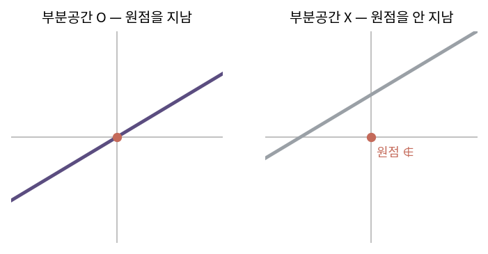
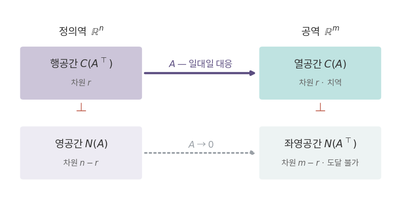

::: {.callout-note collapse="true"}
## 🎯 학습목표

- 부분공간을 정의하고 주어진 집합이 부분공간인지 판정
- 행공간·열공간·영공간·좌영공간이 각각 **어느 공간에 사는지** 구분
- 선형대수학의 기본정리를 그림으로 재현
- 랭크-영도 정리를 서술하고 적용
- ⚠️ 영공간이 "영벡터만 있는 공간"이 아님을 설명
:::

> 🤔 **출발 질문**
>
> 선형변환을 '함수'로 보면 정의역·치역·공역은 각각 무엇인가?

------------------------------------------------------------------------

## 1. 부분공간 {#s1}

### 1) 정의 {#s1-1}

- 벡터공간 $V$의 부분집합 $W$가 **부분공간**(subspace)
  - ① 영벡터를 포함 … $0 \in W$
  - ② 덧셈에 닫힘 … $x, y \in W \Rightarrow x+y \in W$
  - ③ 스칼라배에 닫힘 … $x \in W, c \in \mathbb{R} \Rightarrow cx \in W$
- ②③을 합치면 … **선형결합에 닫힘** (🔗[1장](01_vector.qmd))
- ⟹ 부분공간 = 부분집합이면서 **그 자체로 벡터공간**

### 2) 기하학적으로 {#s1-2}

- $\mathbb{R}^3$의 부분공간은 넷뿐
  - 원점 $\{0\}$ · 원점을 지나는 직선 · 원점을 지나는 평면 · $\mathbb{R}^3$ 전체
- **원점을 지나지 않으면 부분공간이 아님**

| 집합 | 부분공간? | 이유 |
|---|---|---|
| 원점을 지나는 직선 | ○ | 조건 셋 모두 만족 |
| $y = x + 1$ | ✕ | 원점 미포함 … $0 \cdot x = 0$이 밖으로 나감 |
| 제1사분면 | ✕ | 스칼라배 $-1$이 밖으로 나감 |
| $\{(x,y): x=0\}$ | ○ | $y$축 |
| span$\{v_1,\dots,v_k\}$ | ○ | 항상 부분공간 |

{fig-align="center" width="82%"}


------------------------------------------------------------------------

## 2. 행렬이 만드는 네 공간 {#s2}

- $A \in \mathbb{R}^{m\times n}$ … 사상 $f: \mathbb{R}^n \to \mathbb{R}^m$
- ⟹ **행렬 하나가 네 개의 부분공간을 만든다**

| 공간 | 기호 | 정의 | 사는 곳 | 차원 |
|---|---|---|---|---|
| 열공간 column space | $C(A)$ | 열벡터들의 span | $\mathbb{R}^m$ | $r$ |
| 좌영공간 left null space | $N(A^\top)$ | $A^\top y = 0$인 $y$ | $\mathbb{R}^m$ | $m-r$ |
| 행공간 row space | $C(A^\top)$ | 행벡터들의 span | $\mathbb{R}^n$ | $r$ |
| 영공간 null space | $N(A)$ | $Ax = 0$인 $x$ | $\mathbb{R}^n$ | $n-r$ |

- $r = \text{rank}(A)$
- ⚠️ 같은 행렬이라도 행이 만드는 공간과 열이 만드는 공간은 **차원 수가 다른 별개의 공간**
  - 행공간은 $\mathbb{R}^n$에, 열공간은 $\mathbb{R}^m$에 산다

------------------------------------------------------------------------

## 3. 선형대수학의 기본정리 {#s3}

### 1) 정의역 = 행공간 ⊕ 영공간 {#s3-1}

- $\mathbb{R}^n = C(A^\top) \oplus N(A)$
- 두 공간은 직교하고, 합치면 $\mathbb{R}^n$ 전체
  - 차원으로도 확인 … $r + (n-r) = n$
- ⟹ 모든 입력 벡터 $x$는 **딱 한 가지 방법으로** 쪼개짐
  $$x = x_{\text{row}} + x_{\text{null}}$$

### 2) 치역 = 열공간 {#s3-2}

- $Ax$ = 열벡터의 선형결합 (🔗[3장](03_inner_product.qmd) 시각 ②)
  - ⟹ 결과는 **언제나 열공간 안**
- 영공간 성분은 어떻게 되는가
  $$Ax = A(x_{\text{row}} + x_{\text{null}}) = Ax_{\text{row}} + 0$$
  - ⟹ 영공간 성분은 사라지고 **행공간 성분만 열공간으로 옮겨감**
- 이 대응 $C(A^\top) \to C(A)$는 **일대일 대응**
  - 그래서 두 공간의 차원이 같음 → §5

### 3) 공역 = 열공간 ⊕ 좌영공간 {#s3-3}

- $\mathbb{R}^m = C(A) \oplus N(A^\top)$
- 좌영공간 = 공역 중 **아무도 도달하지 못하는 방향**
  - $r = m$이면 좌영공간은 $\{0\}$ … 모든 $b$에 대해 해가 존재

### 4) 두 쌍의 직교 관계 {#s3-4}

- **행공간 ⊥ 영공간**
  - $Ax = 0$ ⟺ $A$의 모든 행과 $x$의 내적이 0 (🔗[3장](03_inner_product.qmd))
  - ⟹ $x$는 모든 행벡터와 직교 ⟹ 행공간 전체와 직교
- **좌영공간 ⊥ 열공간**
  - 같은 논리를 $A^\top$에 적용

{fig-align="center" width="100%"}

> 행렬은 정의역을 두 조각으로 나눈다. 한 조각은 열공간으로 옮겨지고, 다른 한 조각은 0으로 무너진다.

------------------------------------------------------------------------

## 4. ＋ 랭크-영도 정리 {#s4}

### 1) 서술 {#s4-1}

$$\text{rank}(A) + \dim N(A) = n \qquad (n = \text{열의 개수} = \text{입력 차원})$$

- 해석 … 입력 $n$차원 중
  - $r$차원은 **살아남아** 열공간으로
  - $n-r$차원은 **무너져** 0으로
- ⟹ 정보가 어디로 갔는지에 대한 회계 장부

### 2) 읽는 법 {#s4-2}

| 상황 | rank | 영공간 | 해의 개수 ($Ax=b$) |
|---|---|---|---|
| 열이 모두 선형독립 | $r = n$ | $\{0\}$ | 0개 또는 1개 |
| 열이 선형종속 | $r < n$ | 차원 $n-r$ | 0개 또는 무한개 |
| $r = m = n$ | 최대 | $\{0\}$ | 항상 1개 |

- 해가 **무한개일 때의 구조** … 특수해 + 영공간
  $$x = x_p + x_{\text{null}}, \qquad x_{\text{null}} \in N(A)$$
  - 🔗[7장](07_gauss_elimination.qmd)에서 계산으로 확인

------------------------------------------------------------------------

## 5. ＋ 행랭크 = 열랭크 {#s5}

### 1) 왜 당연하지 않은가 {#s5-1}

- 행공간은 $\mathbb{R}^n$에, 열공간은 $\mathbb{R}^m$에 삶
  - $m \neq n$이면 **애초에 다른 공간**
- 그런데도 두 공간의 **차원은 항상 같다**

### 2) 두 가지 설명 {#s5-2}

- **대응 관점** … §3-2에서 $C(A^\top) \to C(A)$가 일대일 대응
  - 일대일 대응이면 차원이 같음
- **소거 관점** … 소거 후 **피벗의 개수**
  - 피벗 개수 = 독립인 행의 수 = 독립인 열의 수
  - 🔗[7장](07_gauss_elimination.qmd)에서 직접 확인

### 3) rank의 상한 {#s5-3}

$$\text{rank}(A) \le \min(m, n)$$

- 등호가 성립할 때 **full rank**
- ⚠️ rank가 $\min(m,n)$ "인 것"이 아니라 그것이 **상한**일 뿐

::: {.callout-tip collapse="true"}
## 계산 확인

::: {.panel-tabset}
## R

```{r}
A <- matrix(c(1, 2, 3,
              2, 4, 6,
              1, 1, 1), nrow = 3, byrow = TRUE)

qr(A)$rank                    # r = 2 (2행이 1행의 2배)
dim(A)[2] - qr(A)$rank        # 영공간 차원 = 1

# 영공간 기저 — SVD의 마지막 특이벡터 (🔗 15장)
s <- svd(A)
round(s$d, 10)                # 특이값 하나가 0
n_basis <- s$v[, which(s$d < 1e-10)]
round(A %*% n_basis, 10)      # 0 벡터 확인
```

## Python

```{python}
import numpy as np

A = np.array([[1,2,3],
              [2,4,6],
              [1,1,1]])

r = np.linalg.matrix_rank(A); r
A.shape[1] - r                       # 영공간 차원

from scipy.linalg import null_space
N = null_space(A)
np.round(A @ N, 10)                  # 0 벡터 확인
```
:::
:::

::: {.callout-important}
## ⚠️ 흔한 오해

- **"영공간은 영벡터만 들어 있는 공간"**
  - 영공간 = **0으로 보내지는 입력들**의 집합
  - 영벡터는 항상 포함되지만, 그것뿐이면 $\text{rank} = n$인 특수한 경우
- **"부분집합이면 부분공간"**
  - 원점을 반드시 포함해야 함 … $y = x+1$은 직선이지만 부분공간 아님
- **"rank는 행 수와 열 수 중 작은 값"**
  - 그것은 **상한**. 실제 rank는 그보다 작을 수 있음
- **"행공간과 열공간은 같은 공간"**
  - 차원만 같고, 사는 공간도 원소도 다름
:::

------------------------------------------------------------------------

::: {.callout-important collapse="true"}
## 🧬 생물정보학에서는 — 배치 효과 제거는 부분공간 제거다

- 배치 보정의 기하학
  - design matrix에서 배치를 나타내는 열들이 span하는 부분공간 $W$
  - 데이터에서 $W$ 방향 성분을 **직교사영해 빼는 것** = residualization
  - `limma::removeBatchEffect`, ComBat, Harmony가 하는 일의 골격
  - 사영행렬 자체는 🔗[9장](09_least_squares.qmd)에서 명시적으로 등장

- ⚠️ 교락(confounding)이면 분리 불가능
  - 모든 환자군이 batch 1, 모든 대조군이 batch 2라면
  - 배치 벡터와 그룹 벡터가 **같은 부분공간**을 가리킴
  - ⟹ 배치를 지울 때 생물학적 신호도 함께 사라짐
  - 분석 단계에서 복구 불가 … 실험 설계 단계에서 무작위화해야 함

- rank로 읽는 실험 설계
  - 배치 열을 추가할수록 영공간이 커지고 추정 가능한 계수가 줄어듦
  - design matrix가 full rank가 아니면 `DESeq2`·`limma`가 오류를 냄 → 🔗[7장](07_gauss_elimination.qmd)

- 차원의 실제 크기
  - 세포 3만 개 × 유전자 2만 개여도 데이터가 실제로 놓인 차원은 수십 수준
  - ⟹ rank가 작다 = 압축 가능하다 → 🔗[13장](13_pca.qmd)·[15장](15_svd.qmd)
:::

------------------------------------------------------------------------

## ✅ 정리와 연습 {#s6}

### 한 줄 요약 {#s6-1}

> 행렬은 정의역 $\mathbb{R}^n$을 행공간과 영공간으로 쪼갠다.
> 행공간 성분만 열공간으로 옮겨가고 영공간 성분은 0으로 무너진다.
> 살아남은 차원이 rank, 무너진 차원이 nullity, 둘의 합이 $n$.

### 체크리스트 {#s6-2}

- [ ] 주어진 집합이 부분공간인지 세 조건으로 판정할 수 있다
- [ ] 네 부분공간이 각각 $\mathbb{R}^m$인지 $\mathbb{R}^n$인지 말할 수 있다
- [ ] 행공간 ⊥ 영공간을 내적으로 설명할 수 있다
- [ ] rank를 보고 해의 개수를 말할 수 있다

### 연습문제 {#s6-3}

1. 다음이 $\mathbb{R}^2$의 부분공간인지 판정하라.
   - (a) $\{(x,y): y = 2x\}$
   - (b) $\{(x,y): y = 2x + 3\}$
   - (c) $\{(x,y): xy = 0\}$
2. $A = \begin{bmatrix}1&2\\2&4\end{bmatrix}$에 대하여 네 부분공간을 각각 구하고 차원을 쓰라.
3. 2번의 $A$에서 행공간과 영공간이 직교함을 내적으로 확인하라.
4. $A$가 $5\times3$이고 $\text{rank}(A)=2$일 때 네 공간의 차원을 모두 구하라.
5. $Ax=b$의 특수해가 $x_p=(1,0,1)$이고 영공간 기저가 $(1,-1,0)$일 때, 해 전체를 쓰라.
6. **생각해 볼 것.** 유전자 2만 개 × 샘플 10개인 발현 행렬 $X$가 있다.
   - $X^\top X$와 $XX^\top$의 크기와 rank 상한을 각각 구하라
   - 어느 쪽을 고유분해하는 것이 유리한가? → 🔗[15장](15_svd.qmd)

------------------------------------------------------------------------

## 🔗 다음 장

- [5. 기저와 좌표계의 변환](05_change_of_basis.qmd)
  - 이 장 … 공간이 **어떻게 쪼개지는가**
  - 다음 장 … 그 공간을 **어떤 좌표로 적을 것인가**

::: {.callout-note collapse="true"}
## 참고 자료

- [4개의 기본 부분공간](https://angeloyeo.github.io/2020/11/17/four_fundamental_subspaces.html) — 공돌이의 수학정리노트
:::
