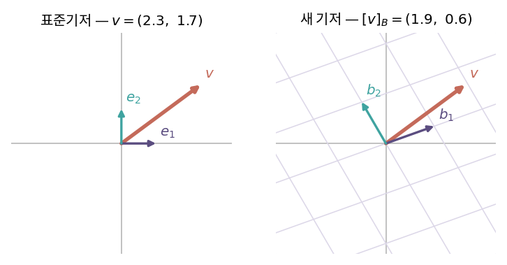
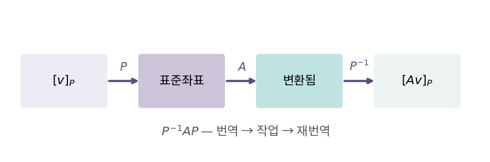

::: {.callout-note collapse="true"}
## 🎯 학습목표

- 같은 벡터를 다른 기저로 표현하고 좌표를 계산
- 기저 행렬 $B$와 좌표 사이의 방향($v = Bc$)을 헷갈리지 않고 쓰기
- 두 기저 사이의 기저변환행렬을 구성
- 닮음변환 $P^{-1}AP$를 세 단계로 읽기
- 닮음 불변량(trace·det·고유값)이 무엇을 뜻하는지 설명
:::

> 🤔 **출발 질문**
>
> 좌표를 바꾸면 행렬이 바뀐다. 그럼 '진짜' 변환은 무엇인가?

------------------------------------------------------------------------

## 1. 좌표계를 바꾼다는 것 {#s1}

### 1) 좌표 = 기저에 대한 계수 {#s1-1}

- 🔗[1장](01_vector.qmd)에서 … 벡터는 불변, 성분은 가변
- 표준기저 $\{e_1, e_2\}$에서 $(3,1)$이 뜻하는 것
  $$v = 3e_1 + 1e_2$$
  - ⟹ 우리가 늘 쓰는 좌표도 **이미 어떤 기저에 대한 계수**
- 다른 기저 $B = \{b_1, b_2\}$를 쓰면 같은 $v$의 계수가 달라짐
  $$v = c_1 b_1 + c_2 b_2, \qquad [v]_B = (c_1, c_2)$$

### 2) 방향 잡기 — $v = Bc$ {#s1-2}

- 기저 행렬 $B$ … **새 기저 벡터를 열로 세운 것** (🔗[2장](02_linear_transformation.qmd))
- $Bc$ = 열벡터의 선형결합 = $c_1 b_1 + c_2 b_2$
  $$\boxed{v = Bc} \qquad\Longleftrightarrow\qquad c = B^{-1}v$$

| 방향 | 식 | 읽는 법 |
|---|---|---|
| $B$좌표 → 표준좌표 | $v = Bc$ | $B$는 "$B$의 말을 표준어로 옮기는 사전" |
| 표준좌표 → $B$좌표 | $c = B^{-1}v$ | 역방향은 역행렬 |

- 예: $B = \begin{bmatrix}3&-1\\1&2\end{bmatrix}$, $v=(5,4)$
  - $c = B^{-1}v = (2, 1)$
  - 확인 … $2(3,1) + 1(-1,2) = (5,4)$ ○

> 기저 행렬은 **새 기저를 표준기저로 번역하는 사전**이다. 좌표를 얻으려면 사전을 거꾸로 써야 한다.

{fig-align="center" width="88%"}


------------------------------------------------------------------------

## 2. 임의의 기저 간 변환 {#s2}

### 1) 두 기저 사이 {#s2-1}

- 기저 $B$와 기저 $C$, 같은 벡터 $v$
  - $v = B\,[v]_B$
  - $v = C\,[v]_C$
- 두 식을 연결
  $$B\,[v]_B = C\,[v]_C \quad\Longrightarrow\quad [v]_B = B^{-1}C\,[v]_C$$

### 2) 기저변환행렬(transition matrix) {#s2-2}

$$P_{C \to B} = B^{-1}C$$

- $C$ 표현을 $B$ 표현으로 바꿔주는 행렬 … 추이행렬이라고도 함
- 특수한 경우
  - $C = I$(표준기저) ⟹ $P = B^{-1}$
  - $B = I$ ⟹ $P = C$
- 성질
  - $P_{B \to C} = P_{C \to B}^{-1}$
  - 기저 벡터들이 선형독립이므로 $P$는 **항상 가역**

### 3) ⚠️ 방향 혼동이 가장 흔한 실수 {#s2-3}

- "기저가 $B$에서 $C$로 바뀌면 좌표도 같은 방향으로 바뀐다"고 착각하기 쉬움
- 실제로는 **반대 방향**
  - 기저 벡터를 2배로 늘리면 → 같은 벡터를 적는 좌표는 **절반**이 됨
- ⟹ 헷갈릴 때는 항상 $v = Bc$ 하나만 기억하고 나머지는 유도

------------------------------------------------------------------------

## 3. ＋ 닮음변환 {#s3}

### 1) 같은 변환, 다른 좌표계 {#s3-1}

- 선형변환 $T$가 표준기저에서 행렬 $A$로 표현된다고 하자
- 같은 $T$를 기저 $P$(열이 새 기저)에서 보면
  $$A' = P^{-1}AP$$
- **오른쪽부터** 읽는 것이 핵심 (🔗[2장](02_linear_transformation.qmd) 합성)

| 순서 | 연산 | 의미 |
|---|---|---|
| ① | $P$ | 새 기저 좌표 → 표준좌표로 번역 |
| ② | $A$ | 표준좌표에서 변환 수행 |
| ③ | $P^{-1}$ | 결과를 다시 새 기저 좌표로 번역 |

- ⟹ **번역 → 작업 → 재번역**의 샌드위치

{fig-align="center" width="88%"}

- $A$와 $A'$는 **닮음**(similar)이라 함

### 2) 닮음 불변량 {#s3-2}

- 좌표계를 바꿔도 변하지 않는 것들

| 불변량 | 이유 |
|---|---|
| 대각합 $\text{tr}$ | $\text{tr}(P^{-1}AP) = \text{tr}(APP^{-1}) = \text{tr}(A)$ |
| 행렬식 $\det$ | $\det(P^{-1})\det(A)\det(P) = \det(A)$ → 🔗[6장](06_determinant.qmd) |
| 고유값 | 같은 특성방정식 → 🔗[11장](11_eigen.qmd) |
| rank | 가역행렬을 곱해도 rank 불변 → 🔗[4장](04_subspaces.qmd) |

- ⟹ 이것들이 **변환 자체의 성질**. 행렬의 개별 원소는 좌표계의 부산물
- "진짜 변환은 무엇인가"라는 출발 질문의 답

------------------------------------------------------------------------

## 4. ＋ 좋은 좌표계를 고른다는 것 {#s4}

### 1) 이 책 나머지의 예고 {#s4-1}

- $P$를 아무거나 골라도 되지만, **잘 고르면 $A'$가 단순해짐**
- 가장 단순한 형태 = 대각행렬
  $$P^{-1}AP = \Lambda = \text{diag}(\lambda_1, \dots, \lambda_n)$$
- 이때 $P$의 열은 무엇인가?
  - 변환해도 방향이 바뀌지 않는 벡터 = **고유벡터** → 🔗[11장](11_eigen.qmd)
  - 이 과정이 **대각화** → 🔗[12장](12_evd.qmd)

### 2) Part V 전체의 구조 {#s4-2}

| 장 | 고르는 좌표계 | 얻는 형태 |
|---|---|---|
| 🔗[12장](12_evd.qmd) | 고유벡터 | $A = V\Lambda V^{-1}$ |
| 🔗[13장](13_pca.qmd) | 분산이 큰 방향 | 주성분 좌표 |
| 🔗[14장](14_qr.qmd) | 정규직교기저 | $A = QR$ |
| 🔗[15장](15_svd.qmd) | 입력·출력 각각의 정규직교기저 | $A = U\Sigma V^\top$ |

- ⟹ 전부 "좌표계를 잘 골라 행렬을 단순하게 만드는" 같은 이야기

::: {.callout-tip collapse="true"}
## 계산 확인

::: {.panel-tabset}
## R

```{r}
B <- matrix(c(3, 1, -1, 2), nrow = 2)   # 새 기저 (열)
v <- c(5, 4)

c_B <- solve(B, v)     # 표준 → B좌표
c_B
B %*% c_B              # 되돌리면 v

# 닮음변환 — 같은 변환을 B 기저에서 보기
A  <- matrix(c(2, 0, 1, 3), nrow = 2)
A2 <- solve(B) %*% A %*% B

c(tr_A = sum(diag(A)),  tr_A2 = sum(diag(A2)))    # 같음
c(det_A = det(A),       det_A2 = det(A2))         # 같음
round(sort(eigen(A)$values), 6)
round(sort(eigen(A2)$values), 6)                  # 같음
```

## Python

```{python}
import numpy as np

B = np.array([[3, -1],
              [1,  2]])
v = np.array([5, 4])

c_B = np.linalg.solve(B, v); c_B
B @ c_B

A  = np.array([[2, 1],
               [0, 3]])
A2 = np.linalg.inv(B) @ A @ B

np.trace(A), np.trace(A2)
np.linalg.det(A), np.linalg.det(A2)
np.sort(np.linalg.eigvals(A)), np.sort(np.linalg.eigvals(A2))
```
:::

- 원소는 전부 달라졌지만 trace·det·고유값은 그대로
:::

::: {.callout-important}
## ⚠️ 흔한 오해

- **$B$와 $B^{-1}$의 방향 혼동**
  - $v = Bc$ 하나만 기억 … 나머지는 전부 여기서 유도
- **"좌표계를 바꾸면 벡터가 변한다"**
  - 변하는 것은 **적는 숫자**뿐 (🔗[1장](01_vector.qmd))
- **"닮음변환은 $PAP^{-1}$이다"**
  - 순서가 반대면 $P$의 역할도 반대가 됨. 어느 쪽이 "새 기저 → 표준"인지로 판단
:::

------------------------------------------------------------------------

::: {.callout-important collapse="true"}
## 🧬 생물정보학에서는 — PC 좌표계도 좌표계다

- PCA가 하는 일 = **좌표계 변경**
  - 원래 좌표계 … 축 = 유전자
  - 새 좌표계 … 축 = 주성분(유전자들의 선형결합)
  - 기저가 정규직교이므로 **회전**일 뿐 (🔗[3장](03_inner_product.qmd))
- 따라서 **전체 PC를 다 쓰면 점들 사이 거리가 보존됨**
  - 앞의 몇 개만 남기는 순간 근사가 됨 → 🔗[15장](15_svd.qmd)

- 읽을 때의 규칙

| 대상 | 해석 가능? |
|---|---|
| PC1 값 "3.2" 자체 | ✕ … 단위가 없는 좌표. 상대적 위치만 의미 |
| 점들 사이의 상대적 배치 | ○ |
| loading (기저벡터 성분) | ○ … 어떤 유전자가 그 축에 기여했는가 |
| 부호 | ✕ … 고유벡터 부호는 불확정 → 🔗[13장](13_pca.qmd) |

- ⚠️ UMAP·t-SNE는 **선형 좌표 변환이 아님**
  - 이 장의 논리가 적용되지 않음
  - 축 값은 물론이고 **군집 사이의 거리도 해석하면 안 됨**
  - PCA는 회전, UMAP은 찌그러뜨리기
:::

------------------------------------------------------------------------

## ✅ 정리와 연습 {#s5}

### 한 줄 요약 {#s5-1}

> 기저 행렬 $B$는 $B$좌표를 표준좌표로 옮기는 사전이고($v=Bc$), 반대는 $B^{-1}$이다.
> 같은 변환을 다른 좌표계에서 보면 $P^{-1}AP$이며, trace·det·고유값은 그래도 변하지 않는다.

### 체크리스트 {#s5-2}

- [ ] $v = Bc$의 방향을 헷갈리지 않는다
- [ ] 두 기저 사이의 기저변환행렬을 구성할 수 있다
- [ ] $P^{-1}AP$를 세 단계로 설명할 수 있다
- [ ] 닮음 불변량을 세 개 이상 말할 수 있다

### 연습문제 {#s5-3}

1. $B=\{(1,1),(1,-1)\}$일 때 $v=(4,2)$의 $B$좌표를 구하라.
2. $B=\{(1,0),(0,1)\}$, $C=\{(1,1),(0,1)\}$일 때 $P_{C\to B}$와 $P_{B\to C}$를 구하라.
3. 기저 벡터를 모두 2배로 늘리면 같은 벡터의 좌표는 어떻게 되는가? 식으로 보여라.
4. $A=\begin{bmatrix}2&1\\0&3\end{bmatrix}$, $P=\begin{bmatrix}1&1\\0&1\end{bmatrix}$일 때 $P^{-1}AP$를 계산하고 trace·det이 보존됨을 확인하라.
5. 닮음변환으로 대각행렬이 되려면 $P$의 열이 무엇이어야 하는지 설명하라.
6. **생각해 볼 것.** 회전행렬 $R_\theta$를 회전축 방향을 기저로 잡아 다시 쓰면 어떤 모양이 되는가? 3차원에서 생각해 보라.

------------------------------------------------------------------------

## 🔗 다음 장

- [6. 행렬식](06_determinant.qmd)
  - 이 장에서 $\det$가 닮음 불변량으로 등장
  - 다음 장 … 그 $\det$가 **무엇을 재는 숫자**인지

::: {.callout-note collapse="true"}
## 참고 자료

- [기저의 변환](https://angeloyeo.github.io/2020/12/07/change_of_basis.html) — 공돌이의 수학정리노트
:::
