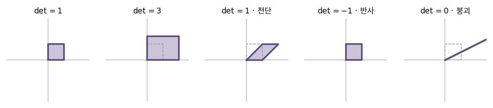
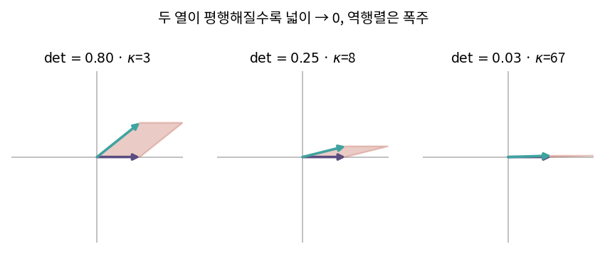

::: {.callout-note collapse="true"}
## 🎯 학습목표

- 행렬식을 **부피 배율**로 해석
- $\det = 0$ ⟺ 차원 붕괴 ⟺ 역행렬 없음을 연결
- 다중공선성을 기하학으로 설명
- 행렬식의 성질을 열 기준으로 서술
- 크래머 공식을 유도하고, 실무에서 쓰지 않는 이유를 설명
- ⚠️ $\det$의 크기만으로 수치 안정성을 판단하면 안 되는 이유
:::

> 🤔 **출발 질문**
>
> 선형변환에서 단위 면적은 얼마나 늘어나는가?

------------------------------------------------------------------------

## 1. 역행렬 {#s1}

### 1) 정의 {#s1-1}

- $AB = BA = I_n$인 $B$가 존재하면 $B = A^{-1}$
- 기하학적으로 … **되돌리는 변환** (🔗[2장](02_linear_transformation.qmd))
- 존재하지 않는 경우 … 정보가 사라진 변환
  - 사영은 눌린 성분을 복구할 수 없음

### 2) 2×2 역행렬 공식 {#s1-2}

$$A = \begin{bmatrix}a&b\\c&d\end{bmatrix} \quad\Longrightarrow\quad A^{-1} = \frac{1}{ad-bc}\begin{bmatrix}d&-b\\-c&a\end{bmatrix}$$

- 분모 $ad-bc$ = **행렬식** $\det A$
- ⟹ $\det A = 0$이면 역행렬이 존재하지 않음
- 이 숫자가 왜 하필 가역성을 판단하는가 → §2

------------------------------------------------------------------------

## 2. 행렬식의 기하학적 의미 {#s2}

### 1) 부피 배율 {#s2-1}

- 표준기저 $e_1, e_2$가 만드는 단위정사각형 … 넓이 1
- 변환 후 $a_1 = Ae_1$, $a_2 = Ae_2$가 만드는 **평행사변형의 넓이** = $\lvert\det A\rvert$
- 시작 넓이가 1이므로 ⟹ $\lvert\det A\rvert$는 곧 **넓이가 몇 배가 되었는가**

| 차원 | $\lvert\det\rvert$가 재는 것 |
|---|---|
| 2×2 | 평행사변형의 넓이 |
| 3×3 | 평행육면체의 부피 |
| $n\times n$ | $n$차원 부피 |

- 어떤 도형이든 배율은 같음 … 넓이 $S$인 영역은 변환 후 $\lvert\det A\rvert \cdot S$

{fig-align="center" width="100%"}


### 2) $\det = 0$ — 차원이 무너졌다 {#s2-2}

- 넓이 0 ⟺ 두 기저벡터가 **한 직선 위에** 놓임
- ⟹ 2차원이 1차원(또는 0차원)으로 붕괴
- 정보가 사라졌으므로 되돌릴 수 없음 ⟹ 역행렬 없음
- 🔗[4장](04_subspaces.qmd)의 언어로 … $\text{rank} < n$, 영공간이 $\{0\}$보다 큼

| $\det A$ | rank | 영공간 | 역행렬 |
|---|---|---|---|
| $\neq 0$ | $n$ (full) | $\{0\}$ | 존재 |
| $= 0$ | $< n$ | 차원 $\ge 1$ | 없음 |

### 3) 부호 — 방향 뒤집힘 {#s2-3}

- $\det > 0$ … 방향(orientation) 유지 … 회전·확대
- $\det < 0$ … 방향 뒤집힘 … 반사
  - 예: 치환행렬 $\begin{bmatrix}0&1\\1&0\end{bmatrix}$의 $\det = -1$ … 넓이는 그대로, 좌우가 바뀜
- 회전행렬 $\det = 1$ … 넓이도 방향도 보존 (🔗[3장](03_inner_product.qmd) 직교행렬)

------------------------------------------------------------------------

## 3. 거의 평행할 때 {#s3}

### 1) 다중공선성의 기하학 {#s3-1}

- 두 열벡터가 **거의** 평행한 경우
  - 평행사변형이 극단적으로 납작해짐 → 넓이 $\approx 0$
  - $\det \approx 0$ → $1/\det$가 폭주 → **역행렬 원소가 거대해짐**
- 데이터로 읽으면
  - 두 공변량이 거의 같은 정보를 담고 있음
  - ⟹ 입력이 조금만 흔들려도 해가 크게 요동침
- 🔗[9장](09_least_squares.qmd) 회귀에서 "계수의 표준오차가 커진다"는 현상의 기하학적 정체

{fig-align="center" width="88%"}


### 2) ＋ 조건수(condition number) {#s3-2}

$$\kappa(A) = \frac{\sigma_{\max}}{\sigma_{\min}} \qquad (\sigma = \text{특이값} \to 🔗\text{15장})$$

- 입력 오차가 출력에서 **몇 배로 증폭되는가**
- ⚠️ $\det$는 수치 안정성의 지표로 부적절

| | 문제 |
|---|---|
| $\det$ | 스케일에 휘둘림 … $\det(2I_{100}) = 2^{100}$인데 이 행렬은 완벽히 안정적 |
| $\det$ | 크기가 작아도 안정적일 수 있고, 커도 불안정할 수 있음 |
| $\kappa$ | 스케일 불변 … 순수하게 "찌그러진 정도"만 잼 |

- 실무 기준 … $\kappa$가 $10^{k}$면 유효숫자 $k$자리를 잃는다고 보면 됨
- R `kappa()`, Python `np.linalg.cond()` → 🔗[부록 A](../appendix/a_numerical.qmd)

------------------------------------------------------------------------

## 4. 행렬식의 성질 {#s4}

- 모두 **열을 기준으로** 읽으면 기하학적 의미가 보임

| 성질 | 식 | 기하 |
|---|---|---|
| 열에 대한 선형성 | 한 열만 $k$배 → $\det$도 $k$배 | 한 변이 $k$배면 넓이도 $k$배 |
| 열의 가법성 | $\det[\dots, u+v, \dots] = \det[\dots,u,\dots]+\det[\dots,v,\dots]$ | 넓이의 분할 |
| 교환 | 두 열 교환 → 부호 반전 | 방향 뒤집힘 |
| 중복 | 두 열이 같으면 $\det=0$ | 납작해짐 |
| 곱 | $\det(AB) = \det A \cdot \det B$ | 배율의 곱 |
| 전치 | $\det(A^\top) = \det A$ | 행으로 재나 열로 재나 같음 |
| 삼각행렬 | $\det$ = 대각 성분의 곱 | 직사각형의 넓이 |
| 역행렬 | $\det(A^{-1}) = 1/\det A$ | 되돌리면 배율도 역수 |

- 마지막 두 줄이 실무의 계산법
  - 삼각행렬로 만든 뒤 대각을 곱함 ⟹ LU 분해로 $\det$ 계산 → 🔗[8장](08_lu_cholesky.qmd)
- 닮음 불변 … $\det(P^{-1}AP) = \det A$ (🔗[5장](05_change_of_basis.qmd))

------------------------------------------------------------------------

## 5. 크래머 공식 {#s5}

### 1) 공식 {#s5-1}

- $Ax = b$의 해
  $$x_i = \frac{\det(A_i)}{\det(A)}$$
  - $A_i$ … $A$의 $i$번째 **열을 $b$로 바꾼** 행렬

### 2) 기하학적 증명 {#s5-2}

- $Ax = b$ ⟺ $b = x_1 a_1 + x_2 a_2$ (🔗[3장](03_inner_product.qmd) 시각 ②)
- $A_1 = [b \;\; a_2]$의 행렬식을 계산
  $$\det[b \;\; a_2] = \det[x_1 a_1 + x_2 a_2 \;\; a_2] = x_1\det[a_1\;\;a_2] + x_2\underbrace{\det[a_2\;\;a_2]}_{=0}$$
- ⟹ $\det(A_1) = x_1 \det(A)$ ⟹ $x_1 = \det(A_1)/\det(A)$
- 기하: $a_1$을 $b$로 바꿨을 때 **평행사변형 넓이가 몇 배가 되는가** = $x_1$

::: {.callout-important}
## ⚠️ ＋ 왜 실무에서는 쓰지 않는가

- 크래머 공식·여인수 전개의 계산량

| 방법 | 계산량 | $n=20$ |
|---|---|---|
| 여인수 전개 | $O(n!)$ | $2.4\times10^{18}$회 |
| 가우스 소거 / LU | $O(n^3)$ | $8000$회 |

- ⟹ 크래머 공식은 **증명과 직관을 위한 도구**
- 실제 계산은 소거법 → 🔗[7장](07_gauss_elimination.qmd)·[8장](08_lu_cholesky.qmd)
- 같은 이유로 **역행렬을 명시적으로 구하지 않음** … `solve(A, b)`를 쓸 것
:::

::: {.callout-tip collapse="true"}
## 계산 확인

::: {.panel-tabset}
## R

```{r}
A <- matrix(c(1, 0.99, 0.99, 1), nrow = 2)   # 거의 평행한 두 열

det(A)          # 0에 가까움
kappa(A)        # 조건수는 매우 큼
solve(A)        # 역행렬 원소가 거대

# 입력을 0.1% 흔들면 해가 얼마나 움직이나
b  <- c(1, 1)
x1 <- solve(A, b)
x2 <- solve(A, b * c(1.001, 1))
rbind(x1, x2)

# 스케일에 휘둘리는 det vs 스케일 불변인 kappa
B <- 2 * diag(100)
c(det = det(B), kappa = kappa(B))
```

## Python

```{python}
import numpy as np

A = np.array([[1, 0.99],
              [0.99, 1]])

np.linalg.det(A)
np.linalg.cond(A)
np.linalg.inv(A)

b  = np.array([1, 1])
x1 = np.linalg.solve(A, b)
x2 = np.linalg.solve(A, b * np.array([1.001, 1]))
np.vstack([x1, x2])

B = 2 * np.eye(100)
np.linalg.det(B), np.linalg.cond(B)
```
:::

- $\det(B)$는 $2^{100}$으로 폭발하지만 조건수는 1 … **완벽히 안정적인 행렬**
:::

------------------------------------------------------------------------

::: {.callout-important collapse="true"}
## 🧬 생물정보학에서는 — 다중공선성 진단

- 실제로 자주 겹치는 공변량 쌍
  - 나이 ↔ 병기(stage)
  - 배치 ↔ 조직 채취 시기
  - 세포 조성 ↔ 질환 상태
  - 라이브러리 크기 ↔ 검출 유전자 수

- **VIF**(variance inflation factor)
  $$\text{VIF}_j = \frac{1}{1-R_j^2}$$
  - $R_j^2$ … 공변량 $j$를 나머지 공변량으로 회귀했을 때의 결정계수
  - 나머지로 거의 설명된다 = 거의 평행하다 = $R_j^2 \to 1$ ⟹ VIF 폭주
  - 경험칙 … VIF > 5–10이면 경고

- ⚠️ 다중공선성이 있어도 **예측은 된다**
  - 망가지는 것은 개별 **계수의 해석**과 표준오차
  - "유전자 A의 효과"를 주장하려면 반드시 확인할 것

- 대응
  - 하나를 제거하거나 합침
  - 주성분으로 대체 → 🔗[13장](13_pca.qmd)
  - ridge 정규화 … $A^\top A + \lambda I$로 납작한 방향을 인위적으로 세움 → 🔗[9장](09_least_squares.qmd)

- ⚠️ $p \gg n$이면 VIF 계산 자체가 불가능
  - 나머지 공변량으로 항상 완벽히 설명됨($R_j^2 = 1$)
  - ⟹ 🔗[10장](10_pseudo_inverse.qmd)의 문제로 넘어감
:::

------------------------------------------------------------------------

## ✅ 정리와 연습 {#s6}

### 한 줄 요약 {#s6-1}

> 행렬식은 그 변환이 부피를 몇 배로 만드는지 재는 숫자다.
> 0이면 차원이 무너졌다는 뜻이고, 0에 가까우면 역행렬을 믿을 수 없다는 뜻이다.
> 다만 안정성을 보려면 $\det$이 아니라 조건수를 봐야 한다.

### 체크리스트 {#s6-2}

- [ ] $\det$를 부피 배율로 설명할 수 있다
- [ ] $\det=0$과 rank·영공간·역행렬을 한 줄로 연결할 수 있다
- [ ] $\det$의 부호가 뜻하는 것을 말할 수 있다
- [ ] $\det$ 대신 조건수를 봐야 하는 이유를 예로 들 수 있다

### 연습문제 {#s6-3}

1. $A=\begin{bmatrix}2&1\\1&3\end{bmatrix}$의 $\det$를 구하고, 단위정사각형이 어떤 평행사변형이 되는지 그려라.
2. $\det\begin{bmatrix}1&2\\2&4\end{bmatrix}=0$임을 확인하고, 이 변환이 평면을 어디로 보내는지 설명하라.
3. 회전행렬 $R_\theta$의 $\det$를 계산하고 그 값이 1인 이유를 기하학적으로 설명하라.
4. $\det(AB)=\det A\det B$를 이용해 $\det(A^{-1}) = 1/\det A$를 유도하라.
5. 크래머 공식으로 $\begin{cases}x+2y=5\\3x+4y=11\end{cases}$를 풀어라.
6. **생각해 볼 것.** $\det(0.1 \cdot I_{10}) = 10^{-10}$이다.
   - 이 행렬은 수치적으로 불안정한가?
   - 조건수를 계산해 답하고, 왜 $\det$가 오해를 부르는지 설명하라

------------------------------------------------------------------------

## 🔗 다음 장

- [7. 기본행렬과 가우스-조던 소거법](07_gauss_elimination.qmd)
  - Part II … 공간의 **구조**를 봤음
  - Part III … 그 구조 위에서 실제로 **방정식을 푸는 법**
  - 이 장에서 "쓰면 안 된다"고 한 방법 대신 무엇을 쓰는지

::: {.callout-note collapse="true"}
## 참고 자료

- [행렬식의 기하학적 의미](https://angeloyeo.github.io/2019/08/06/determinant.html) — 공돌이의 수학정리노트
:::
