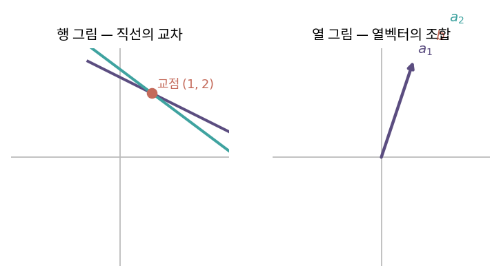
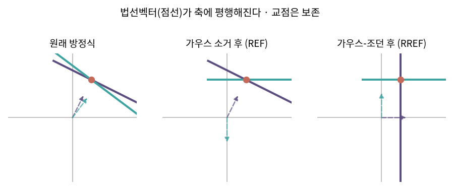

::: {.callout-note collapse="true"}
## 🎯 학습목표

- 연립방정식의 세 조작을 기본행렬로 표현
- REF와 RREF를 구분하고 직접 작성
- 소거 결과에서 rank·free variable·영공간 기저를 읽기
- 해가 0개·1개·무한개인 조건을 🔗[4장](04_subspaces.qmd)의 언어로 서술
- ⚠️ 왜 행 연산만 하고 열 연산은 하지 않는지 설명
:::

> 🤔 **출발 질문**
>
> 중고등학교에서 하던 '소거'는 행렬 언어로 무엇인가?

------------------------------------------------------------------------

## 1. 연립방정식의 세 가지 조작 {#s1}

### 1) 허용되는 것 {#s1-1}

| 조작 | 예 | 벡터 연산으로는 |
|---|---|---|
| **상수배** scaling | 식 하나에 $k \neq 0$을 곱함 | 벡터 상수배 |
| **순서 바꾸기** permutation | 두 식의 순서 교환 | — |
| **더하기** addition | 식 하나를 상수배해 다른 식에 더함 | 벡터 합 |

- 🔗[1장](01_vector.qmd)의 두 기본 연산이 그대로 재등장

### 2) 왜 해가 바뀌지 않는가 {#s1-2}

- 세 조작 모두 **되돌릴 수 있음**(가역)
  - $k$배 했으면 $1/k$배, 더했으면 빼면 원래대로
- ⟹ 조작 전후의 연립방정식은 **같은 해집합**을 가짐
- 이 성질에 이름을 붙인 것이 **행동치**(row-equivalent) → §4-2

------------------------------------------------------------------------

## 2. 기본행렬 — 연산도 행렬이다 {#s2}

### 1) 첨가행렬 {#s2-1}

- $Ax = b$를 한 덩어리로 적은 것
  $$[A \mid b] \qquad (m \times (n+1))$$
- 목표 … 왼쪽을 $I$로 만들면 오른쪽이 해

### 2) 세 종류의 기본행렬 {#s2-2}

- 모두 **단위행렬 $I$를 조금 고친 것**

| 조작 | 기본행렬 $E$ | 예 (3×3) |
|---|---|---|
| Row multiplication | $I$의 **대각** 성분 하나를 $k$로 | 2행을 $k$배 → $\text{diag}(1,k,1)$ |
| Row switching | $I$의 **행 순서**를 바꿈 (치환행렬) | 2·3행 교환 |
| Row addition | $I$의 **비대각** 성분 하나를 $s$로 | 2행 $+= s\times$1행 → $E_{21}=s$ |

### 3) 왼쪽에 곱하면 행 연산 {#s2-3}

$$E[A \mid b] \;=\; (\text{그 행 연산을 적용한 결과})$$

- ⚠️ **왼쪽**에 곱해야 행 연산. 오른쪽에 곱하면 **열** 연산이 됨
- 소거 전체는 기본행렬의 곱
  $$E_k \cdots E_2 E_1 A = U$$
- 각 $E$는 가역이고 역행렬도 같은 종류
  - Row addition $E_{21}=s$의 역행렬은 $E_{21}=-s$ … **부호만 바뀜**
  - 이 단순함이 🔗[8장](08_lu_cholesky.qmd) LU 분해를 가능하게 함

> 소거는 손으로 하는 요령이 아니라 **행렬 곱의 연속**이다. 그래서 컴퓨터가 할 수 있다.

------------------------------------------------------------------------

## 3. 가우스 / 가우스-조던 소거법 {#s3}

### 1) REF — 사다리꼴 {#s3-1}

- **REF**(Row-Echelon Form) 조건
  - 모두 0인 행은 맨 아래
  - 각 행의 **피벗**(0이 아닌 첫 원소)은 위 행의 피벗보다 오른쪽
  - 피벗 아래는 모두 0
- echelon … 사다리. 계단 모양에서 온 이름
- 가우스 소거법 = 위에서 아래로 피벗 아래를 0으로 만드는 과정

### 2) RREF {#s3-2}

- **RREF**(Reduced REF) … REF에서 한 걸음 더
  - 피벗을 모두 1로 scaling
  - 피벗 **위쪽**도 모두 0
- 가우스-조던 소거법의 결과
- ⚠️ REF는 여러 개일 수 있지만 **RREF는 유일**

$$A \;\xrightarrow{\text{가우스}}\; U(\text{REF}) \;\xrightarrow{\text{조던}}\; R(\text{RREF})$$

### 3) 피벗과 free variable {#s3-3}

| 열 | 이름 | 의미 |
|---|---|---|
| 피벗이 있는 열 | pivot variable | 값이 결정됨 |
| 피벗이 없는 열 | **free variable** | 아무 값이나 가능 |

- free variable 개수 = 영공간의 차원 = $n - r$ (🔗[4장](04_subspaces.qmd))

------------------------------------------------------------------------

## 4. 소거법의 활용 {#s4}

### 1) 역행렬 계산 {#s4-1}

$$[A \mid I] \;\xrightarrow{\text{가우스-조던}}\; [I \mid A^{-1}]$$

- $A$를 $I$로 만드는 연산들의 곱이 곧 $A^{-1}$
- 🔗[6장](06_determinant.qmd)에서 본 여인수 전개보다 압도적으로 빠름

### 2) 행동치 {#s4-2}

- $A$, $U$(REF), $R$(RREF)는 모두 **행동치**
  $$Ax=b \;\Longleftrightarrow\; Ux=c \;\Longleftrightarrow\; Rx=d$$
- ⟹ 해집합이 동일. 모양만 보기 쉬워짐

### 3) 선형독립 판별 {#s4-3}

- 🔗[1장](01_vector.qmd)의 정의를 **계산으로** 바꾸는 단계
- 벡터들을 행(또는 열)으로 쌓고 소거
  - 0인 행이 나오면 → 그 벡터는 나머지의 선형결합 → **종속**
  - 0인 행이 없으면 → **독립**

### 4) rank {#s4-4}

$$\text{rank}(A) = \text{피벗의 개수}$$

- 소거하면 종속인 벡터는 자연히 0행으로 사라짐 → 남은 것이 독립인 것들
- 행으로 세나 열로 세나 피벗 개수는 같음 ⟹ **행랭크 = 열랭크** (🔗[4장](04_subspaces.qmd))

### 5) 영공간 기저 {#s4-5}

- free variable 하나를 1, 나머지를 0으로 두고 풀면 영공간 기저 벡터 하나
- free variable이 $n-r$개 ⟹ 기저 벡터도 $n-r$개

------------------------------------------------------------------------

## 5. ＋ 해의 구조 — 특수해 + 영공간 {#s5}

### 1) 구조 {#s5-1}

$$x = x_p + x_{\text{null}}, \qquad x_{\text{null}} \in N(A)$$

- $x_p$ … 특수해 하나 (free variable을 모두 0으로 두고 구함)
- $Ax_p = b$, $Ax_{\text{null}} = 0$ ⟹ $A(x_p + x_{\text{null}}) = b$ ○
- ⟹ 해집합 = **영공간을 $x_p$만큼 평행이동한 것**
  - 영공간은 원점을 지나는 부분공간, 해집합은 지나지 않을 수 있음 (🔗[4장](04_subspaces.qmd))

### 2) 해가 몇 개인가 {#s5-2}

- 판정의 두 축 … **일관성**(consistency)과 **rank**

| 조건 | 해 |
|---|---|
| REF에서 $[0\;0\;\cdots\;0 \mid c]$, $c \neq 0$ 행이 생김 | **0개** … $b \notin C(A)$ |
| 일관됨 + $r = n$ (free variable 없음) | **1개** |
| 일관됨 + $r < n$ (free variable 있음) | **무한개** |

- 🔗[4장](04_subspaces.qmd)의 언어로 다시 쓰면
  - 해 존재 ⟺ $b \in C(A)$
  - 해 유일 ⟺ $N(A) = \{0\}$

------------------------------------------------------------------------

## 6. 기하학적 의미 {#s6}

### 1) 행 그림 {#s6-1}

- 방정식 하나 = 직선(2D) 또는 초평면(nD)
- 계수가 곧 그 직선의 **법선벡터** … $2x+y=5$의 법선은 $(2,1)$
- 🔗[3장](03_inner_product.qmd)의 행벡터 등고선과 같은 그림

{fig-align="center" width="88%"}


### 2) 소거가 하는 일 {#s6-2}

- 목표 형태 $x = \alpha$, $y = \beta$의 법선벡터는 $(1,0)$, $(0,1)$
- ⟹ 소거 = **법선벡터들을 단위벡터에 평행하게 만드는 과정**
- 각 조작은 법선벡터를 상수배하거나 더해 새 법선벡터를 만드는 것
  - 직선은 움직이지만 **교점은 그대로**
  - 그것이 행동치의 기하학적 내용

{fig-align="center" width="100%"}


::: {.callout-tip collapse="true"}
## 계산 확인

::: {.panel-tabset}
## R

```{r}
A <- matrix(c(1, 2, 3,
              2, 4, 8,
              1, 2, 4), nrow = 3, byrow = TRUE)
b <- c(6, 16, 8)

qr(A)$rank                 # r = 2 → free variable 1개
ncol(A) - qr(A)$rank       # 영공간 차원

# RREF (직접 구현 — pracma::rref 로도 가능)
rref <- function(M, tol = 1e-10) {
  r <- 1
  for (j in seq_len(ncol(M))) {
    p <- which.max(abs(M[r:nrow(M), j])) + r - 1
    if (abs(M[p, j]) < tol) next
    M[c(r, p), ] <- M[c(p, r), ]          # switching
    M[r, ] <- M[r, ] / M[r, j]            # multiplication
    for (i in setdiff(seq_len(nrow(M)), r))
      M[i, ] <- M[i, ] - M[i, j] * M[r, ] # addition
    r <- r + 1
    if (r > nrow(M)) break
  }
  round(M, 10)
}
rref(cbind(A, b))          # 마지막 행이 0 0 0 | 0 → 일관됨, 무한개
```

## Python

```{python}
import numpy as np
from sympy import Matrix

A = np.array([[1,2,3],
              [2,4,8],
              [1,2,4]])
b = np.array([6,16,8])

np.linalg.matrix_rank(A)
Matrix(np.column_stack([A, b])).rref()   # (RREF, 피벗 열 인덱스)

from scipy.linalg import null_space
null_space(A)                             # 영공간 기저
```
:::

- 피벗 열 인덱스가 곧 pivot variable, 나머지가 free variable
:::

::: {.callout-important}
## ⚠️ 흔한 오해

- **"열 연산도 하면 더 빠르지 않나"**
  - 행 연산 = 방정식끼리의 조작 … 해 불변
  - 열 연산 = **변수를 섞는 것** … 해가 바뀜
  - ⟹ 첨가행렬에서는 행 연산만
- **"REF는 하나뿐"**
  - REF는 여러 개. **RREF만 유일**
- **"피벗은 아무 0 아닌 값이면 된다"**
  - 수학적으로는 그렇지만, 수치적으로는 **절댓값이 가장 큰 것**을 골라야 함(partial pivoting)
  - 0에 가까운 피벗으로 나누면 오차가 폭증 → 🔗[6장](06_determinant.qmd) 조건수
- **"rank는 소거 전 행렬을 봐도 안다"**
  - 눈으로 보이는 종속은 일부뿐. 소거해야 확정
:::

------------------------------------------------------------------------

::: {.callout-important collapse="true"}
## 🧬 생물정보학에서는 — design matrix의 rank

- `model.matrix()`가 만드는 것이 곧 $A$
  - 행 = 샘플, 열 = 절편·그룹·공변량
  - 회귀 계수 추정 = $Ax = b$를 푸는 일 → 🔗[9장](09_least_squares.qmd)

- **full rank가 아니면 추정 불가능한 계수가 생김**
  - `limma`·`DESeq2`의 `model matrix is not full rank` 오류
  - 영공간이 $\{0\}$이 아니므로 해가 무한개 … 어느 것을 답이라 할지 정할 수 없음

- 흔한 원인 세 가지

| 원인 | 상황 | 대응 |
|---|---|---|
| 더미변수 함정 | 절편 + 모든 수준의 더미 → 더미 열의 합 = 절편 열 | 한 수준을 기준으로 빼거나 `~ 0 + group` |
| 완전교락 | 모든 환자군이 batch 1, 모든 대조군이 batch 2 | 분석으로 복구 불가 → 🔗[4장](04_subspaces.qmd) |
| 중첩 설계 | 개체 ID와 그룹이 일대일 | 그룹 또는 개체 항 중 하나를 뺌 |

- 진단 절차
  - `qr(design)$rank`와 `ncol(design)`을 비교
  - 다르면 어느 열이 종속인지 소거로 확인
  - ⟹ 이 장의 rank·free variable이 그대로 쓰이는 자리

- ⚠️ 완전교락은 **경고가 아니라 설계 실패**
  - 소거로 찾아낼 수는 있어도 되돌릴 수는 없음
  - 시료가 실험실을 떠나기 전에 batch를 무작위화해야 함
:::

------------------------------------------------------------------------

## ✅ 정리와 연습 {#s7}

### 한 줄 요약 {#s7-1}

> 소거의 세 조작은 각각 기본행렬이고, 소거 전체는 행렬 곱의 연속이다.
> 결과인 RREF에서 피벗 개수가 rank, 피벗 없는 열이 free variable,
> 해는 특수해 하나에 영공간을 더한 것이다.

### 체크리스트 {#s7-2}

- [ ] 세 조작을 각각 기본행렬로 쓸 수 있다
- [ ] REF와 RREF를 구분할 수 있다
- [ ] RREF에서 rank와 free variable을 읽을 수 있다
- [ ] 해가 0개·1개·무한개인 조건을 rank로 말할 수 있다

### 연습문제 {#s7-3}

1. 3×3 단위행렬에서 "2행에 3행의 2배를 더하는" 기본행렬 $E$를 쓰고, $E^{-1}$을 구하라.
2. $\begin{bmatrix}1&2&3\\2&4&8\\1&2&4\end{bmatrix}$를 RREF로 만들고 rank와 free variable을 말하라.
3. 2번 행렬의 영공간 기저를 free variable 방법으로 구하라.
4. $[A \mid I] \to [I \mid A^{-1}]$이 성립하는 이유를 기본행렬의 곱으로 설명하라.
5. 다음 각각의 해의 개수를 판정하라.
   - (a) $r=n=m$
   - (b) $r=n<m$이고 일관됨
   - (c) $r<n$이고 일관됨
   - (d) REF에 $[0\;0\;0 \mid 5]$ 행이 있음
6. **생각해 볼 것.** `~ group` (절편 포함)과 `~ 0 + group`의 design matrix를 각각 쓰고 rank를 비교하라. 두 모형은 같은 것을 추정하는가?

------------------------------------------------------------------------

## 🔗 다음 장

- [8. LU 분해와 숄레스키 분해](08_lu_cholesky.qmd)
  - 이 장 … 소거를 **한 번** 하는 법
  - 다음 장 … 그 소거 과정을 **저장해 재사용**하는 법

::: {.callout-note collapse="true"}
## 참고 자료

- [기본 행렬](https://angeloyeo.github.io/2021/06/15/elementary_square_matrices.html) — 공돌이의 수학정리노트
- [가우스 / 가우스-조던 소거법](https://angeloyeo.github.io/2021/06/19/Gauss_elimination.html) — 공돌이의 수학정리노트
:::
