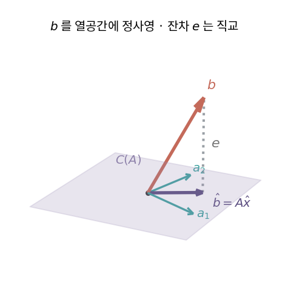
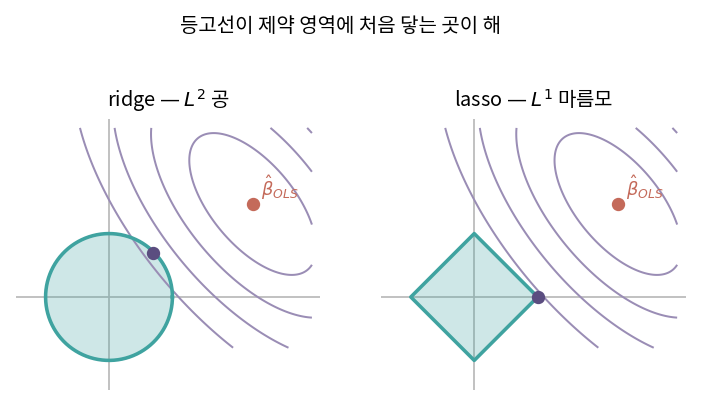
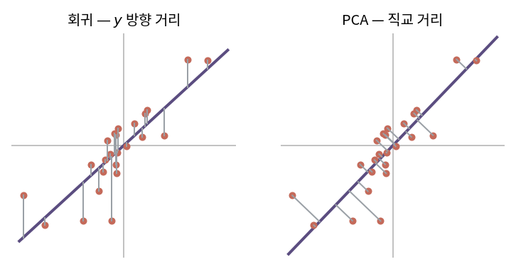

::: {.callout-note collapse="true"}
## 🎯 학습목표

- 최소제곱 문제를 **열공간으로의 정사영**으로 설명
- 정규방정식을 직교성에서 유도
- 사영행렬의 성질(멱등·대칭·trace)을 이용
- 정규방정식 대신 QR을 쓰는 이유를 조건수로 설명
- ridge와 lasso의 기하학을 구분
- ⚠️ 최소제곱이 최소화하는 거리가 **직교거리가 아님**을 설명
:::

> 🤔 **출발 질문**
>
> $b$가 열공간 안에 없는데, 어떻게 '가장 좋은' 조합 비율을 정하는가?

------------------------------------------------------------------------

## 1. 연립방정식으로서의 회귀 {#s1}

### 1) 회귀는 열벡터의 선형결합 {#s1-1}

- 단순회귀 $y_i = \beta_0 + \beta_1 x_i$를 행렬로
  $$\underbrace{\begin{bmatrix}1&x_1\\1&x_2\\ \vdots&\vdots\\1&x_m\end{bmatrix}}_{A}\underbrace{\begin{bmatrix}\beta_0\\\beta_1\end{bmatrix}}_{x} = \underbrace{\begin{bmatrix}y_1\\y_2\\ \vdots\\y_m\end{bmatrix}}_{b}$$
- 🔗[3장](03_inner_product.qmd) 시각 ②로 읽으면
  $$b \approx \beta_0 \cdot \mathbf{1} + \beta_1 \cdot x$$
- ⟹ **데이터가 $A$(열), 찾는 것이 계수 $x$**
  - 절편을 위해 $\mathbf{1}$ 열을 끼워 넣는 것이 관례

### 2) 해가 없는 것이 정상 {#s1-2}

- 보통 $m \gg n$ … 샘플이 변수보다 훨씬 많음 (**과대결정계**)
- 방정식 $m$개, 미지수 $n$개 ⟹ 모두 만족시킬 수 없음
- 🔗[4장](04_subspaces.qmd)의 언어로
  - $C(A)$는 $\mathbb{R}^m$ 안의 $n$차원 부분공간
  - $b$가 그 안에 들어 있을 확률은 사실상 0
- ⟹ 질문을 바꿔야 함
  - ✕ "$Ax=b$를 만족하는 $x$는?"
  - ○ "$Ax$가 $b$에 **가장 가까운** $x$는?"

------------------------------------------------------------------------

## 2. 열공간 밖의 $b$ {#s2}

### 1) 가장 가까운 점 = 정사영 {#s2-1}

- $C(A)$ 위의 점 중 $b$와의 거리가 최소인 점
  - = $b$에서 $C(A)$로 내린 **수선의 발**
  - = $b$의 **직교사영** $\hat{b}$
- 최소화 대상
  $$\min_x \lVert b - Ax \rVert^2$$
  - $L^2$ 노름 (🔗[3장](03_inner_product.qmd))

### 2) 정규방정식 유도 {#s2-2}

- 잔차 $e = b - A\hat{x}$
- $\hat{b}$가 수선의 발 ⟺ **잔차가 $C(A)$의 모든 벡터와 직교**
  - $A$의 모든 열과 직교 ⟺ $A^\top e = 0$
  $$A^\top(b - A\hat{x}) = 0$$
- 정리하면
  $$\boxed{A^\top A\,\hat{x} = A^\top b} \qquad\Longrightarrow\qquad \hat{x} = (A^\top A)^{-1}A^\top b$$
- **왜 $A^\top$를 곱하는가**
  - $A$는 $m\times n$ 직사각 → 역행렬 없음
  - $A^\top A$는 $n \times n$ **정사각** → 열이 선형독립이면 가역
  - ⟹ 전치를 곱해 역행렬이 존재하는 형태로 만드는 것

### 3) 잔차는 좌영공간에 산다 {#s2-3}

- $A^\top e = 0$ ⟺ $e \in N(A^\top)$ = **좌영공간** (🔗[4장](04_subspaces.qmd))
- ⟹ $b$의 분해
  $$b = \underbrace{\hat{b}}_{\in\, C(A)} + \underbrace{e}_{\in\, N(A^\top)}$$
- 4장에서 본 $\mathbb{R}^m = C(A) \oplus N(A^\top)$가 **여기서 쓰임**

> 회귀는 통계 기법이기 이전에 기하 문제다. 데이터가 만든 부분공간에 관측값을 떨어뜨리는 일.

{fig-align="center" width="62%"}


------------------------------------------------------------------------

## 3. ＋ 사영행렬 (hat matrix) {#s3}

### 1) 정의 {#s3-1}

$$\hat{b} = A\hat{x} = \underbrace{A(A^\top A)^{-1}A^\top}_{H}\,b$$

- $H$ … $b$에 모자(hat)를 씌워 $\hat{b}$로 만든다고 해서 **hat matrix**
- 역할 … $\mathbb{R}^m$의 벡터를 $C(A)$로 떨어뜨리는 **사영행렬**

### 2) 성질 {#s3-2}

| 성질 | 식 | 의미 |
|---|---|---|
| 멱등 | $H^2 = H$ | 이미 떨어뜨린 것을 또 떨어뜨려도 그대로 (🔗[2장](02_linear_transformation.qmd)) |
| 대칭 | $H^\top = H$ | **직교**사영이라는 뜻 |
| trace | $\text{tr}(H) = \text{rank}(A) = n$ | 모형이 쓴 **자유도** |
| 여사영 | $I-H$도 사영행렬 | $C(A)$가 아니라 $N(A^\top)$로 사영 … $e = (I-H)b$ |

- 잔차제곱합도 바로 나옴
  $$\text{RSS} = \lVert e \rVert^2 = b^\top (I-H) b$$
- ⚠️ $H$를 **명시적으로 만들지 말 것** … $m \times m$ 행렬 (🔗[2장](02_linear_transformation.qmd) 계산 비용)

------------------------------------------------------------------------

## 4. 최적화 관점에서 본 회귀 {#s4}

### 1) 비용함수 {#s4-1}

$$J(\beta_0,\beta_1) = \frac{1}{2m}\sum_{i=1}^{m}\bigl(y_i - (\beta_0 + \beta_1 x_i)\bigr)^2$$

- **제곱을 쓰는 이유**
  - 부호를 없애기 위해 … 절댓값 대신
  - 미분이 깔끔 … $\frac{1}{2}$는 미분하면 사라지라고 붙인 것
- ⚠️ 제곱은 **큰 오차에 훨씬 큰 벌점**을 줌 → 이상치에 취약

### 2) 그릇 모양의 곡면 {#s4-2}

- $x, y$는 데이터(상수), 변수는 $(\beta_0, \beta_1)$
- $J$는 $(\beta_0,\beta_1)$ 평면 위의 **이차형식** → 볼록한 그릇 (🔗[12장](12_evd.qmd))
- 최솟값이 유일하게 하나 … 국소최솟값 문제가 없음

### 3) 두 가지 도달법 {#s4-3}

| 방법 | 방식 | 언제 |
|---|---|---|
| 해석해 | $\nabla J = 0$ → 정규방정식 | $n$이 작고 $A^\top A$가 다룰 만할 때 |
| 경사하강 | 기울기 반대로 조금씩 이동 | $n$·$m$이 크거나, 모형이 비선형이거나, 온라인 학습 |

- $\nabla J = 0$을 풀면 §2의 정규방정식이 그대로 나옴
  - 행렬미분 공식은 🔗[17장](17_matrix_calculus.qmd)

------------------------------------------------------------------------

## 5. ＋ QR로 푸는 최소제곱 {#s5}

### 1) 정규방정식의 문제 {#s5-1}

- $A^\top A$를 만드는 순간 조건수가 **제곱**됨
  $$\kappa(A^\top A) = \kappa(A)^2$$
- 🔗[6장](06_determinant.qmd) … $\kappa$가 $10^k$면 유효숫자 $k$자리를 잃음
  - $\kappa(A)=10^6$이면 $A^\top A$는 $10^{12}$ ⟹ double precision으로도 위험

### 2) QR로 우회 {#s5-2}

- $A = QR$ ($Q$ 직교, $R$ 상삼각 → 🔗[14장](14_qr.qmd))
- 정규방정식에 대입
  $$A^\top A = R^\top Q^\top Q R = R^\top R$$
  $$R^\top R\hat{x} = R^\top Q^\top b \quad\Longrightarrow\quad R\hat{x} = Q^\top b$$
- ⟹ **상삼각 방정식 하나** … back substitution으로 끝 (🔗[8장](08_lu_cholesky.qmd))
- $A^\top A$를 만들지 않으므로 조건수가 제곱되지 않음
- **`lm()`이 실제로 하는 일이 이것** … 내부는 LAPACK의 QR 루틴

------------------------------------------------------------------------

## 6. ＋ 정규화 회귀의 기하학 {#s6}

### 1) ridge — 영공간을 메운다 {#s6-1}

$$\hat{x}_{\text{ridge}} = (A^\top A + \lambda I)^{-1}A^\top b$$

- $A^\top A$의 모든 고윳값에 $\lambda$를 더하는 것 (🔗[12장](12_evd.qmd))
  - 고윳값 0인 방향(영공간) → $\lambda$가 되어 **가역**
  - 거의 0인 방향(다중공선성) → 폭주가 억제됨
- ⟹ 🔗[6장](06_determinant.qmd)에서 본 납작한 방향을 **인위적으로 세우는 것**
- 기하: $\lVert x\rVert^2 \le t$라는 **공** 안에서 최소화

### 2) lasso — 왜 계수가 0이 되는가 {#s6-2}

- 제약이 $\sum\lvert x_i\rvert \le t$ … $L^1$ 공 = **마름모**(고차원에서는 꼭짓점이 많은 다면체)
- 등고선(타원)이 제약 영역과 처음 닿는 지점이 해
  - 공(ridge) … 어디서든 닿을 수 있음 → 계수가 작아지되 0은 아님
  - 마름모(lasso) … **꼭짓점에서 닿기 쉬움** → 그 축의 계수가 정확히 0

| | 제약 | 기하 | 결과 |
|---|---|---|---|
| ridge | $L^2$ | 공 | 계수를 **줄임** … 모두 살아남음 |
| lasso | $L^1$ | 마름모 | 계수를 **죽임** … 변수 선택 |

- 🔗[3장](03_inner_product.qmd)에서 본 노름의 차이가 여기서 결과를 바꿈

{fig-align="center" width="88%"}


::: {.callout-tip collapse="true"}
## 계산 확인

::: {.panel-tabset}
## R

```{r}
set.seed(1)
m <- 100
x <- rnorm(m); y <- 2 + 3 * x + rnorm(m)
A <- cbind(1, x)

# ① 정규방정식
beta_ne <- solve(crossprod(A), crossprod(A, y))

# ② QR (lm이 쓰는 방식)
qrA <- qr(A)
beta_qr <- backsolve(qr.R(qrA), t(qr.Q(qrA)) %*% y)

# ③ lm
beta_lm <- coef(lm(y ~ x))

round(cbind(정규방정식 = beta_ne, QR = beta_qr, lm = beta_lm), 8)

# 사영행렬의 성질 — 만들지 말라고 했지만 한 번만
H <- A %*% solve(crossprod(A)) %*% t(A)
c(멱등 = max(abs(H %*% H - H)),
  대칭 = max(abs(H - t(H))),
  trace = sum(diag(H)))          # = rank(A) = 2

# 잔차 ⊥ 열공간
e <- y - A %*% beta_ne
round(crossprod(A, e), 10)       # 0 벡터
```

## Python

```{python}
import numpy as np

rng = np.random.default_rng(1)
m = 100
x = rng.normal(size=m); y = 2 + 3*x + rng.normal(size=m)
A = np.column_stack([np.ones(m), x])

beta_ne = np.linalg.solve(A.T @ A, A.T @ y)          # 정규방정식
beta_ls = np.linalg.lstsq(A, y, rcond=None)[0]       # 내부는 SVD/QR

H = A @ np.linalg.inv(A.T @ A) @ A.T
np.allclose(H @ H, H), np.allclose(H, H.T), np.trace(H)

e = y - A @ beta_ne
np.allclose(A.T @ e, 0)
```
:::
:::

::: {.callout-important}
## ⚠️ 흔한 오해

- **"최소제곱은 점과 직선 사이의 거리를 최소화한다"**
  - 최소화하는 것은 **$y$ 방향(수직) 거리**이지 직선까지의 **직교거리**가 아님
  - $x$에는 오차가 없다고 가정하기 때문
  - 직교거리를 최소화하는 것은 다른 방법 … total least squares, 그리고 사실상 🔗[13장](13_pca.qmd) PCA
  - ⟹ **회귀직선과 PC1은 다른 선**

{fig-align="center" width="88%"}

- **"$A^\top A$는 항상 가역"**
  - 열이 선형독립일 때만. $p > n$이면 절대 불가 → 🔗[10장](10_pseudo_inverse.qmd)
- **"`solve(t(A) %*% A) %*% t(A) %*% y`가 정석"**
  - 수치적으로 나쁜 방법. `lm()`이나 QR을 쓸 것
- **"$H$를 만들어서 $\hat{y}$를 구한다"**
  - $H$는 $m\times m$ … 샘플이 10만이면 만들 수 없음
:::

------------------------------------------------------------------------

::: {.callout-important collapse="true"}
## 🧬 생물정보학에서는 — leverage와 이상치

- **leverage** $h_{ii}$ … hat matrix의 대각 원소
  - "샘플 $i$의 관측값이 자기 자신의 예측값을 얼마나 끌고 가는가"
  - $\hat{y}_i = \sum_j h_{ij}y_j$에서 $h_{ii}$가 자기 기여분
- 성질
  - $0 \le h_{ii} \le 1$, $\sum_i h_{ii} = n$ (모형의 자유도)
  - 평균은 $n/m$ ⟹ 경험칙으로 $2n/m$을 넘으면 **high leverage**

- ⚠️ leverage와 outlier는 **다른 것**

| | 무엇이 극단적인가 | 진단 |
|---|---|---|
| leverage | **$x$ 공간**에서 혼자 떨어져 있음 | $h_{ii}$ |
| outlier | **$y$ 값**이 예측에서 많이 벗어남 | 표준화 잔차 |
| 영향점 | 둘 다 … 빼면 결론이 바뀜 | Cook's distance |

- 오믹스에서 걸리는 자리
  - 나이 공변량에서 혼자 80세인 샘플 → 그 축의 기울기를 혼자 결정
  - 배치 하나에 샘플이 한 개뿐 → 그 배치 계수는 그 샘플이 전부 ($h_{ii}=1$)
  - ⟹ QC 지표(라이브러리 크기·검출 유전자 수)로는 멀쩡해 보이는데 회귀에서 문제가 되는 샘플이 여기서 잡힘
- ⟹ `plot(lm(...))`의 네 번째 그림(Residuals vs Leverage)이 정확히 이 이야기

- ⚠️ 유전자 2만 개에 대해 각각 회귀를 돌리면
  - $A$는 전부 같으므로 $H$도 하나 ⟹ leverage는 **유전자와 무관하게 동일**
  - 샘플 수준 진단을 유전자마다 반복할 필요 없음
:::

------------------------------------------------------------------------

## ✅ 정리와 연습 {#s7}

### 한 줄 요약 {#s7-1}

> $b$가 열공간 밖이면 만족시킬 수 없다. 대신 열공간에 직교사영한다.
> 잔차가 열공간과 직교한다는 조건이 곧 정규방정식이고,
> 실제 계산은 조건수 제곱을 피하려고 QR로 한다.

### 체크리스트 {#s7-2}

- [ ] 정규방정식을 직교성에서 유도할 수 있다
- [ ] $H$의 세 성질을 말할 수 있다
- [ ] 정규방정식 대신 QR을 쓰는 이유를 말할 수 있다
- [ ] ridge와 lasso의 기하학적 차이를 그림으로 설명할 수 있다

### 연습문제 {#s7-3}

1. $A=\begin{bmatrix}1&1\\1&2\\1&3\end{bmatrix}$, $b=(1,2,2)^\top$일 때 정규방정식으로 $\hat{x}$를 구하라.
2. 1번의 잔차 $e$를 구하고 $A^\top e = 0$을 확인하라.
3. 1번의 $H$를 구하고 $H^2=H$, $\text{tr}(H)=2$를 확인하라.
4. $\kappa(A)=10^4$일 때 $\kappa(A^\top A)$는 얼마인가? double precision(유효숫자 약 16자리)에서 어떤 문제가 생기는가?
5. ridge 해가 $\lambda \to \infty$일 때 어디로 가는가? $\lambda \to 0$일 때는?
6. **생각해 볼 것.** 두 변수 $x_1, x_2$의 상관이 0.999다.
   - $A^\top A$의 고윳값을 대략 예상해 보라
   - ridge에서 $\lambda$를 더하면 어느 방향이 가장 크게 바뀌는가? → 🔗[12장](12_evd.qmd)

------------------------------------------------------------------------

## 🔗 다음 장

- [10. 의사역행렬](10_pseudo_inverse.qmd)
  - 이 장 … $(A^\top A)^{-1}A^\top$를 **회귀의 공식**으로 만났음
  - 다음 장 … 같은 것을 **역행렬의 일반화**로 다시 봄. 그리고 $A^\top A$마저 특이할 때는?

::: {.callout-note collapse="true"}
## 참고 자료

- [선형회귀](https://angeloyeo.github.io/2020/08/24/linear_regression.html) — 공돌이의 수학정리노트
:::
