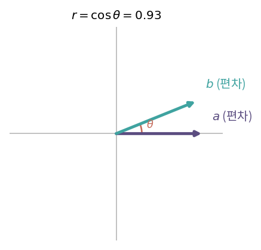
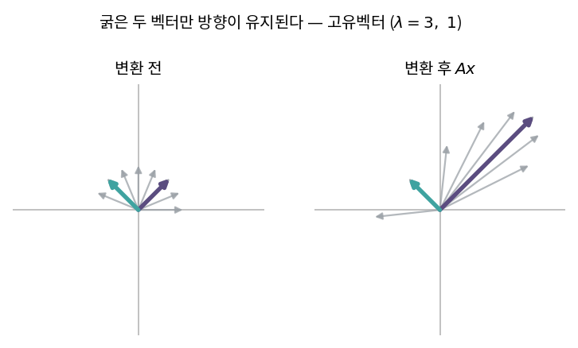

::: {.callout-note collapse="true"}
## 🎯 학습목표

- 상관계수를 중심화한 벡터의 코사인으로 해석
- 고유값·고유벡터를 정의하고 특성방정식으로 계산
- 고유공간을 영공간으로 읽기
- 고윳값과 trace·det의 관계 서술
- ⚠️ 고유벡터의 직교성이 **언제** 성립하는지 정확히 말하기
- $A^k$의 거동을 최대 고윳값으로 예측
:::

> 🤔 **출발 질문**
>
> 상관계수는 왜 하필 코사인의 모양을 하고 있는가?

------------------------------------------------------------------------

## 1. 상관계수는 벡터의 내적이다 {#s1}

### 1) 공분산과 상관계수 {#s1-1}

- 데이터 $n$쌍 $(x_i, y_i)$
- **공분산** … 편차 곱의 평균
  $$\text{Cov}(X,Y) = \frac{1}{n}\sum_{i=1}^{n}(x_i-\bar{x})(y_i-\bar{y})$$
- **상관계수** … 공분산을 두 표준편차로 나눈 것 (표준화)
  $$r = \frac{\text{Cov}(X,Y)}{\sigma_X \sigma_Y}$$

### 2) 내적으로 다시 읽기 {#s1-2}

- 편차 벡터를 정의 … $a_i = x_i - \bar{x}$, $b_i = y_i - \bar{y}$
- 그러면
  $$\text{Cov} = \frac{a^\top b}{n}, \qquad \sigma_X = \frac{\lVert a\rVert}{\sqrt{n}}, \qquad \sigma_Y = \frac{\lVert b\rVert}{\sqrt{n}}$$
- 대입하면 $n$이 전부 약분됨
  $$\boxed{r = \frac{a^\top b}{\lVert a\rVert \lVert b\rVert} = \cos\theta}$$
- ⟹ **상관계수 = 중심화한 두 벡터 사이 각도의 코사인** (🔗[3장](03_inner_product.qmd))

### 3) 읽는 법 {#s1-3}

- 내적의 의미 … "$a$의 변화를 $b$가 얼마나 설명해 주는가"
  - 길이로 나눴으므로 크기는 빠지고 **방향의 일치도만** 남음

| $r$ | $\theta$ | 의미 |
|---|---|---|
| $1$ | $0°$ | 편차 벡터가 같은 방향 … 완전한 양의 상관 |
| $0$ | $90°$ | **직교** … 선형관계 없음 |
| $-1$ | $180°$ | 반대 방향 |

- $-1 \le r \le 1$인 이유 … 코시-슈바르츠 부등식 (🔗[3장](03_inner_product.qmd))
- ⚠️ 여기서 벡터가 사는 공간은 **$n$차원(샘플이 축)**
  - 두 유전자의 상관을 볼 때, 벡터의 성분은 샘플

{fig-align="center" width="48%"}

  - 산점도에서 보는 2차원 그림과는 다른 공간

------------------------------------------------------------------------

## 2. 고유값과 고유벡터 {#s2}

### 1) 정의 {#s2-1}

$$Ax = \lambda x, \qquad x \neq 0$$

- 변환 $A$를 가해도 **방향이 유지되고 크기만 변하는** 벡터 $x$ = **고유벡터**
- 그 배율 $\lambda$ = **고유값**
- 🔗[2장](02_linear_transformation.qmd) 변환 갤러리로 확인

| 변환 | 고유벡터 | 고유값 |
|---|---|---|
| 확대 $kI$ | 모든 벡터 | $k$ (중복) |
| $x$축 사영 | $(1,0)$ / $(0,1)$ | $1$ / $0$ |
| 전단 $\begin{bmatrix}1&1\\0&1\end{bmatrix}$ | $(1,0)$뿐 | $1$ (중근) |
| 회전 $R_\theta$ | **실수 고유벡터 없음** | 복소수 → §5 |

- 사영의 $\lambda=0$ … 고유벡터가 영공간에 있다는 뜻 (🔗[4장](04_subspaces.qmd))

{fig-align="center" width="88%"}


### 2) 특성방정식 {#s2-2}

- 식을 옮기면
  $$(A-\lambda I)x = 0$$
- $x \neq 0$인 해(비자명해)가 있어야 함
  - ⟺ $A-\lambda I$의 영공간이 $\{0\}$보다 큼
  - ⟺ $A-\lambda I$가 **특이행렬**
  - ⟺ $\det(A-\lambda I) = 0$ (🔗[6장](06_determinant.qmd))

$$\boxed{\det(A-\lambda I)=0} \qquad \text{← 특성방정식}$$

- 풀이 순서
  - ① 특성방정식으로 $\lambda$를 구함 ($n$차 다항식 → 근 $n$개)
  - ② 각 $\lambda$에 대해 $(A-\lambda I)x=0$을 풀어 $x$를 구함 (🔗[7장](07_gauss_elimination.qmd))

### 3) 고유공간 {#s2-3}

- 고유값 $\lambda$에 대응하는 고유벡터들 + 영벡터 = **고유공간**
  $$E_\lambda = N(A-\lambda I)$$
- 부분공간이므로 상수배해도 여전히 고유벡터
  - ⟹ 고유벡터는 **방향만 정해지고 길이는 임의**
  - 보통 길이 1로 정규화해서 씀

------------------------------------------------------------------------

## 3. 성질 {#s3}

| 성질 | 식 | 어디서 왔나 |
|---|---|---|
| 합 | $\sum_i \lambda_i = \text{tr}(A)$ | 특성다항식의 계수 |
| 곱 | $\prod_i \lambda_i = \det(A)$ | 고유벡터가 만드는 부피 (🔗[6장](06_determinant.qmd)) |
| 가역성 | $\lambda=0$이 있음 ⟺ $\det=0$ ⟺ 특이 | 위 두 줄의 결합 |
| 닮음 불변 | $P^{-1}AP$의 고유값은 $A$와 동일 | 🔗[5장](05_change_of_basis.qmd) |
| 거듭제곱 | $A^k$의 고유값은 $\lambda^k$ | $A^2x = A(\lambda x) = \lambda^2 x$ |
| 역행렬 | $A^{-1}$의 고유값은 $1/\lambda$ | 같은 방식 |

- 첫 두 줄은 **검산에 유용**
  - 계산한 고유값들을 더해 trace와, 곱해 det와 비교

::: {.callout-important}
## ⚠️ "고유벡터는 항상 직교한다"는 대칭행렬에서만 참

- **반례** … $A=\begin{bmatrix}1&1\\0&2\end{bmatrix}$
  - $\lambda=1$ → 고유벡터 $(1,0)$
  - $\lambda=2$ → 고유벡터 $(1,1)$
  - 내적 $= 1 \neq 0$ ⟹ **직교하지 않음**
- 대칭행렬 $A=A^\top$에서는 참 … 그 이유는 🔗[12장](12_evd.qmd) 스펙트럼 정리
- 다행히 실무에서 마주치는 행렬 상당수가 대칭
  - 공분산행렬, 상관행렬, $X^\top X$, 그래프 라플라시안
- ⚠️ 그렇다고 일반 행렬에까지 적용하면 안 됨

*(원자료 `S_M_1_선형대수_3` 문서의 「고유값과 고유벡터 · 특성」 항목을 이렇게 정정합니다.)*
:::

------------------------------------------------------------------------

## 4. (선택) 복소 고윳값 {#s4}

- 회전행렬 $R_\theta=\begin{bmatrix}\cos\theta&-\sin\theta\\\sin\theta&\cos\theta\end{bmatrix}$의 특성방정식
  $$\lambda^2 - 2\cos\theta\,\lambda + 1 = 0 \quad\Longrightarrow\quad \lambda = e^{\pm i\theta}$$
- 기하학적으로 당연 … 회전은 **어떤 방향도 유지하지 않음**
- 복소 고윳값이 담고 있는 정보
  - 크기 $\lvert\lambda\rvert = 1$ … 길이 보존
  - 편각 $\theta$ … 회전각
- ⟹ 복소 고윳값이 켤레쌍으로 나오면 그 변환에 **회전이 숨어 있다**는 신호

------------------------------------------------------------------------

## 5. ＋ 거듭제곱 $A^k$와 동적 시스템 {#s5}

### 1) 왜 고유값이 장기 거동을 지배하는가 {#s5-1}

- $x_0$를 고유벡터로 전개 … $x_0 = c_1v_1 + \cdots + c_nv_n$
- $k$번 적용하면
  $$A^kx_0 = c_1\lambda_1^k v_1 + \cdots + c_n\lambda_n^k v_n$$
- $\lvert\lambda_1\rvert > \lvert\lambda_2\rvert > \cdots$이면 $k$가 커질수록 **첫 항이 압도**
- ⟹ 시스템의 장기 상태는 **최대 고윳값의 고유벡터 방향**

| $\lvert\lambda_{\max}\rvert$ | 장기 거동 |
|---|---|
| $<1$ | 0으로 수렴 |
| $=1$ | 정상상태로 수렴 |
| $>1$ | 발산 |

### 2) 마르코프 연쇄 {#s5-2}

- 전이행렬 $P$ … 각 열의 합이 1
- 항상 $\lambda=1$인 고유값을 가짐
  - 그 고유벡터(정규화한 것)가 **정상분포**
- $\pi = P\pi$ … 더 이상 변하지 않는 상태
- **PageRank** … 웹 링크 전이행렬의 주고유벡터가 곧 페이지 중요도

### 3) ＋ 멱반복법 {#s5-3}

- ⚠️ 특성방정식은 $n \ge 5$부터 **대수적으로 풀 수 없음** (아벨-루피니)
  - ⟹ 실제 고유값 계산은 다항식을 풀지 않음
- **멱반복법**(power iteration)
  $$x_{k+1} = \frac{Ax_k}{\lVert Ax_k\rVert}$$
  - §5-1의 논리 그대로 … 최대 고유벡터로 수렴
  - 수렴 속도 $\propto \lvert\lambda_2/\lambda_1\rvert$ … 1·2등이 비슷하면 느림
- 행렬-벡터 곱만 쓰므로 **희소행렬에 이상적** (🔗[2장](02_linear_transformation.qmd))
  - 상위 몇 개만 필요한 대규모 문제의 기본 전략 → 🔗[15장](15_svd.qmd)
- 전체 고유값이 필요하면 QR 알고리즘 → 🔗[14장](14_qr.qmd)

::: {.callout-tip collapse="true"}
## 계산 확인

::: {.panel-tabset}
## R

```{r}
# 상관계수 = 중심화한 벡터의 코사인
set.seed(1)
x <- rnorm(20); y <- 0.7 * x + rnorm(20, sd = 0.7)
a <- x - mean(x); b <- y - mean(y)
c(cor = cor(x, y),
  cosine = sum(a * b) / (sqrt(sum(a^2)) * sqrt(sum(b^2))))

# 비대칭 행렬 — 고유벡터가 직교하지 않음
A <- matrix(c(1, 0, 1, 2), nrow = 2)     # [[1,1],[0,2]]
e <- eigen(A); e$vectors
crossprod(e$vectors)[1, 2]               # 0이 아님

# 대칭 행렬 — 직교
S <- crossprod(matrix(rnorm(9), 3))
es <- eigen(S, symmetric = TRUE)
round(crossprod(es$vectors), 10)         # 단위행렬

# 검산 — 합은 trace, 곱은 det
c(sum(es$values), sum(diag(S)))
c(prod(es$values), det(S))

# 멱반복법
v <- rnorm(3)
for (i in 1:100) v <- (S %*% v) / sqrt(sum((S %*% v)^2))
c(power = as.vector(t(v) %*% S %*% v), eigen = max(es$values))
```

## Python

```{python}
import numpy as np
rng = np.random.default_rng(1)

x = rng.normal(size=20); y = 0.7*x + rng.normal(size=20, scale=0.7)
a, b = x - x.mean(), y - y.mean()
np.corrcoef(x, y)[0,1], a @ b / (np.linalg.norm(a)*np.linalg.norm(b))

A = np.array([[1,1],[0,2]])
w, V = np.linalg.eig(A); V, V[:,0] @ V[:,1]     # 직교 아님

M = rng.normal(size=(3,3)); S = M.T @ M
w, Q = np.linalg.eigh(S)
np.round(Q.T @ Q, 10)                            # 직교
w.sum(), np.trace(S)
```
:::
:::

------------------------------------------------------------------------

::: {.callout-important collapse="true"}
## 🧬 생물정보학에서는 — 그래프도 행렬이다

- 세포를 노드로 보는 순간 선형대수가 다시 등장
  - **인접행렬** $A$ … $a_{ij}=1$이면 두 세포가 이웃
  - **차수행렬** $D$ … 대각에 각 노드의 이웃 수
  - **그래프 라플라시안** $L = D - A$

- scRNA-seq의 kNN 그래프
  - PCA 공간에서 각 세포의 최근접 이웃 $k$개를 연결
  - Seurat `FindNeighbors`가 만드는 것이 이 그래프
  - 3만 세포 × $k=20$ ⟹ 극도로 **희소**한 행렬

- 라플라시안의 성질

| 성질 | 의미 |
|---|---|
| 대칭 | 고유벡터가 직교 → 🔗[12장](12_evd.qmd) |
| 양의 준정치 | 모든 고윳값 $\ge 0$ |
| 최소 고윳값 $=0$ | 고유벡터는 상수벡터 $\mathbf{1}$ |
| 0의 **중복도** = 연결성분 개수 | 그래프가 몇 조각으로 끊어져 있는가 |

- ⟹ **고유값이 그래프의 구조를 알려 준다**
  - 0이 두 개면 완전히 분리된 두 덩어리
  - 0에 아주 가까운 고윳값이 있으면 **거의** 분리된 덩어리 → 군집
  - 이것이 🔗[13장](13_pca.qmd) 스펙트럼 군집화의 원리

- ⚠️ 계산 현실
  - 3만 × 3만 행렬의 전체 고유분해는 불가능
  - 필요한 것은 **가장 작은 쪽 몇 개**뿐 ⟹ 멱반복 계열의 반복법
  - 희소성을 살려야 가능 (🔗[2장](02_linear_transformation.qmd))
:::

------------------------------------------------------------------------

## ✅ 정리와 연습 {#s6}

### 한 줄 요약 {#s6-1}

> 상관계수는 중심화한 두 벡터의 코사인이다.
> 고유벡터는 변환해도 방향이 변하지 않는 벡터이고, 고유값은 그 배율이다.
> 특성방정식은 "$A-\lambda I$가 특이하다"는 조건일 뿐이며, 실제 계산은 반복법으로 한다.

### 체크리스트 {#s6-2}

- [ ] 상관계수를 내적으로 유도할 수 있다
- [ ] 특성방정식이 왜 $\det=0$인지 설명할 수 있다
- [ ] 고유공간을 영공간으로 쓸 수 있다
- [ ] 고유벡터가 직교하는 경우와 아닌 경우를 구분할 수 있다

### 연습문제 {#s6-3}

1. $A=\begin{bmatrix}2&1\\1&2\end{bmatrix}$의 고유값과 고유벡터를 구하고, 고유벡터가 직교함을 확인하라.
2. $A=\begin{bmatrix}1&1\\0&2\end{bmatrix}$에 대해 같은 것을 하고, 직교하지 않음을 확인하라. 두 경우의 차이는 무엇인가?
3. 1번에서 $\sum\lambda=\text{tr}(A)$, $\prod\lambda=\det(A)$를 검산하라.
4. $x$축 사영행렬의 고유값을 구하고, $\lambda=0$의 고유공간이 무엇인지 🔗[4장](04_subspaces.qmd)의 용어로 말하라.
5. 전이행렬 $P=\begin{bmatrix}0.9&0.2\\0.1&0.8\end{bmatrix}$의 정상분포를 구하라.
6. **생각해 볼 것.** 어떤 대칭행렬의 고유값이 $(5, 0.01, -3)$이다.
   - 이 행렬은 양정치인가?
   - $A^{10}$을 계산하면 어느 방향이 지배하는가?
   - 이 행렬을 역행렬로 쓰면 어느 방향이 위험한가? → 🔗[6장](06_determinant.qmd) 조건수

------------------------------------------------------------------------

## 🔗 다음 장

- [12. 고윳값 분해(EVD)와 대칭행렬](12_evd.qmd)
  - 이 장 … 고유벡터를 **찾았음**
  - 다음 장 … 그 고유벡터를 **기저로 삼으면** 무슨 일이 일어나는가 (🔗[5장](05_change_of_basis.qmd) 닮음변환의 회수)

::: {.callout-note collapse="true"}
## 참고 자료

- [고유값과 고유벡터](https://angeloyeo.github.io/2019/07/17/eigen_vector.html) — 공돌이의 수학정리노트
- [복소 고윳값과 고유벡터](https://angeloyeo.github.io/2020/11/02/complex_eigen.html) — 공돌이의 수학정리노트
:::
