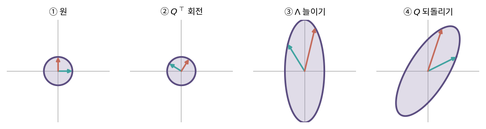
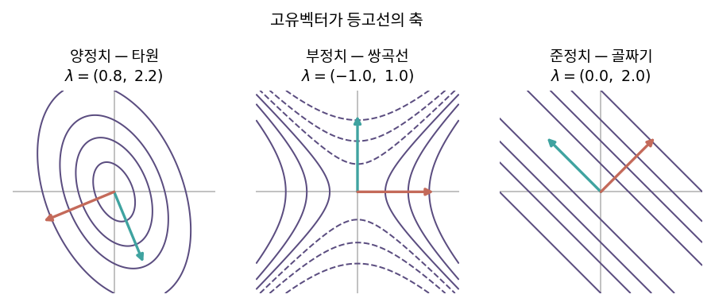

::: {.callout-note collapse="true"}
## 🎯 학습목표

- 대각화를 🔗[5장](05_change_of_basis.qmd) 닮음변환으로 설명
- $A=V\Lambda V^{-1}$를 세 단계 기하 변환으로 읽기
- 대각화가 불가능한 경우를 예로 들기
- 스펙트럼 정리를 서술하고 고유벡터 직교성을 증명
- 이차형식의 등고선으로 양정치 여부를 판단
- ⚠️ $V$가 "회전"인 것은 **대칭행렬일 때뿐**임을 설명
:::

> 🤔 **출발 질문**
>
> 행렬을 '돌리고 · 늘이고 · 되돌리기'로 쪼갤 수 있을까?

------------------------------------------------------------------------

## 1. 대각화 {#s1}

### 1) 발상 — 고유벡터를 기저로 삼으면 {#s1-1}

- 🔗[5장](05_change_of_basis.qmd) … 같은 변환을 기저 $P$에서 보면 $P^{-1}AP$
- 만약 $P$의 열을 **고유벡터**로 잡는다면?
- 고유벡터 좌표계에서 $A$가 하는 일 … 각 축을 $\lambda_i$배 하는 것뿐
  - ⟹ 대각행렬이 되어야 함

### 2) 확인 {#s1-2}

- $V = [v_1 \; v_2 \; \cdots \; v_n]$ … 고유벡터를 열로
- $AV$를 열별로 계산 (🔗[3장](03_inner_product.qmd))
  $$AV = [Av_1 \; \cdots \; Av_n] = [\lambda_1v_1 \; \cdots \; \lambda_nv_n] = V\Lambda$$
- $V$가 가역이면
  $$V^{-1}AV = \Lambda \qquad\Longleftrightarrow\qquad \boxed{A = V\Lambda V^{-1}}$$

### 3) 조건 {#s1-3}

- $V$가 가역 ⟺ **고유벡터 $n$개가 선형독립** (🔗[1장](01_vector.qmd))
- 충분조건 … 고유값이 모두 서로 다르면 고유벡터는 자동으로 선형독립
- 중복 고유값이 있으면 확인이 필요 → §3

------------------------------------------------------------------------

## 2. $A = V\Lambda V^{-1}$의 기하학 {#s2}

### 2-1) 세 단계 {#s2-1}

- 오른쪽부터 읽기 (🔗[2장](02_linear_transformation.qmd))

| 순서 | 연산 | 하는 일 |
|---|---|---|
| ① | $V^{-1}$ | 표준좌표 → **고유벡터 좌표**로 번역 |
| ② | $\Lambda$ | 각 축을 $\lambda_i$배 … 순수한 늘이기/줄이기 |
| ③ | $V$ | 다시 표준좌표로 번역 |

- ⟹ **번역 → 늘이기 → 되번역**
- 복잡해 보이던 변환이 "적절한 좌표계에서는 축별 상수배일 뿐"

### 2-2) ⚠️ "돌림"이라는 표현의 조건 {#s2-2}

- 흔히 $V$를 "회전"이라고 설명하지만 **정확하지 않음**
  - 회전이 되려면 $V$가 **직교행렬**이어야 함 (🔗[3장](03_inner_product.qmd))
  - 일반 행렬의 고유벡터는 직교하지 않음 (🔗[11장](11_eigen.qmd) ⚠️)
  - ⟹ $V$는 일반적으로 **기울어진 기저로의 변환**
- $V$가 진짜 회전이 되는 것은 **대칭행렬일 때** → §4

*(원자료 `S_M_1_선형대수_3` 문서의 "$V ≒$ 선형회전" 설명은 대칭행렬에 한해 정확합니다.)*

### 2-3) 거듭제곱이 쉬워진다 {#s2-3}

$$A^k = V\Lambda V^{-1}\cdot V\Lambda V^{-1}\cdots = V\Lambda^kV^{-1}$$

- $\Lambda^k$ … 대각 성분을 $k$제곱하면 끝
- 🔗[11장](11_eigen.qmd)에서 본 장기 거동이 여기서 식으로 정리됨
- 같은 원리로 $A^{-1} = V\Lambda^{-1}V^{-1}$, 행렬 지수 $e^A = Ve^\Lambda V^{-1}$

------------------------------------------------------------------------

## 3. ＋ 모든 행렬이 대각화되지는 않는다 {#s3}

### 3-1) 반례 {#s3-1}

- 전단행렬 $A=\begin{bmatrix}1&1\\0&1\end{bmatrix}$
  - 특성방정식 $(1-\lambda)^2=0$ ⟹ $\lambda=1$ (중근)
  - $(A-I)x=0$을 풀면 고유벡터는 $(1,0)$ **하나뿐**
- ⟹ 고유벡터가 2개 필요한데 1개 … $V$를 만들 수 없음

### 3-2) 두 가지 중복도 {#s3-2}

| 중복도 | 정의 |
|---|---|
| 대수적 중복도 | 특성방정식에서 그 근이 나타나는 횟수 |
| 기하적 중복도 | 고유공간의 차원 $= \dim N(A-\lambda I)$ |

- 항상 기하적 $\le$ 대수적
- **모든 고유값에서 둘이 같으면** 대각화 가능
- 하나라도 기하적 < 대수적이면 **결손 행렬**(defective) … 대각화 불가
- 이 경우 최선의 형태가 **조던 표준형** … 대각선 바로 위에 1이 남음 (이름만)

### 3-3) 그래서 SVD가 필요하다 {#s3-3}

- EVD의 한계
  - 정사각행렬에만 정의됨
  - 정사각이어도 대각화가 안 될 수 있음
  - $V$가 직교가 아니면 기하학적 해석이 흐려짐
- ⟹ **모든 행렬에 통하는 분해**가 필요 → 🔗[15장](15_svd.qmd)

------------------------------------------------------------------------

## 4. 대칭행렬의 EVD — 스펙트럼 정리 {#s4}

### 4-1) 서술 {#s4-1}

> 실수 대칭행렬 $A = A^\top$는 항상 대각화 가능하고, 고유값은 모두 실수이며, 고유벡터는 서로 직교하도록 고를 수 있다.

$$\boxed{A = Q\Lambda Q^\top} \qquad Q^\top Q = I$$

- $V^{-1} = V^\top$가 되므로 역행렬 계산이 **전치로 끝남** (🔗[3장](03_inner_product.qmd))

### 4-2) 직교성의 증명 {#s4-2}

- 서로 다른 고유값 $\lambda_1 \neq \lambda_2$, 고유벡터 $x_1, x_2$
- $A$가 대칭임을 이용해 같은 양을 두 가지로 계산
  $$\lambda_1 x_1^\top x_2 = (Ax_1)^\top x_2 = x_1^\top A^\top x_2 = x_1^\top Ax_2 = \lambda_2 x_1^\top x_2$$
- 정리하면
  $$(\lambda_1-\lambda_2)\,x_1^\top x_2 = 0$$
- $\lambda_1 \neq \lambda_2$이므로 $x_1^\top x_2 = 0$ ⟹ **직교** ∎

### 4-3) 이제 "돌림"이 정확해진다 {#s4-3}

- $Q$가 직교행렬 ⟹ 길이와 각도를 보존 ⟹ **진짜 회전(또는 반사)**
- ⟹ $A = Q\Lambda Q^\top$의 세 단계

| 순서 | 연산 | 하는 일 |
|---|---|---|
| ① $Q^\top$ | 회전 | 고유벡터 축에 맞춰 돌림 |
| ② $\Lambda$ | 상수배 | 각 축을 $\lambda_i$배 |
| ③ $Q$ | 회전 | 원래 방향으로 되돌림 |

- §2-2에서 미뤄둔 "돌리고 늘이고 되돌리기"가 **여기서 문자 그대로 참**

{fig-align="center" width="100%"}


### 4-4) 실무에서 만나는 대칭행렬 {#s4-4}

- 공분산행렬·상관행렬 (🔗[13장](13_pca.qmd))
- $X^\top X$, $XX^\top$ (🔗[9장](09_least_squares.qmd))
- 그래프 라플라시안 (🔗[11장](11_eigen.qmd))
- 헤시안 (🔗[17장](17_matrix_calculus.qmd))
- 거리·커널 행렬
- ⟹ 데이터 분석에서 고유분해를 쓰는 거의 모든 자리가 대칭
  - R `eigen(A, symmetric=TRUE)`, Python `np.linalg.eigh` … 더 빠르고 안정적

------------------------------------------------------------------------

## 5. 고유분해 성질 총정리 {#s5}

| 성질 | 조건 |
|---|---|
| 고유값-고유벡터 쌍이 $n$개 | $n\times n$ 행렬 (중복 포함) |
| $\text{tr}(A)=\sum\lambda_i$, $\det(A)=\prod\lambda_i$ | 항상 |
| 고유값이 실수 + 고유벡터 직교 | **대칭** |
| 양정치 ⟺ 모든 $\lambda_i > 0$ | 대칭 |
| 양의 준정치 ⟺ 모든 $\lambda_i \ge 0$ | 대칭 |
| 양정치 ⟹ $A^{-1}$ 존재 | $\det=\prod\lambda_i>0$ |
| $X^\top X$의 고유값 $\ge 0$ | 항상 … $x^\top X^\top Xx=\lVert Xx\rVert^2\ge0$ |
| $X$가 full rank ⟺ $X^\top X$ 가역 | 🔗[4장](04_subspaces.qmd) |

- 마지막 두 줄이 🔗[9장](09_least_squares.qmd) 정규방정식과 🔗[8장](08_lu_cholesky.qmd) 숄레스키의 근거

------------------------------------------------------------------------

## 6. ＋ 이차형식과 등고선 타원 {#s6}

### 6-1) 이차형식 {#s6-1}

$$q(x) = x^\top A x \qquad (A = A^\top)$$

- 대칭 부분만 기여하므로 $A$를 대칭으로 두어도 일반성을 잃지 않음
- 예: $q(x,y)=2x^2+2xy+3y^2$ ⟹ $A=\begin{bmatrix}2&1\\1&3\end{bmatrix}$

### 6-2) 고유벡터 좌표에서 보면 {#s6-2}

- $A=Q\Lambda Q^\top$을 대입하고 $y = Q^\top x$로 두면
  $$q(x) = x^\top Q\Lambda Q^\top x = y^\top \Lambda y = \sum_i \lambda_i y_i^2$$
- ⟹ **교차항이 사라짐.** 축을 돌렸더니 순수한 제곱합
- 등고선 $q=c$의 모양
  - 축 방향 = **고유벡터**
  - 축 반지름 $\propto 1/\sqrt{\lambda_i}$ … 고유값이 클수록 **좁은** 축

### 6-3) 분류 {#s6-3}

| 고유값 | 이름 | 등고선 | 임계점 |
|---|---|---|---|
| 모두 $>0$ | 양정치 | 타원 (그릇) | 최솟값 |
| 모두 $\ge 0$, 0 포함 | 양의 준정치 | 평평한 방향이 있는 골짜기 | 최솟값이 유일하지 않음 |
| 부호가 섞임 | 부정치 | 쌍곡선 (말안장) | 안장점 |
| 모두 $<0$ | 음정치 | 뒤집힌 그릇 | 최댓값 |

- 회수와 예고
  - 🔗[9장](09_least_squares.qmd) 비용함수가 그릇 모양인 이유 … $A^\top A$가 양의 준정치라서
  - 🔗[8장](08_lu_cholesky.qmd) 숄레스키가 되는 조건이 곧 양정치
  - 🔗[17장](17_matrix_calculus.qmd) 헤시안의 극값 판정이 이 표 그대로

{fig-align="center" width="100%"}


::: {.callout-tip collapse="true"}
## 계산 확인

::: {.panel-tabset}
## R

```{r}
A <- matrix(c(2, 1, 1, 3), nrow = 2)      # 대칭
e <- eigen(A, symmetric = TRUE)
Q <- e$vectors; L <- diag(e$values)

max(abs(Q %*% L %*% t(Q) - A))            # A = Q Λ Qᵀ
round(crossprod(Q), 10)                   # QᵀQ = I
e$values                                  # 둘 다 양수 → 양정치

# 거듭제곱은 대각만 제곱
max(abs(Q %*% diag(e$values^5) %*% t(Q) - A %*% A %*% A %*% A %*% A))

# 이차형식의 등고선
g <- expand.grid(x = seq(-3, 3, 0.05), y = seq(-3, 3, 0.05))
q <- with(g, 2*x^2 + 2*x*y + 3*y^2)
contour(unique(g$x), unique(g$y), matrix(q, 121), asp = 1,
        levels = c(1, 4, 9), drawlabels = FALSE, col = "#5B4D80")
arrows(0, 0, Q[1, ] * 2, Q[2, ] * 2, col = "grey40", length = 0.1)  # 고유벡터 = 타원의 축

# 결손 행렬 — 대각화 불가
B <- matrix(c(1, 0, 1, 1), nrow = 2)      # [[1,1],[0,1]]
eigen(B)$vectors                          # 두 열이 사실상 같은 방향
qr(eigen(B)$vectors)$rank                 # 1 → V가 가역이 아님
```

## Python

```{python}
import numpy as np

A = np.array([[2.,1.],[1.,3.]])
w, Q = np.linalg.eigh(A)                  # 대칭 전용 — 더 안정적
np.allclose(Q @ np.diag(w) @ Q.T, A)
np.allclose(Q.T @ Q, np.eye(2))
w                                          # 양정치

np.allclose(Q @ np.diag(w**5) @ Q.T, np.linalg.matrix_power(A, 5))

B = np.array([[1.,1.],[0.,1.]])
wB, VB = np.linalg.eig(B)
np.linalg.matrix_rank(VB)                  # 1 → 결손
```
:::
:::

::: {.callout-important}
## ⚠️ 흔한 오해

- **"$V$는 회전행렬이다"**
  - 대칭행렬일 때만. 일반 행렬의 $V$는 기울어진 기저
- **"고유값이 중복되면 대각화가 안 된다"**
  - 중복 자체는 문제가 아님 … $kI$는 고유값이 전부 같아도 이미 대각
  - 문제는 **고유벡터가 모자란 경우**
- **"`eigen()`이 준 고유벡터는 유일하다"**
  - 부호와 크기는 임의 (🔗[11장](11_eigen.qmd)). 중복 고유값이면 방향도 임의
  - ⟹ 실행할 때마다, 언어마다 다를 수 있음 → 🔗[13장](13_pca.qmd)
- **"양정치 판정은 고유값을 다 구해야 한다"**
  - `chol()`이 성공하는지 보는 편이 훨씬 빠름 (🔗[8장](08_lu_cholesky.qmd))
:::

------------------------------------------------------------------------

::: {.callout-important collapse="true"}
## 🧬 생물정보학에서는 — 마할라노비스 거리

- 문제 … "이 샘플이 평균에서 얼마나 떨어져 있는가"
  - 유클리드 거리는 **모든 방향을 동등하게** 취급
  - 그런데 데이터가 특정 방향으로 길게 퍼져 있다면? 그 방향의 3만큼과 좁은 방향의 3은 다른 의미

- **마할라노비스 거리**
  $$d^2(x) = (x-\mu)^\top \Sigma^{-1} (x-\mu)$$
- 고유분해로 읽기 … $\Sigma = Q\Lambda Q^\top$이면 $\Sigma^{-1} = Q\Lambda^{-1}Q^\top$
  $$d^2 = \lVert \Lambda^{-1/2}Q^\top(x-\mu) \rVert^2$$
  - ① $Q^\top$ … 고유벡터 축으로 회전
  - ② $\Lambda^{-1/2}$ … 각 축을 표준편차로 나눔
  - ③ 그다음 보통의 유클리드 거리
- ⟹ **타원 등고선을 원으로 펴고 나서 재는 거리** = 분산 단위로 재는 거리
  - 1차원이면 $\lvert x-\mu\rvert/\sigma$ … z-score와 정확히 같음
  - §6의 이차형식 등고선이 그대로 거리의 등고선

- 쓰이는 자리
  - PC 공간에서 QC 이상치 탐지 … 상위 몇 개 PC로 $\Sigma$를 잡음
  - 배치·그룹 사이의 거리 비교
  - 세포 유형 할당의 거리 기준

- ⚠️ $\Sigma^{-1}$이 늘 존재하지는 않음
  - $p > n$이면 $\Sigma$는 rank 부족 ⟹ 고유값 0 ⟹ 역행렬 없음 (🔗[10장](10_pseudo_inverse.qmd))
  - 대응 … 상위 PC 몇 개만 쓰기 / 축소추정(shrinkage) / 대각에 작은 값 더하기(🔗[9장](09_least_squares.qmd) ridge)
  - 작은 고유값 방향이 거리를 **지배**하므로, 잡음 방향을 그대로 두면 거리 자체가 잡음이 됨
:::

------------------------------------------------------------------------

## ✅ 정리와 연습 {#s7}

### 한 줄 요약 {#s7-1}

> 고유벡터를 기저로 삼으면 행렬은 대각행렬이 된다 — 그것이 대각화다.
> 대칭행렬에서는 그 기저가 직교이므로 "회전 · 늘이기 · 되돌리기"가 문자 그대로 성립하고,
> 고유값의 부호가 이차형식의 모양을 결정한다.

### 체크리스트 {#s7-2}

- [ ] $AV=V\Lambda$에서 $A=V\Lambda V^{-1}$을 유도할 수 있다
- [ ] 대각화 가능 조건을 중복도로 말할 수 있다
- [ ] 대칭행렬 고유벡터의 직교성을 증명할 수 있다
- [ ] 고유값 부호로 등고선 모양을 말할 수 있다

### 연습문제 {#s7-3}

1. $A=\begin{bmatrix}3&1\\1&3\end{bmatrix}$을 $Q\Lambda Q^\top$로 분해하라.
2. 1번 결과로 $A^{5}$를 구하라. 직접 곱한 것과 비교하라.
3. $A=\begin{bmatrix}2&1\\0&2\end{bmatrix}$의 대수적·기하적 중복도를 구하고 대각화 가능 여부를 판정하라.
4. $q(x,y)=x^2+4xy+y^2$의 행렬을 쓰고 고유값을 구하라. 등고선은 어떤 모양인가?
5. 양정치 행렬의 역행렬도 양정치임을 고유값으로 보여라.
6. **생각해 볼 것.** 공분산행렬의 고유값이 $(100, 1, 0.01)$이다.
   - 데이터는 어떤 모양으로 퍼져 있는가?
   - 마할라노비스 거리에서 어느 방향의 차이가 가장 크게 반영되는가?
   - 이 방향이 측정 잡음이라면 어떤 문제가 생기는가?

------------------------------------------------------------------------

## 🔗 다음 장

- [13. 주성분분석(PCA)](13_pca.qmd)
  - 이 장 … 대칭행렬을 **분해**했음
  - 다음 장 … 그 대칭행렬이 **공분산행렬**일 때 분해가 무엇을 뜻하는가

::: {.callout-note collapse="true"}
## 참고 자료

- [고윳값 분해](https://angeloyeo.github.io/2020/11/19/eigen_decomposition.html) — 공돌이의 수학정리노트
- [마할라노비스 거리](https://angeloyeo.github.io/2022/09/28/Mahalanobis_distance.html) — 공돌이의 수학정리노트
:::
