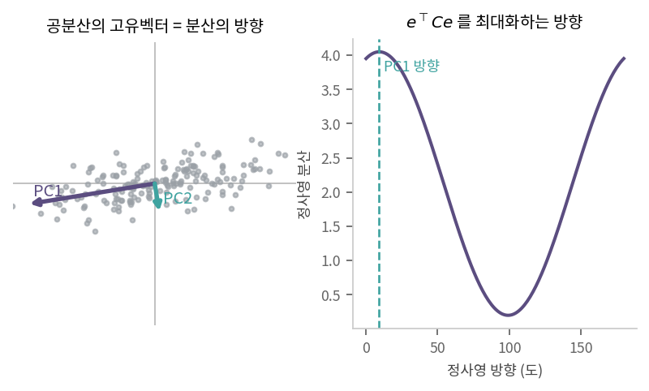
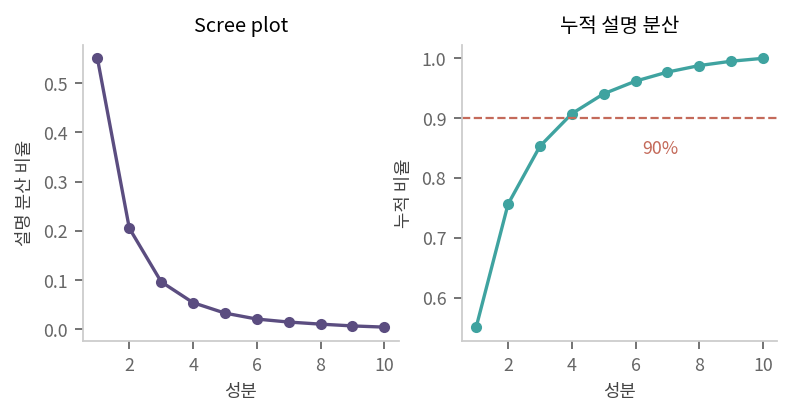
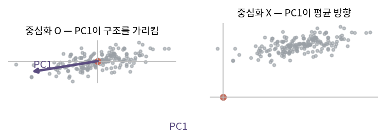

::: {.callout-note collapse="true"}
## 🎯 학습목표

- PCA를 "정사영 벡터 고르기" 문제로 정식화
- 공분산행렬을 내적으로 읽기
- 분산 최대화에서 고유벡터가 나오는 과정을 라그랑주 승수법으로 유도
- Scree plot을 읽고 성분 개수를 정하기
- ⚠️ 중심화·스케일링·부호 문제를 설명
- ⚠️ "분산이 큰 방향 = 신호"라는 가정이 깨지는 경우를 알기
:::

> 🤔 **출발 질문**
>
> 국어 점수와 영어 점수를 '잘' 섞어 종합점수를 만든다면, 그 비율은 어떻게 정하는가?

------------------------------------------------------------------------

## 1. 종합점수 만들기 {#s1}

- 두 점수를 하나로 요약하는 방법은 무수히 많음
  - 단순 평균 … $(x_1+x_2)/2$
  - 가중 평균 … $0.7x_1 + 0.3x_2$
- 일반화하면 … 단위벡터 $e$에 **정사영**한 값 (🔗[3장](03_inner_product.qmd))
  $$z = x^\top e, \qquad \lVert e\rVert = 1$$
- ⟹ 질문은 **"어떤 $e$를 고를 것인가"**로 바뀜

- 좋은 $e$의 기준
  - 정사영해도 **원래 데이터의 구조가 최대한 남는 방향**
  - 두 사람의 점수가 원래 달랐다면 종합점수도 달라야 함
  - ⟹ 정사영한 값들이 **최대한 퍼져 있어야** 함 = 분산 최대

> 차원을 줄이면서 정보를 지키는 문제는 "어느 방향으로 눌러야 덜 겹치는가"의 문제다.

------------------------------------------------------------------------

## 2. 공분산행렬 {#s2}

### 1) 정의 {#s2-1}

- 데이터 행렬 $X$ … 행 = 샘플($n$), 열 = feature($p$)
- **중심화** … 각 열에서 그 열의 평균을 뺌 ⟹ 모든 feature의 평균이 0
- 공분산행렬
  $$C = \frac{1}{n}X^\top X \qquad (p \times p)$$

### 2) 원소가 뜻하는 것 {#s2-2}

- $(i,j)$ 원소 = feature $i$와 $j$의 편차 벡터의 **내적을 $n$으로 나눈 것** (🔗[3장](03_inner_product.qmd) 시각 ①)
  $$C_{ij} = \frac{1}{n}\,a_i^\top a_j = \text{Cov}(i, j)$$
  - 대각 원소 $C_{ii} = \sigma_i^2$ … 각 feature의 분산
- ⟹ **"각 feature의 변동이 얼마나 닮았는가"**를 모아 놓은 표 (🔗[11장](11_eigen.qmd))
- $n$ vs $n-1$ … 모집단이면 $n$, 표본이면 $n-1$. $n$이 크면 차이 없음

### 3) 구조 {#s2-3}

- $C$는 **대칭** ⟹ 고유벡터가 직교 (🔗[12장](12_evd.qmd) 스펙트럼 정리)
- $C$는 **양의 준정치** ⟹ 모든 고유값 $\ge 0$
  - $e^\top C e = \frac{1}{n}\lVert Xe\rVert^2 \ge 0$
- ⟹ $C = Q\Lambda Q^\top$로 분해 가능하고, $\Lambda$는 음수가 없음

### 4) 기하학적 의미 {#s2-4}

| 대상 | 의미 |
|---|---|
| 고유벡터 $q_i$ | 데이터가 퍼진 **방향** |
| 고유값 $\lambda_i$ | 그 방향으로 퍼진 **정도**(분산) |
| 고유값 순 정렬 | 중요한 순서로 방향이 정렬됨 |

- 🔗[12장](12_evd.qmd)의 이차형식 등고선이 곧 데이터 구름의 타원

------------------------------------------------------------------------

## 3. PCA — 분산을 최대로 {#s3}

### 1) 정사영한 데이터의 분산 {#s3-1}

- 단위벡터 $e$에 정사영한 값들 … $z = Xe$ ($n \times 1$)
- 중심화되어 있으므로 $z$의 평균도 0
  $$\text{Var}(z) = \frac{1}{n}z^\top z = \frac{1}{n}(Xe)^\top(Xe) = e^\top \underbrace{\left(\tfrac{1}{n}X^\top X\right)}_{C} e = e^\top C e$$
- ⟹ **정사영 분산 = 이차형식** (🔗[12장](12_evd.qmd))

### 2) 최적화 문제 {#s3-2}

$$\max_e\; e^\top C e \quad \text{subject to}\quad e^\top e = 1$$

- 제약이 없으면 $e$를 무한히 키워 분산도 무한 ⟹ 길이 1로 고정해야 의미가 생김

### 3) 라그랑주 승수법 {#s3-3}

- 라그랑주 함수
  $$L(e,\lambda) = e^\top C e - \lambda(e^\top e - 1)$$
- $e$로 미분 (행렬미분은 🔗[17장](17_matrix_calculus.qmd))
  $$\frac{\partial L}{\partial e} = 2Ce - 2\lambda e = 0 \quad\Longrightarrow\quad \boxed{Ce = \lambda e}$$
- ⟹ **답은 공분산행렬의 고유벡터**
- 그때 분산 값은
  $$e^\top Ce = e^\top(\lambda e) = \lambda$$
  - ⟹ **고유값이 곧 그 방향의 분산**

### 4) 두 번째 이후의 성분 {#s3-4}

- 두 번째 축의 조건 … 첫 번째와 **직교**하면서 분산이 최대
- 답 … 두 번째로 큰 고유값의 고유벡터
- 대칭행렬이므로 직교성은 자동 (🔗[12장](12_evd.qmd))

{fig-align="center" width="92%"}

- ⟹ **PCA = 공분산행렬의 고윳값 분해**
  - 주성분(principal component) = 고유벡터
  - 점수(score) = $XQ$ … 새 좌표 (🔗[5장](05_change_of_basis.qmd))
  - loading = 고유벡터의 성분 … 각 유전자가 그 축에 기여한 정도

------------------------------------------------------------------------

## 4. Scree plot {#s4}

- 전체 분산 = 고유값의 합 (🔗[12장](12_evd.qmd) trace)
  $$\sum_i \sigma_i^2 = \text{tr}(C) = \sum_i \lambda_i$$
- **설명 분산 비율** … $\lambda_i / \sum_j \lambda_j$
- Scree plot … 고유값을 큰 순서로 찍은 그림
  - 급격히 떨어지다 완만해지는 지점(elbow)까지 채택
  - 또는 누적 비율 80–90%까지
- ⚠️ 실제 데이터에서는 **뚜렷한 elbow가 없는 경우가 더 많음**
  - 결국 판단이 들어감 ⟹ 개수를 바꿔 보고 결과가 얼마나 달라지는지 확인할 것

{fig-align="center" width="88%"}


------------------------------------------------------------------------

## 5. ＋ 실무 주의점 {#s5}

### 1) 중심화는 필수 {#s5-1}

- 중심화하지 않으면 $\frac{1}{n}X^\top X$는 공분산이 아니라 **2차 적률**
- 첫 성분이 데이터의 **평균 방향**을 가리켜 버림
  - 모든 값이 양수인 발현 데이터에서 특히 치명적
- ⟹ `prcomp(center = TRUE)`가 기본인 이유

{fig-align="center" width="88%"}


### 2) 스케일링은 선택 {#s5-2}

| | 대상 행렬 | 언제 |
|---|---|---|
| 스케일링 없음 | 공분산행렬 | 모든 feature의 단위가 같을 때 |
| 스케일링 함 | **상관행렬** | 단위가 다를 때 (키와 몸무게, 나이와 발현량) |

- 스케일링하면 모든 feature의 분산이 1 ⟹ 공분산행렬 = 상관행렬
- ⚠️ 스케일링은 **분산이 작은 feature를 증폭**시킴
  - 거의 발현되지 않는 유전자의 잡음이 큰 목소리를 냄

### 3) 부호는 불확정 {#s5-3}

- $q$가 고유벡터면 $-q$도 고유벡터 (🔗[11장](11_eigen.qmd))
- ⟹ PC 플롯이 좌우/상하로 뒤집혀도 **정상**
  - 같은 코드를 다른 버전·다른 언어에서 돌리면 뒤집힐 수 있음
  - 논문 그림을 재현할 때 자주 겪는 일

::: {.callout-important}
## ⚠️ 흔한 오해

- **"PC1은 가장 중요한 생물학적 축이다"**
  - PC1은 **분산이 가장 큰 축**일 뿐
  - 배치 효과·라이브러리 크기·세포 주기가 PC1을 차지하는 일이 흔함
  - ⟹ PC를 해석하기 전에 메타데이터와의 상관을 반드시 확인
- **"PCA는 회귀직선을 찾는 것과 비슷하다"**
  - 회귀는 $y$ 방향 거리, PCA는 **직교거리**를 최소화 (🔗[9장](09_least_squares.qmd))
  - ⟹ 두 선은 다름
- **"PCA는 항상 차원을 줄인다"**
  - PCA 자체는 회전일 뿐 (🔗[5장](05_change_of_basis.qmd)). 앞의 몇 개를 **버릴 때** 줄어듦
- **"공분산행렬을 만들어야 PCA를 할 수 있다"**
  - $p$가 크면 $p\times p$ 행렬 자체가 불가능
  - $X$를 직접 SVD하면 됨 → 🔗[15장](15_svd.qmd)
:::

::: {.callout-tip collapse="true"}
## 계산 확인

::: {.panel-tabset}
## R

```{r}
set.seed(1)
n <- 200
x1 <- rnorm(n)
X  <- cbind(x1, 0.8 * x1 + rnorm(n, sd = 0.5), rnorm(n, sd = 0.3))
Xc <- scale(X, center = TRUE, scale = FALSE)   # 중심화만

# ① 고유분해로 직접
C <- crossprod(Xc) / n
e <- eigen(C, symmetric = TRUE)
e$values                                        # 각 방향의 분산

# ② prcomp와 비교
p <- prcomp(X, center = TRUE, scale. = FALSE)
rbind(eigen = e$values, prcomp = p$sdev^2)      # sdev^2 는 n-1 기준이라 미세하게 다름

# 부호만 다를 수 있음
round(abs(e$vectors) - abs(p$rotation), 10)

# 설명 분산 비율 · 전체 분산 = trace
c(trace = sum(diag(C)), sum_eigen = sum(e$values))
round(e$values / sum(e$values), 3)

# 정사영 분산 = eᵀCe 확인
v <- e$vectors[, 1]
c(quadform = as.numeric(t(v) %*% C %*% v), eigenvalue = e$values[1])

# 중심화를 빼먹으면?
C_bad <- crossprod(X) / n
eigen(C_bad, symmetric = TRUE)$vectors[, 1]     # 평균 방향으로 끌려감
colMeans(X)
```

## Python

```{python}
import numpy as np
rng = np.random.default_rng(1)

n = 200
x1 = rng.normal(size=n)
X = np.column_stack([x1, 0.8*x1 + rng.normal(scale=0.5, size=n),
                     rng.normal(scale=0.3, size=n)])
Xc = X - X.mean(0)

C = Xc.T @ Xc / n
w, Q = np.linalg.eigh(C)
w = w[::-1]; Q = Q[:, ::-1]        # eigh는 오름차순

w                                   # 각 방향 분산
w / w.sum()                         # 설명 분산 비율
np.trace(C), w.sum()

v = Q[:, 0]
v @ C @ v, w[0]                     # 이차형식 = 고유값
```
:::
:::

------------------------------------------------------------------------

::: {.callout-important collapse="true"}
## 🧬 생물정보학에서는 — 스펙트럼 군집화

- 🔗[11장](11_eigen.qmd)에서 만든 그래프 라플라시안 $L = D - A$로 돌아옴
- **스펙트럼 군집화**의 절차
  - ① 세포 간 kNN 그래프를 만듦 (보통 PC 공간에서)
  - ② 라플라시안의 **가장 작은** 고유값 $k$개의 고유벡터를 구함
  - ③ 그 고유벡터들을 좌표로 삼아 $k$-means
- 왜 작은 쪽인가
  - 고유값 0의 중복도 = 연결성분 개수 (🔗[11장](11_eigen.qmd))
  - 0에 **가까운** 고유값 = 거의 끊어진 덩어리 ⟹ 군집 경계

- Seurat 파이프라인과의 대응

| 단계 | 이 교재의 어디 |
|---|---|
| 정규화·HVG 선택 | 전처리 |
| `RunPCA` | 이 장 (계산은 🔗[15장](15_svd.qmd) truncated SVD) |
| `FindNeighbors` | kNN·SNN 그래프 = 인접행렬 (🔗[11장](11_eigen.qmd)) |
| `FindClusters` | Louvain/Leiden … 모듈성 최적화. 스펙트럼 군집화와 사촌 |
| `RunUMAP` | 비선형 임베딩 … 선형대수 밖 (🔗[5장](05_change_of_basis.qmd) ⚠️) |

- ⚠️ **PCA 전 전처리가 결과를 지배함**
  - 정규화 방식, log 변환 여부, HVG 몇 개를 고르는가
  - 이 선택들이 공분산행렬을 바꾸고 ⟹ 고유벡터를 바꾸고 ⟹ 군집을 바꿈
- ⚠️ **PC 개수(`npcs`, `dims`)를 바꾸면 군집이 통째로 달라질 수 있음**
  - Scree plot에 elbow가 뚜렷하지 않은 것이 보통 (§4)
  - ⟹ 몇 가지 값으로 돌려 보고 안정적인 결론만 보고할 것
- ⚠️ 배치 효과가 상위 PC를 차지하면 군집 = 배치가 됨
  - PC와 메타데이터의 상관을 먼저 확인 (🔗[4장](04_subspaces.qmd) 배치 보정)
:::

------------------------------------------------------------------------

## ✅ 정리와 연습 {#s6}

### 한 줄 요약 {#s6-1}

> 정사영한 데이터의 분산은 $e^\top C e$이고, 길이 1 제약에서 이를 최대화하면 $Ce=\lambda e$가 나온다.
> 즉 주성분은 공분산행렬의 고유벡터이고, 그 방향의 분산이 고유값이다.

### 체크리스트 {#s6-2}

- [ ] 정사영 분산이 이차형식임을 보일 수 있다
- [ ] 라그랑주 승수법으로 고유벡터가 답임을 유도할 수 있다
- [ ] 설명 분산 비율을 고유값으로 계산할 수 있다
- [ ] 중심화를 빼먹으면 무엇이 잘못되는지 말할 수 있다

### 연습문제 {#s6-3}

1. $C=\begin{bmatrix}4&2\\2&3\end{bmatrix}$의 고유값·고유벡터를 구하고 PC1 방향과 그 분산을 말하라.
2. 1번에서 설명 분산 비율을 구하라.
3. $e^\top Ce$를 $e=(\cos\theta,\sin\theta)$로 두고 $\theta$에 대해 미분해 최대점을 구하라. 1번 결과와 비교하라.
4. 중심화하지 않은 데이터에 PCA를 적용하면 PC1이 어디를 가리키는지 설명하라.
5. 공분산 PCA와 상관행렬 PCA가 다른 결과를 주는 예를 하나 들라.
6. **생각해 볼 것.** scRNA-seq에서 PC1이 검출 유전자 수(nFeature)와 상관 0.9를 보인다.
   - 이것은 생물학적 발견인가?
   - 어떻게 대응하겠는가? → 🔗[4장](04_subspaces.qmd)

------------------------------------------------------------------------

## 🔗 다음 장

- [14. 그람-슈미트와 QR 분해](14_qr.qmd)
  - 이 장 … 대칭행렬의 고유벡터가 **이미 직교**라서 좋았음
  - 다음 장 … 직교하지 않은 벡터들을 **직접 직각으로 세우는** 방법

::: {.callout-note collapse="true"}
## 참고 자료

- [주성분분석(PCA)](https://angeloyeo.github.io/2019/07/27/PCA.html) — 공돌이의 수학정리노트
:::
