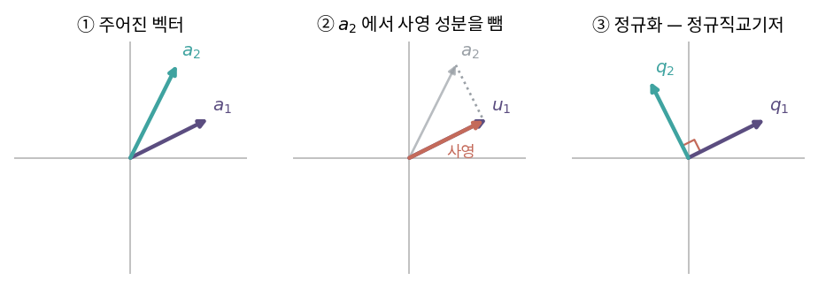

::: {.callout-note collapse="true"}
## 🎯 학습목표

- 정규직교기저의 이점을 계산으로 보이기
- 그람-슈미트 과정을 직접 수행
- QR 분해를 구하고 $R$의 원소가 어디서 오는지 설명
- 고전적 그람-슈미트의 수치 문제와 대안을 알기
- QR로 최소제곱과 고유값 계산이 어떻게 이루어지는지 서술
:::

> 🤔 **출발 질문**
>
> 아무렇게나 놓인 기저를 직각으로 세울 수 있는가?

------------------------------------------------------------------------

## 1. 왜 정규직교기저인가 {#s1}

### 1) 좌표 계산이 공짜 {#s1-1}

- 일반 기저 $B$ … 좌표를 구하려면 $c = B^{-1}v$ (🔗[5장](05_change_of_basis.qmd))
  - 연립방정식을 풀어야 함 (🔗[7장](07_gauss_elimination.qmd))
- 정규직교기저 $\{q_1,\dots,q_n\}$ … 내적 한 번
  $$v = c_1q_1+\cdots+c_nq_n \quad\Longrightarrow\quad c_i = q_i^\top v$$
- 유도 … 양변에 $q_i^\top$를 곱하면 $j \neq i$인 항은 전부 0 (🔗[3장](03_inner_product.qmd))

### 2) 그 밖의 이점 {#s1-2}

| 이점 | 근거 |
|---|---|
| 역행렬이 전치 | $Q^\top Q = I$ |
| 길이·각도 보존 | $\lVert Qx\rVert = \lVert x\rVert$ |
| 수치적으로 안정 | 조건수 $\kappa(Q)=1$ (🔗[6장](06_determinant.qmd)) |
| 사영이 간단 | 각 축 성분을 따로 계산 가능 |

- ⟹ **가능하면 직교기저로 바꿔 놓고 일한다**는 것이 수치선형대수의 기본 전략

------------------------------------------------------------------------

## 2. 그람-슈미트 과정 {#s2}

### 1) 아이디어 {#s2-1}

- 선형독립인 $\{a_1,\dots,a_k\}$가 주어짐
- 하나씩 추가하면서, **이미 만든 방향의 성분을 빼 버림**
  - 남는 것은 기존 방향들과 직교

### 2) 절차 {#s2-2}

- 사영 연산 (🔗[3장](03_inner_product.qmd)·[9장](09_least_squares.qmd))
  $$\text{proj}_u(a) = \frac{u^\top a}{u^\top u}\,u$$
- 직교화
  $$u_1 = a_1$$
  $$u_2 = a_2 - \text{proj}_{u_1}(a_2)$$
  $$u_k = a_k - \sum_{j<k}\text{proj}_{u_j}(a_k)$$
- 정규화
  $$q_i = \frac{u_i}{\lVert u_i\rVert}$$

### 3) 확인할 점 {#s2-3}

- $\text{span}\{a_1,\dots,a_k\} = \text{span}\{q_1,\dots,q_k\}$ … **생성공간은 그대로**
  - 각 단계에서 기존 벡터들의 선형결합만 빼기 때문 (🔗[1장](01_vector.qmd))
- $a_k$가 앞의 것들에 종속이면 $u_k = 0$ ⟹ 정규화 불가
  - ⟹ 과정이 멈추는 것이 곧 **선형종속의 발견**

{fig-align="center" width="100%"}


------------------------------------------------------------------------

## 3. QR 분해 {#s3}

### 1) 그람-슈미트를 행렬로 적으면 {#s3-1}

- 과정을 거꾸로 읽으면 각 $a_j$는 $q_1,\dots,q_j$의 선형결합
  $$a_j = r_{1j}q_1 + r_{2j}q_2 + \cdots + r_{jj}q_j, \qquad r_{ij} = q_i^\top a_j$$
- 열로 쌓으면
  $$\boxed{A = QR}$$
  - $Q$ … 열이 정규직교 ($m\times n$)
  - $R$ … **상삼각** ($n \times n$)

### 2) $R$이 상삼각인 이유 {#s3-2}

- $a_j$는 $q_1,\dots,q_j$까지만 씀 … $j$보다 큰 번호는 아직 만들어지지도 않았음
- ⟹ $i > j$이면 $r_{ij} = 0$
- $R$의 원소는 **그람-슈미트 과정에서 이미 계산한 내적들** … 따로 구할 필요 없음
- 대각 $r_{ii} = \lVert u_i\rVert > 0$

### 3) 존재 조건과 두 형태 {#s3-3}

- $A$의 열이 선형독립이면 존재 ($m \ge n$인 직사각도 가능)

| 형태 | $Q$ | $R$ | 용도 |
|---|---|---|---|
| reduced (thin) | $m\times n$ | $n\times n$ | 최소제곱 등 실무 대부분 |
| full | $m\times m$ | $m\times n$ | 좌영공간 기저가 필요할 때 (🔗[4장](04_subspaces.qmd)) |

------------------------------------------------------------------------

## 4. ＋ 그람-슈미트는 수치적으로 불안정하다 {#s4}

### 1) 무엇이 문제인가 {#s4-1}

- 뺄셈이 누적되면서 **직교성을 잃음**
  - 두 벡터가 거의 평행하면 $u_k = a_k - \text{proj}(a_k)$가 **거의 0** … 큰 수에서 큰 수를 빼는 상황
  - 남은 작은 값은 대부분 반올림 오차 (🔗[6장](06_determinant.qmd) 조건수)
- 결과 … 계산된 $Q$에서 $Q^\top Q$가 $I$에서 눈에 띄게 벗어남

### 2) 대안 {#s4-2}

| 방법 | 아이디어 | 안정성 |
|---|---|---|
| 고전 그람-슈미트 (CGS) | 원래 $a_k$에서 모든 사영을 한 번에 뺌 | 나쁨 |
| **수정 그람-슈미트** (MGS) | 뺄 때마다 **갱신된 벡터**에서 다음 사영을 계산 | 훨씬 좋음 |
| **하우스홀더 반사** | 직교변환으로 열의 아래쪽을 한 번에 0으로 | 가장 안정 · LAPACK 표준 |
| 기븐스 회전 | 원소 하나씩 0으로 | 희소행렬·부분 갱신에 유리 |

- MGS는 **수식이 같고 순서만 다름** … 정확한 산술에서는 동일, 부동소수점에서는 크게 다름
- ⟹ `qr()`, `np.linalg.qr()`이 실제로 쓰는 것은 하우스홀더

------------------------------------------------------------------------

## 5. ＋ QR의 쓰임 {#s5}

### 1) 최소제곱 {#s5-1}

- 🔗[9장](09_least_squares.qmd)에서 미뤄둔 것
  $$A = QR \;\Longrightarrow\; A^\top A = R^\top R \;\Longrightarrow\; R\hat{x} = Q^\top b$$
- 상삼각 방정식 하나 ⟹ back substitution (🔗[8장](08_lu_cholesky.qmd))
- $A^\top A$를 만들지 않으므로 조건수가 제곱되지 않음
- **`lm()`의 내부가 이것**

### 2) QR 알고리즘 — 고유값 계산 {#s5-2}

- 🔗[11장](11_eigen.qmd)에서 미뤄둔 "전체 고유값은 어떻게 구하는가"의 답
- 반복
  $$A_k = Q_kR_k \quad\longrightarrow\quad A_{k+1} = R_kQ_k$$
- 핵심 … 이것은 **닮음변환** (🔗[5장](05_change_of_basis.qmd))
  $$A_{k+1} = R_kQ_k = Q_k^\top(Q_kR_k)Q_k = Q_k^\top A_k Q_k$$
  - ⟹ 고유값이 보존됨
- 반복하면 $A_k$가 상삼각으로 수렴 ⟹ **대각 성분이 고유값**
- 실제 구현은 먼저 헤센베르그/삼중대각 형태로 줄이고 shift를 씀
- ⟹ `eigen()`·`np.linalg.eig`의 내부

### 3) 직교기저가 필요한 모든 곳 {#s5-3}

- 열공간의 정규직교기저 … $Q$의 열 (🔗[4장](04_subspaces.qmd))
- 사영행렬을 $QQ^\top$로 … $A(A^\top A)^{-1}A^\top$보다 안정 (🔗[9장](09_least_squares.qmd))

::: {.callout-tip collapse="true"}
## 계산 확인

::: {.panel-tabset}
## R

```{r}
# 그람-슈미트 직접 구현 (고전 vs 수정)
gs <- function(A, modified = FALSE) {
  Q <- matrix(0, nrow(A), ncol(A))
  for (j in seq_len(ncol(A))) {
    v <- A[, j]
    if (modified) {
      for (i in seq_len(j - 1)) v <- v - sum(Q[, i] * v) * Q[, i]        # 갱신된 v 사용
    } else {
      for (i in seq_len(j - 1)) v <- v - sum(Q[, i] * A[, j]) * Q[, i]   # 원래 열 사용
    }
    Q[, j] <- v / sqrt(sum(v^2))
  }
  Q
}

# 거의 평행한 열을 가진 행렬 (조건수가 큼)
set.seed(1)
A <- cbind(1, 1 + 1e-8 * rnorm(6), (1:6) / 6)

ortho_err <- function(Q) max(abs(crossprod(Q) - diag(ncol(Q))))
c(고전 = ortho_err(gs(A, FALSE)),
  수정 = ortho_err(gs(A, TRUE)),
  하우스홀더 = ortho_err(qr.Q(qr(A))))

# QR로 최소제곱 — lm과 일치
y <- rnorm(6)
qrA <- qr(A)
beta_qr <- backsolve(qr.R(qrA), t(qr.Q(qrA)) %*% y)
round(cbind(QR = beta_qr, lm = coef(lm(y ~ A[, 2] + A[, 3]))), 6)

# QR 알고리즘 — 고유값이 대각으로 모임
S <- crossprod(matrix(rnorm(16), 4))
M <- S
for (i in 1:200) { d <- qr(M); M <- qr.R(d) %*% qr.Q(d) }
rbind(QR알고리즘 = sort(diag(M)), eigen = sort(eigen(S)$values))
```

## Python

```{python}
import numpy as np
rng = np.random.default_rng(1)

A = np.column_stack([np.ones(6),
                     1 + 1e-8*rng.normal(size=6),
                     np.arange(1,7)/6])

Q, R = np.linalg.qr(A)                      # 하우스홀더
np.abs(Q.T @ Q - np.eye(3)).max()

y = rng.normal(size=6)
beta = np.linalg.solve(R, Q.T @ y)
np.allclose(beta, np.linalg.lstsq(A, y, rcond=None)[0])

M0 = rng.normal(size=(4,4)); S = M0.T @ M0
M = S.copy()
for _ in range(200):
    q, r = np.linalg.qr(M); M = r @ q
np.sort(np.diag(M)), np.sort(np.linalg.eigvalsh(S))
```
:::
:::

::: {.callout-important}
## ⚠️ 흔한 오해

- **"그람-슈미트를 코드로 옮기면 그대로 쓸 수 있다"**
  - 교육용으로는 좋지만 실무에서는 직교성을 잃음 … 하우스홀더를 쓸 것
- **"$Q$는 정사각행렬"**
  - reduced QR에서는 $m\times n$ 직사각. 이때 $Q^\top Q=I$지만 $QQ^\top \neq I$
  - $QQ^\top$는 열공간으로의 **사영행렬** (🔗[9장](09_least_squares.qmd))
- **"QR 분해는 유일하다"**
  - $R$의 대각을 양수로 고정하면 유일. 그렇지 않으면 열마다 부호가 자유
- **"QR 알고리즘과 QR 분해는 같은 말"**
  - 분해는 한 번의 연산, 알고리즘은 그 분해를 반복하는 고유값 계산법
:::

------------------------------------------------------------------------

::: {.callout-important collapse="true"}
## 🧬 생물정보학에서는 — 프로크루스테스 정렬

- 문제 … 같은 대상을 두 번 측정했는데 좌표계가 다름
  - 두 배치에서 각각 구한 PCA·UMAP 임베딩
  - 연속 절편의 공간전사체 좌표
  - 서로 다른 플랫폼의 공통 샘플

- **직교 프로크루스테스 문제**
  $$\min_{Q}\; \lVert A - BQ \rVert_F \quad \text{subject to}\quad Q^\top Q = I$$
  - 회전(과 반사)만 허용 … 모양은 건드리지 않고 **방향만** 맞춤
  - 프로베니우스 노름 (🔗[3장](03_inner_product.qmd))
- 해 … $B^\top A = U\Sigma V^\top$로 SVD하면 (🔗[15장](15_svd.qmd))
  $$Q = UV^\top$$
  - 특이값을 전부 1로 바꾼 것 … "늘이기를 버리고 회전만 남긴다"

- 왜 회전만 허용하는가
  - 직교행렬은 **점들 사이 거리를 보존** (🔗[3장](03_inner_product.qmd))
  - ⟹ 데이터 구조를 왜곡하지 않고 겹쳐 볼 수 있음
  - PC 부호가 뒤집힌 문제(🔗[13장](13_pca.qmd))도 자동으로 해결됨

- ⚠️ 주의
  - 스케일 차이가 있으면 별도 처리 (확장 프로크루스테스)
  - 두 임베딩의 **점이 대응되어야** 함 … 같은 샘플이 같은 행
  - 잘 겹쳐졌다고 해서 두 측정이 같은 생물학을 본다는 뜻은 아님
:::

------------------------------------------------------------------------

## ✅ 정리와 연습 {#s6}

### 한 줄 요약 {#s6-1}

> 그람-슈미트는 이미 만든 방향의 성분을 빼 나가며 직교기저를 만든다.
> 그 과정을 행렬로 적으면 $A=QR$이고, $R$의 원소는 과정에서 나온 내적들이다.
> 실제 계산은 수치 안정성 때문에 하우스홀더로 한다.

### 체크리스트 {#s6-2}

- [ ] 정규직교기저에서 좌표가 내적으로 나오는 이유를 유도할 수 있다
- [ ] 그람-슈미트를 3개 벡터에 대해 손으로 수행할 수 있다
- [ ] $R$이 상삼각인 이유를 설명할 수 있다
- [ ] QR로 최소제곱을 푸는 두 줄을 쓸 수 있다

### 연습문제 {#s6-3}

1. $a_1=(1,1,0)$, $a_2=(1,0,1)$에 그람-슈미트를 적용해 $q_1,q_2$를 구하라.
2. 1번의 $A=[a_1\;a_2]$에 대해 $R$을 구하고 $A=QR$을 확인하라.
3. $R$의 대각 성분이 $\lVert u_i\rVert$인 이유를 설명하라.
4. $Q$가 $m\times n$ ($m>n$)일 때 $Q^\top Q$와 $QQ^\top$가 각각 무엇인지 말하라.
5. QR 알고리즘의 한 단계가 닮음변환임을 보여라.
6. **생각해 볼 것.** 두 열이 거의 평행한 행렬에 고전 그람-슈미트를 적용했다.
   - 두 번째 단계에서 어떤 수치 문제가 생기는가?
   - 조건수와 어떻게 연결되는가? → 🔗[6장](06_determinant.qmd)

------------------------------------------------------------------------

## 🔗 다음 장

- [15. 특이값 분해(SVD)](15_svd.qmd)
  - 이 장 … **입력 쪽**에 직교기저를 세웠음
  - 다음 장 … 입력과 **출력 양쪽**에 직교기저를 세우면 무슨 일이 일어나는가

::: {.callout-note collapse="true"}
## 참고 자료

- [그람-슈미트 과정](https://angeloyeo.github.io/2020/11/23/gram_schmidt.html) — 공돌이의 수학정리노트
:::
