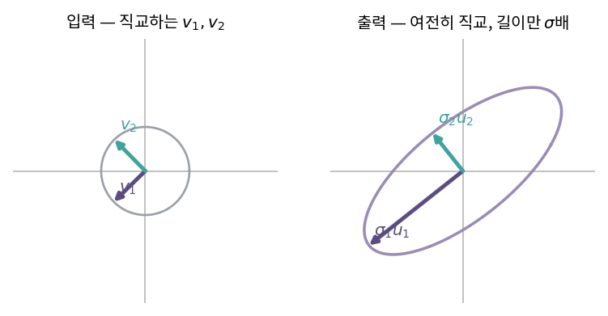
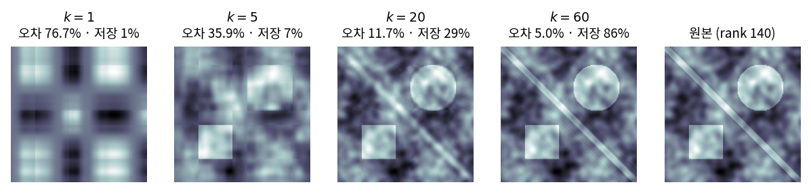

::: {.callout-note collapse="true"}
## 🎯 학습목표

- SVD를 정의하고 각 인자의 역할을 말하기
- $Av_i = \sigma_i u_i$로 기하학적 의미를 읽기
- $U,V$의 열과 네 부분공간을 연결
- 저랭크 근사가 왜 최선인지 설명
- PCA와 SVD의 관계를 식으로 보이기
- ⚠️ 대규모 데이터에서 full SVD 대신 무엇을 쓰는지 알기
:::

> 🤔 **출발 질문**
>
> 직교하는 벡터들이 선형변환 후에도 직교하게 만들 수 있을까? 정사각행렬이 아니어도?

------------------------------------------------------------------------

## 1. 정의 {#s1}

### 1) 형태 {#s1-1}

- **임의의** $A \in \mathbb{R}^{m\times n}$에 대하여
  $$\boxed{A = U\Sigma V^\top}$$

| 인자 | 크기 | 성질 |
|---|---|---|
| $U$ | $m\times m$ | 직교 … 좌특이벡터 |
| $\Sigma$ | $m\times n$ | 대각 … $\sigma_1 \ge \sigma_2 \ge \cdots \ge 0$ |
| $V$ | $n\times n$ | 직교 … 우특이벡터 |

- ⚠️ EVD와 달리 **정사각일 필요도, 대각화 가능할 필요도 없음**
  - 🔗[12장](12_evd.qmd)에서 본 결손 행렬도 SVD는 항상 존재
- reduced form … $r=\text{rank}(A)$개만 남기면 $U_r(m\times r)$, $\Sigma_r(r\times r)$, $V_r(n\times r)$

### 2) 출발 질문에 답하기 {#s1-2}

- $AV = U\Sigma$를 열별로 읽으면
  $$Av_i = \sigma_i u_i$$
- ⟹ **$v_i$들은 서로 직교하고, 변환된 $Av_i$들도 서로 직교**
  - 길이만 $\sigma_i$배로 바뀜
- 그런 입력 기저가 **항상 존재한다**는 것이 SVD의 내용

{fig-align="center" width="88%"}


------------------------------------------------------------------------

## 2. 기하학적 의미 {#s2}

### 1) 세 단계 {#s2-1}

| 순서 | 연산 | 하는 일 |
|---|---|---|
| ① $V^\top$ | 회전 | 입력을 $v$ 축에 맞춰 돌림 |
| ② $\Sigma$ | 늘이기 | 각 축을 $\sigma_i$배 · 차원도 맞춤 |
| ③ $U$ | 회전 | 출력 공간에서 $u$ 축 방향으로 돌림 |

- **회전 → 늘이기 → 회전**
- 단위원 → 타원 … 타원의 축 방향이 $u_i$, 반지름이 $\sigma_i$

### 2) EVD와의 차이 {#s2-2}

| | EVD $A=V\Lambda V^{-1}$ | SVD $A=U\Sigma V^\top$ |
|---|---|---|
| 대상 | 정사각 + 대각화 가능 | **모든 행렬** |
| 양쪽 기저 | 같음 ($V$와 $V^{-1}$) | **다름** ($V$와 $U$) |
| 기저의 직교성 | 대칭일 때만 | 항상 |
| 값의 부호 | $\lambda$는 음수·복소수 가능 | $\sigma \ge 0$ |

- 핵심 차이 … SVD는 **입력 공간과 출력 공간에 각각 다른 직교기저**를 세움
  - $m \neq n$이면 애초에 같을 수 없음 (🔗[4장](04_subspaces.qmd))

------------------------------------------------------------------------

## 3. ＋ 네 부분공간의 재회 {#s3}

- $r = $ 0이 아닌 특이값의 개수 $= \text{rank}(A)$

| 부분공간 | 정규직교기저 | 차원 |
|---|---|---|
| 열공간 $C(A)$ | $u_1,\dots,u_r$ | $r$ |
| 좌영공간 $N(A^\top)$ | $u_{r+1},\dots,u_m$ | $m-r$ |
| 행공간 $C(A^\top)$ | $v_1,\dots,v_r$ | $r$ |
| 영공간 $N(A)$ | $v_{r+1},\dots,v_n$ | $n-r$ |

- 🔗[4장](04_subspaces.qmd)의 다이어그램이 **구체적인 기저와 함께** 완성됨
  - $Av_i = \sigma_i u_i$ ($i \le r$) … 행공간 → 열공간의 일대일 대응
  - $Av_i = 0$ ($i > r$) … 영공간이 0으로
- ⟹ rank 계산의 가장 신뢰할 만한 방법이 SVD
  - 수치적으로 0에 가까운 특이값을 tolerance로 끊음

------------------------------------------------------------------------

## 4. 저랭크 근사 {#s4}

### 1) 랭크-1 조각들의 합 {#s4-1}

- 🔗[3장](03_inner_product.qmd) 시각 ③의 회수
  $$A = \sum_{i=1}^{r}\sigma_i\,u_iv_i^\top$$
- 각 항 $u_iv_i^\top$는 **랭크 1** … 납작한 조각
- $\sigma_i$가 그 조각의 **비중(정보량)**
- 상위 $k$개만 남긴 것
  $$A_k = \sum_{i=1}^{k}\sigma_i\,u_iv_i^\top$$

### 2) ＋ 에카르트-영 정리 {#s4-2}

> 랭크가 $k$ 이하인 모든 행렬 중에서 $A$에 가장 가까운 것은 $A_k$이다.

$$\min_{\text{rank}(B)\le k}\lVert A-B\rVert_F = \lVert A-A_k\rVert_F = \sqrt{\sum_{i>k}\sigma_i^2}$$

- 프로베니우스 노름·스펙트럼 노름 양쪽에서 성립 (🔗[3장](03_inner_product.qmd))
- ⟹ "큰 것부터 $k$개 자른다"는 소박한 방법이 **증명된 최적해**
- 남은 오차가 버린 특이값의 제곱합 ⟹ **설명 비율**을 계산할 수 있음

### 3) 압축의 산술 {#s4-3}

- $m\times n$ 저장 vs $k(m+n+1)$ 저장
- 예: $1000\times1000$ 이미지, $k=50$
  - 원본 $10^6$ ⟹ 근사 $50\times2001 \approx 10^5$ … **10분의 1**

{fig-align="center" width="100%"}


------------------------------------------------------------------------

## 5. 의사역행렬 {#s5}

- 🔗[10장](10_pseudo_inverse.qmd)에서 예고한 것
  $$A^+ = V\Sigma^+U^\top$$
- $\Sigma^+$ … 0이 아닌 $\sigma_i$는 $1/\sigma_i$로, 0은 0으로 두고 전치
- 왜 이것이 최종 형태인가
  - 랭크 부족·직사각을 모두 포함
  - 작은 특이값을 **버리는 것**으로 정규화까지 가능 (truncated SVD 해)
- ⚠️ $\sigma_i$가 아주 작으면 $1/\sigma_i$가 폭주
  - 조건수 $\kappa = \sigma_1/\sigma_r$ (🔗[6장](06_determinant.qmd))가 여기서 정의됨

------------------------------------------------------------------------

## 6. EVD와 SVD의 관계, 그리고 PCA {#s6}

### 1) $A^\top A$의 고유분해 {#s6-1}

$$A^\top A = (U\Sigma V^\top)^\top(U\Sigma V^\top) = V\Sigma^\top U^\top U\Sigma V^\top = V(\Sigma^\top\Sigma)V^\top$$

- ⟹ $V$는 $A^\top A$의 **고유벡터**, $\sigma_i^2$이 그 **고유값**
- 같은 방식으로 $AA^\top = U(\Sigma\Sigma^\top)U^\top$ ⟹ $U$는 $AA^\top$의 고유벡터
- 대칭 양의 준정치 행렬이면 SVD와 EVD가 (부호를 빼고) 일치

### 2) PCA = 중심화한 $X$의 SVD {#s6-2}

- 중심화한 $X$ ($n \times p$)에 대해 $X = U\Sigma V^\top$
- 공분산행렬 (🔗[13장](13_pca.qmd))
  $$C = \frac{1}{n}X^\top X = \frac{1}{n}V\Sigma^2V^\top$$

| PCA 용어 | SVD 언어 |
|---|---|
| 주성분(loading) | $V$의 열 |
| 각 성분의 분산 | $\sigma_i^2/n$ |
| 점수(score) | $XV = U\Sigma$ |

- ⟹ **공분산행렬을 만들지 않고도 PCA가 됨**
  - $p$가 2만이면 $C$는 $2\times10^4 \times 2\times10^4$ … 만들 수 없음
  - $X$를 직접 SVD하면 그 문제가 사라짐
- ⟹ `prcomp()`가 내부에서 `svd()`를 쓰는 이유 (`princomp()`는 고유분해라 덜 안정적)

::: {.callout-tip collapse="true"}
## 계산 확인

::: {.panel-tabset}
## R

```{r}
set.seed(1)
A <- matrix(rnorm(24), nrow = 6)          # 6 x 4
s <- svd(A)

# 1) Av = σu
max(abs(A %*% s$v[, 1] - s$d[1] * s$u[, 1]))

# 2) 직교성
round(crossprod(s$u), 10); round(crossprod(s$v), 10)

# 3) 랭크-1 합으로 복원
Ak <- function(k) s$u[, 1:k, drop = FALSE] %*%
                  diag(s$d[1:k], k) %*% t(s$v[, 1:k, drop = FALSE])
max(abs(Ak(4) - A))

# 4) 에카르트-영 — 오차 = 버린 특이값의 제곱합
c(실제 = norm(A - Ak(2), "F"), 이론 = sqrt(sum(s$d[3:4]^2)))

# 5) PCA = 중심화 X의 SVD
X  <- matrix(rnorm(200 * 5), 200)
Xc <- scale(X, center = TRUE, scale = FALSE)
sv <- svd(Xc); pc <- prcomp(X)
rbind(SVD = sv$d^2 / (nrow(X) - 1), prcomp = pc$sdev^2)
round(abs(sv$v) - abs(pc$rotation), 10)    # 부호만 다를 수 있음
```

## Python

```{python}
import numpy as np
rng = np.random.default_rng(1)

A = rng.normal(size=(6,4))
U, d, Vt = np.linalg.svd(A, full_matrices=False)

np.allclose(A @ Vt[0], d[0] * U[:,0])                  # Av = σu
np.allclose(U.T @ U, np.eye(4)), np.allclose(Vt @ Vt.T, np.eye(4))

def Ak(k): return U[:, :k] @ np.diag(d[:k]) @ Vt[:k]
np.linalg.norm(A - Ak(2), 'fro'), np.sqrt((d[2:]**2).sum())

# rank = 0이 아닌 특이값 개수
B = np.outer(rng.normal(size=5), rng.normal(size=3))    # 랭크 1
np.round(np.linalg.svd(B, compute_uv=False), 10)
```
:::
:::

::: {.callout-important}
## ⚠️ 흔한 오해

- **"SVD는 정사각행렬에만 된다"**
  - 정반대. **모든 행렬**에 존재하는 것이 SVD의 핵심
- **"특이값은 고유값이다"**
  - $\sigma_i^2$이 $A^\top A$의 고유값. $A$ 자신의 고유값과는 일반적으로 다름
  - 대칭 양의 준정치일 때만 $\sigma_i = \lambda_i$
- **"R의 `svd()$v`는 $V^\top$"**
  - R은 $V$를, NumPy는 $V^\top$를 돌려줌 … 관례가 다름 (🔗[부록 C](../appendix/c_cheatsheet.qmd))
- **"특이값이 작으면 버려도 안전하다"**
  - 근사에서는 그렇지만, **역문제**에서는 작은 $\sigma$ 방향이 답을 지배함
  - 무엇을 버리는지는 목적에 따라 다름
:::

------------------------------------------------------------------------

::: {.callout-important collapse="true"}
## 🧬 생물정보학에서는 — truncated / randomized SVD

- 규모의 문제
  - 3만 세포 × 2만 유전자 … full SVD는 시간도 메모리도 불가능
  - 그런데 실제로 필요한 것은 **상위 30–50개 성분**뿐
- ⟹ 전체를 구하지 않고 상위 $k$개만 구하는 방법

| 방법 | 아이디어 | 구현 |
|---|---|---|
| truncated SVD | 크릴로프 부분공간 반복 (🔗[11장](11_eigen.qmd) 멱반복의 후손) | `irlba::irlba`, `RSpectra` |
| randomized SVD | 무작위 사영으로 부분공간을 잡은 뒤 작은 문제로 축소 | `rsvd`, `sklearn` |

- 왜 가능한가
  - 두 방법 모두 **행렬-벡터 곱만** 사용
  - ⟹ 희소성을 그대로 살림 (🔗[2장](02_linear_transformation.qmd))
  - 중심화를 명시적으로 하지 않고 $Xv - \bar{x}(\mathbf{1}^\top v)$로 처리 ⟹ 희소성 유지

- Seurat `RunPCA`가 실제로 하는 일
  - HVG만 골라 행렬을 줄임
  - `irlba`로 상위 `npcs`개 성분만 계산
  - 결과 $U\Sigma$가 cell embeddings, $V$가 feature loadings (§6-2)

- ⚠️ 실무 주의
  - **`npcs` 선택이 downstream 전부를 결정** … 이웃 그래프 → 군집 → UMAP (🔗[13장](13_pca.qmd))
  - 근사 알고리즘이므로 **실행마다 미세하게 다를 수 있음** … seed 고정
  - 부호는 여전히 불확정 (🔗[13장](13_pca.qmd))
  - 특이값이 완만하게 감소하면 "몇 개가 신호인가"에 답이 없음 … elbow가 없는 것이 보통
:::

------------------------------------------------------------------------

## ✅ 정리와 연습 {#s7}

### 한 줄 요약 {#s7-1}

> 모든 행렬은 회전 · 늘이기 · 회전으로 쪼개진다.
> 입력과 출력에 각각 직교기저를 세우기 때문에 정사각이 아니어도, 대각화가 안 되어도 언제나 가능하다.
> 큰 특이값부터 $k$개 남기면 랭크 $k$ 이하에서 최적 근사가 된다.

### 체크리스트 {#s7-2}

- [ ] $Av_i=\sigma_i u_i$를 말로 설명할 수 있다
- [ ] $U,V$의 열과 네 부분공간을 대응시킬 수 있다
- [ ] 저랭크 근사의 오차를 특이값으로 계산할 수 있다
- [ ] PCA를 SVD로 다시 쓸 수 있다

### 연습문제 {#s7-3}

1. $A=\begin{bmatrix}3&0\\0&2\end{bmatrix}$의 SVD를 구하라. EVD와 같은가?
2. $A=\begin{bmatrix}0&2\\0&0\end{bmatrix}$의 고유값과 특이값을 각각 구하고 비교하라.
3. $A=uv^\top$ (랭크 1)의 특이값이 $\lVert u\rVert\lVert v\rVert$ 하나뿐임을 보여라.
4. $\sigma=(10,5,1,0.01)$일 때 $k=2$ 근사의 프로베니우스 오차를 구하라.
5. $A^\top A = V\Sigma^\top\Sigma V^\top$를 유도하고, $\sigma_i$와 고유값의 관계를 쓰라.
6. **생각해 볼 것.** 유전자 2만 × 세포 3만 발현 행렬의 특이값이 완만하게 감소한다.
   - 상위 몇 개를 남길지 어떻게 정하겠는가?
   - 30개와 50개를 썼을 때 결론이 달라진다면 무엇을 보고해야 하는가?

------------------------------------------------------------------------

## 🔗 다음 장

- [16. 독립성과 다른 분해](16_ica_nmf.qmd)
  - Part V까지 … **직교**를 기준으로 좌표계를 골랐음
  - Part VI … 직교가 아닌 다른 기준(독립성·비음수성)으로 고르면 무엇이 보이는가

::: {.callout-note collapse="true"}
## 참고 자료

- [특이값 분해(SVD)](https://angeloyeo.github.io/2019/08/01/SVD.html) — 공돌이의 수학정리노트
:::
