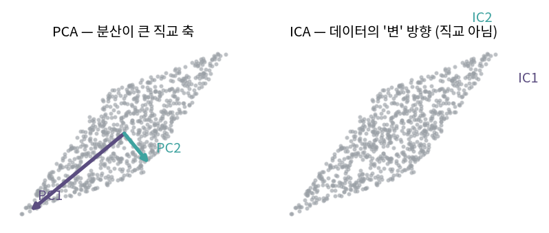

::: {.callout-note collapse="true"}
## 🎯 학습목표

- 론스키안으로 함수의 선형독립을 판정하고 그 한계를 알기
- ICA의 목적을 중심극한정리의 역발상으로 설명
- 백색화가 왜 ICA의 전처리인지 설명
- PCA와 ICA의 차이를 기준·기저·순서로 비교
- NMF가 왜 해석 가능한 표현을 주는지 말하기
:::

> 🤔 **출발 질문**
>
> 직교하는 축이 늘 최선인가? 섞인 신호를 원래대로 되돌릴 수 있는가?

------------------------------------------------------------------------

## 1. 론스키안과 함수의 선형독립 {#s1}

### 1) 함수도 벡터다 {#s1-1}

- 🔗[1장](01_vector.qmd) … 벡터공간의 규칙만 지키면 무엇이든 벡터
- 함수 $f_1,\dots,f_n$이 **선형독립**
  $$c_1f_1(x)+\cdots+c_nf_n(x) = 0 \;\;(\text{모든 } x) \quad\Longrightarrow\quad c_1=\cdots=c_n=0$$
- ⚠️ "모든 $x$에서"가 핵심 … 한 점에서 0인 것은 아무 의미 없음

### 2) 론스키안 {#s1-2}

- $f_i$가 $n-1$번까지 미분 가능할 때
  $$W(x) = \det\begin{bmatrix}
  f_1 & f_2 & \cdots & f_n \\
  f_1' & f_2' & \cdots & f_n' \\
  \vdots & & & \vdots \\
  f_1^{(n-1)} & f_2^{(n-1)} & \cdots & f_n^{(n-1)}
  \end{bmatrix}$$
- 판정
  - 어떤 $x$에서 $W(x) \neq 0$ ⟹ **선형독립**
  - ⚠️ $W \equiv 0$ ⟹ 종속일 수도, 아닐 수도

### 3) 왜 성립하는가 {#s1-3}

- 선형결합식을 $n-1$번 미분 ⟹ 방정식 $n$개
  $$\begin{bmatrix}f_1&\cdots&f_n\\ \vdots& &\vdots\\ f_1^{(n-1)}&\cdots&f_n^{(n-1)}\end{bmatrix}\begin{bmatrix}c_1\\\vdots\\c_n\end{bmatrix} = 0$$
- 종속이면 $c \neq 0$인 해가 존재 ⟹ 행렬이 특이 ⟹ $\det = 0$ (🔗[6장](06_determinant.qmd))
- 대우를 취하면 … $W \neq 0$ ⟹ 독립 ∎
- ⚠️ 역은 성립하지 않음
  - 반례 … $f_1 = x^2$, $f_2 = x\lvert x\rvert$
  - $W \equiv 0$이지만 두 함수는 선형독립

------------------------------------------------------------------------

## 2. 독립성분분석 (ICA) {#s2}

### 1) 문제 — 칵테일 파티 {#s2-1}

- 원본 신호 $s$ (서로 **통계적으로 독립**), 혼합 행렬 $A$
  $$x = As$$
- 관측된 것은 $x$뿐. $A$도 $s$도 모름
- 목표 … 분리 행렬 $W$를 찾아 $\hat{s} = Wx$가 원본이 되게
- ⚠️ 🔗[13장](13_pca.qmd) PCA는 무상관(uncorrelated)을 만들 뿐
  - 무상관 $\neq$ 독립. 2차 통계량만 보기 때문

### 2) 중심극한정리의 역발상 {#s2-2}

- CLT … 독립 변수를 여럿 더하면 **가우시안에 가까워짐**
- 뒤집어 읽으면 … 혼합물 $x$는 원본 $s$보다 **더 가우시안**
- ⟹ 전략: $w^\top x$가 **최대한 비가우시안**이 되는 $w$를 찾으면 그것이 원본 성분

> PCA는 "가장 많이 퍼진 방향"을 찾고, ICA는 "가장 가우시안답지 않은 방향"을 찾는다.

- 비가우시안성의 측도
  - **첨도**(kurtosis) … 계산은 쉽지만 이상치에 민감
  - **네겐트로피**(negentropy) … 이론적으로 좋지만 근사가 필요
  - FastICA는 네겐트로피의 근사를 씀

### 3) ＋ 백색화(whitening) {#s2-3}

- ICA 전에 데이터를 **무상관 + 단위분산**으로 만드는 전처리
- 공분산 $C = Q\Lambda Q^\top$ (🔗[12장](12_evd.qmd))일 때

| 방법 | 변환 | 특징 |
|---|---|---|
| PCA 백색화 | $\Lambda^{-1/2}Q^\top x$ | 축이 PC 방향으로 회전됨 |
| **ZCA 백색화** | $Q\Lambda^{-1/2}Q^\top x$ | 다시 되돌려 **원래 방향에 가장 가깝게** |

- 백색화 후에는 공분산이 $I$ ⟹ 어떤 **회전**을 해도 여전히 $I$
  - $Q^\top I Q = I$ (🔗[3장](03_inner_product.qmd))
- ⟹ **남은 자유도는 회전뿐** … ICA는 "올바른 회전 찾기" 문제로 축소됨
  - 이것이 ICA 알고리즘이 백색화를 표준 전처리로 쓰는 이유

### 4) 알고리즘과 모호성 {#s2-4}

- 대표적 방법 … Bell-Sejnowski(infomax), natural gradient, FastICA
- ⚠️ 원리적으로 **정할 수 없는 것 세 가지**

| 모호성 | 이유 |
|---|---|
| 성분의 **순서** | $A$의 열을 섞어도 같은 $x$ … PCA와 달리 "제1성분"이 없음 |
| **부호** | $s_i \to -s_i$, $a_i \to -a_i$로 상쇄 |
| **스케일** | $s_i \to 2s_i$, $a_i \to a_i/2$로 상쇄 |

- ⚠️ 원본이 **가우시안이면 분리 불가능**
  - 가우시안은 회전에 대해 불변 ⟹ 어떤 회전이 정답인지 구분할 정보가 없음

------------------------------------------------------------------------

## 3. PCA vs ICA {#s3}

| | PCA | ICA |
|---|---|---|
| 기준 | 분산 최대 | 통계적 독립 (비가우시안성 최대) |
| 사용하는 통계량 | 2차까지 (공분산) | **고차** (첨도·엔트로피) |
| 기저 | 항상 **직교** | 직교가 아닐 수 있음 |
| 성분의 순서 | 고유값 순으로 정해짐 | **정해지지 않음** |
| 유일성 | 부호만 불확정 | 순서·부호·스케일 불확정 |
| 가우시안 데이터 | 문제없음 | **불가능** |
| 목적 | 압축·차원축소 | 분리·근원 찾기 |

- ⟹ 둘 다 "데이터를 대표하는 기저를 찾는" 방법이지만 **기준이 다름**

{fig-align="center" width="88%"}


------------------------------------------------------------------------

## 4. NMF {#s4}

### 1) 정의 {#s4-1}

- 음수가 없는 $X \in \mathbb{R}_{\ge0}^{m\times n}$를
  $$X \approx WH, \qquad W \in \mathbb{R}_{\ge0}^{m\times k},\; H \in \mathbb{R}_{\ge0}^{k\times n}$$
- $k \ll \min(m,n)$ … 저랭크 근사 (🔗[15장](15_svd.qmd))
- 열로 읽으면
  $$x_j \approx \sum_{i=1}^{k} h_{ij}\,w_i$$
  - $W$의 열 $w_i$ … **기저 패턴**(부품)
  - $H$의 열 … 각 샘플이 그 부품들을 **얼마나 썼는가**

### 2) 왜 해석이 되는가 {#s4-2}

- 모든 값이 $\ge 0$ ⟹ **빼기가 없음**
- ⟹ "부분들을 더해서 전체를 만든다"는 구조가 강제됨

| | 부호 | 해석 |
|---|---|---|
| PCA·SVD | loading에 음수 허용 | "이 유전자를 빼고 저 유전자를 더한 축" … 실체를 상상하기 어려움 |
| NMF | 전부 $\ge 0$ | "이 유전자들이 같이 켜지는 프로그램" … 실체에 대응시키기 쉬움 |

- ⚠️ 대신 잃는 것
  - 직교성 없음 … 성분끼리 겹칠 수 있음
  - 순서 없음 … 🔗[15장](15_svd.qmd)처럼 "설명 분산 순"이 아님
  - 최적해 보장 없음 … 비볼록 문제

### 3) 곱셈 업데이트 규칙 {#s4-3}

$$W \leftarrow W \circ \frac{XH^\top}{WHH^\top}, \qquad H \leftarrow H \circ \frac{W^\top X}{W^\top WH}$$

- $\circ$와 분수는 **원소별** 연산 (🔗[2장](02_linear_transformation.qmd) 하다마드 곱)
- 왜 이 형태인가
  - 곱셈이므로 **음수가 절대 나오지 않음** … 제약을 자동으로 만족
  - 목적함수가 단조 감소함이 증명됨 (Lee & Seung)
- ⚠️ 국소 최소점으로 수렴 … 초기값에 따라 답이 달라짐
  - ⟹ 여러 번 돌려 안정적인 성분만 채택

::: {.callout-important}
## ⚠️ 흔한 오해

- **"무상관이면 독립이다"**
  - 가우시안일 때만 동치. 일반적으로 독립 ⟹ 무상관이고 역은 거짓
  - PCA와 ICA가 갈리는 지점이 정확히 여기
- **"ICA의 IC1이 가장 중요한 성분"**
  - ICA에는 순서가 없음. 출력 순서는 알고리즘의 사정일 뿐
- **"NMF의 $k$는 설명 분산으로 정한다"**
  - 직교하지 않으므로 분산이 깔끔하게 분해되지 않음
  - 재구성 오차·안정성(여러 실행 간 일치도)으로 판단
- **"$W \equiv 0$이면 함수들이 선형종속"**
  - 반례가 있음 (§1-3)
:::

::: {.callout-tip collapse="true"}
## 계산 확인

::: {.panel-tabset}
## R

```{r}
# 백색화 후에는 어떤 회전에도 공분산이 I
set.seed(1)
X  <- matrix(rnorm(500), 250) %*% matrix(c(2, 1, 0, 1), 2)
Xc <- scale(X, scale = FALSE)
C  <- cov(Xc)
e  <- eigen(C, symmetric = TRUE)

Z_pca <- Xc %*% e$vectors %*% diag(1 / sqrt(e$values))          # PCA 백색화
Z_zca <- Xc %*% e$vectors %*% diag(1 / sqrt(e$values)) %*% t(e$vectors)  # ZCA

round(cov(Z_pca), 10); round(cov(Z_zca), 10)                     # 둘 다 I

theta <- pi / 7
R <- matrix(c(cos(theta), sin(theta), -sin(theta), cos(theta)), 2)
round(cov(Z_zca %*% R), 10)                                      # 회전해도 I

# ZCA가 원래 방향에 더 가까움
c(PCA = norm(Z_pca - Xc, "F"), ZCA = norm(Z_zca - Xc, "F"))

# NMF — 곱셈 업데이트를 직접
nmf <- function(X, k, iter = 500) {
  W <- matrix(runif(nrow(X) * k), ncol = k)
  H <- matrix(runif(k * ncol(X)), nrow = k)
  for (i in seq_len(iter)) {
    W <- W * (X %*% t(H)) / (W %*% H %*% t(H) + 1e-10)
    H <- H * (t(W) %*% X) / (t(W) %*% W %*% H + 1e-10)
  }
  list(W = W, H = H)
}
V <- matrix(abs(rnorm(60)), 10)      # 10 x 6, 전부 양수
fit <- nmf(V, k = 2)
c(오차 = norm(V - fit$W %*% fit$H, "F"), 음수개수 = sum(fit$W < 0, fit$H < 0))
```

## Python

```{python}
import numpy as np
rng = np.random.default_rng(1)

X = rng.normal(size=(250,2)) @ np.array([[2.,0.],[1.,1.]])
Xc = X - X.mean(0)
C = np.cov(Xc.T)
w, Q = np.linalg.eigh(C)

Z_pca = Xc @ Q @ np.diag(1/np.sqrt(w))
Z_zca = Z_pca @ Q.T
np.round(np.cov(Z_zca.T), 10)

th = np.pi/7
R = np.array([[np.cos(th), -np.sin(th)],[np.sin(th), np.cos(th)]])
np.round(np.cov((Z_zca @ R).T), 10)        # 회전 불변

from sklearn.decomposition import NMF, FastICA
V = np.abs(rng.normal(size=(10,6)))
m = NMF(n_components=2, init='nndsvd', max_iter=1000).fit(V)
(m.transform(V) >= 0).all(), (m.components_ >= 0).all()
```
:::
:::

------------------------------------------------------------------------

::: {.callout-important collapse="true"}
## 🧬 생물정보학에서는

### NMF — 음수가 없다는 사실이 곧 제약

| 응용 | $X$ | $W$의 열 | $H$ |
|---|---|---|---|
| **Mutational signature** | 변이 유형(96) × 환자 | 돌연변이 서명 (COSMIC) | 환자별 기여도 |
| **Deconvolution** | 유전자 × bulk 샘플 | 세포 유형별 발현 프로파일 | 세포 조성 비율 |
| **발현 프로그램** | 유전자 × 세포 | 함께 켜지는 유전자 집합 | 세포별 활성도 |

- count 데이터가 음수가 아니라는 **사실 자체가 모형의 제약**이 됨
  - 조성 비율은 음수일 수 없음 · 돌연변이 개수도 음수일 수 없음
- ⟹ PCA보다 해석이 자연스러운 이유

### CCA와 일반화 SVD — 두 데이터셋의 공통 축

- 문제 … 같은 샘플을 두 가지로 측정 (RNA와 ATAC, 두 배치의 scRNA)
- **CCA**(정준상관분석) … 두 데이터셋에서 상관이 최대가 되는 방향 쌍을 찾음
  $$\max_{a,b}\;\text{corr}(X a,\; Y b)$$
  - 해는 $X^\top Y$를 SVD한 것에서 나옴 (🔗[15장](15_svd.qmd))
  - PCA가 한 행렬의 구조를 찾는다면, CCA는 **두 행렬의 공유 구조**를 찾음
- Seurat의 데이터셋 통합 … CCA로 공통 공간을 만든 뒤 상호 최근접 이웃을 anchor로 사용
- ⚠️ 공통 축을 찾는 방법이므로 **없는 공통점을 만들어낼 수도 있음**
  - 서로 다른 조직을 억지로 정렬하면 생물학적 차이가 지워짐
  - 통합 전후의 군집 구조를 반드시 비교할 것 (🔗[4장](04_subspaces.qmd) 배치 보정과 같은 위험)
:::

------------------------------------------------------------------------

## ✅ 정리와 연습 {#s5}

### 한 줄 요약 {#s5-1}

> PCA는 분산을, ICA는 비가우시안성을, NMF는 비음수성을 기준으로 기저를 고른다.
> 무엇을 기준으로 삼느냐가 무엇이 보이는지를 결정한다.

### 체크리스트 {#s5-2}

- [ ] 론스키안 판정의 방향과 한계를 말할 수 있다
- [ ] CLT의 역발상을 설명할 수 있다
- [ ] 백색화 후 남는 자유도가 회전뿐인 이유를 말할 수 있다
- [ ] NMF가 해석 가능한 이유를 부호로 설명할 수 있다

### 연습문제 {#s5-3}

1. $f_1=e^x$, $f_2=e^{2x}$의 론스키안을 구하고 선형독립임을 보여라.
2. $f_1=x^2$, $f_2=x\lvert x\rvert$의 론스키안이 항등적으로 0임을 보이고, 그럼에도 선형독립인 이유를 설명하라.
3. 두 독립 균등분포 난수의 합이 원래보다 가우시안에 가까워짐을 히스토그램으로 확인하라.
4. 백색화된 데이터에 임의의 회전을 적용해도 공분산이 $I$임을 식으로 보여라.
5. NMF의 곱셈 업데이트가 비음수성을 자동으로 유지하는 이유를 설명하라.
6. **생각해 볼 것.** 어떤 데이터에서 PCA의 PC1과 ICA의 성분 하나가 거의 같았다.
   - 무엇을 뜻하는가?
   - 두 결과가 크게 다르다면 그것은 또 무엇을 뜻하는가?

------------------------------------------------------------------------

## 🔗 다음 장

- [17. 선형대수와 미분](17_matrix_calculus.qmd)
  - 이 장까지 … 행렬을 **분해**하는 이야기
  - 다음 장 … 곡선을 다루는 미분과 직선만 다루는 선형대수가 만나는 자리

::: {.callout-note collapse="true"}
## 참고 자료

- [NMF (non-negative matrix factorization)](https://angeloyeo.github.io/2020/10/15/NMF.html) — 공돌이의 수학정리노트
:::
