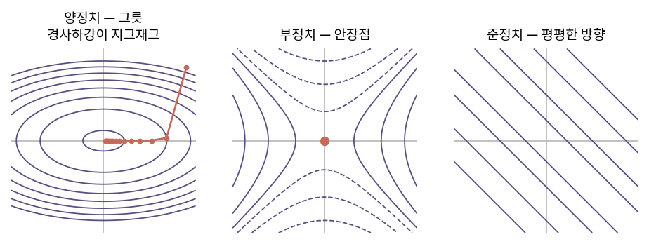

::: {.callout-note collapse="true"}
## 🎯 학습목표

- 자코비안을 국소적 선형근사로 설명
- 다변수 연쇄법칙을 행렬곱으로 쓰기
- 자코비안 행렬식을 부피 배율로 해석
- 헤시안으로 극값을 판정
- 기본 행렬미분 공식으로 정규방정식을 유도
:::

> 🤔 **출발 질문**
>
> 곡선을 다루는 미분과 직선만 다루는 선형대수는 어디서 만나는가?

------------------------------------------------------------------------

## 1. 자코비안 행렬 {#s1}

### 1) 정의 {#s1-1}

- 벡터함수 $f:\mathbb{R}^n \to \mathbb{R}^m$의 일차 편미분을 모은 행렬
  $$J_{ij} = \frac{\partial f_i}{\partial x_j}, \qquad J \in \mathbb{R}^{m\times n}$$
- 행 = 출력 성분, 열 = 입력 변수
- $m=1$이면 한 행 … **그래디언트의 전치**

### 2) 국소적 선형근사 {#s1-2}

$$f(x+h) \approx f(x) + Jh$$

- 1변수의 $f(x+h)\approx f(x)+f'(x)h$를 그대로 일반화
- ⟹ **미분한다는 것은 국소적으로 선형변환으로 갈아타는 일** (🔗[2장](02_linear_transformation.qmd))
- 곡선을 다루는 미분이 선형대수와 만나는 지점이 여기

### 3) 연쇄법칙 = 행렬곱 {#s1-3}

$$J_{g \circ f}(x) = J_g(f(x))\,J_f(x)$$

- 합성함수의 미분이 **자코비안의 곱**
- 🔗[2장](02_linear_transformation.qmd)에서 본 "행렬곱 = 변환의 합성"이 미분에서도 그대로
- ⚠️ 곱셈 순서가 중요 … 오른쪽부터 적용
- 딥러닝의 역전파가 이 곱을 뒤에서부터 계산하는 것

### 4) 자코비안 행렬식 = 부피 배율 {#s1-4}

- $m=n$일 때 $\det J$는 **국소적 부피 배율** (🔗[6장](06_determinant.qmd))
- 쓰이는 곳

| 상황 | 역할 |
|---|---|
| 변수변환 적분 | $dV' = \lvert\det J\rvert\, dV$ … 극좌표의 $r$이 그 예 |
| 확률밀도 변환 | $p_Y(y) = p_X(x)\,\lvert\det J\rvert^{-1}$ |
| $\det J = 0$인 점 | 국소적으로 차원이 무너짐 … 특이점 |

- 🔗[16장](16_ica_nmf.qmd) ICA에서 확률밀도가 선형변환에 어떻게 반응하는지가 이 식

------------------------------------------------------------------------

## 2. 헤시안 행렬 {#s2}

### 1) 정의 {#s2-1}

- 스칼라함수 $f:\mathbb{R}^n\to\mathbb{R}$의 이차 편미분
  $$H_{ij} = \frac{\partial^2 f}{\partial x_i \partial x_j}$$
- $f$가 충분히 매끄러우면 편미분 순서를 바꿔도 같음 ⟹ $H$는 **대칭**
- ⟹ 🔗[12장](12_evd.qmd) 스펙트럼 정리를 그대로 적용 가능
  - 실수 고유값, 직교 고유벡터

### 2) 이차 테일러 전개 {#s2-2}

$$f(x+h) \approx f(x) + g^\top h + \tfrac{1}{2}h^\top H h \qquad (g = \nabla f)$$

- 마지막 항이 **이차형식** (🔗[12장](12_evd.qmd))
- ⟹ 임계점($g=0$) 근처에서 함수의 모양은 $H$의 고유값이 결정

### 3) 극값 판정 {#s2-3}

- 🔗[12장](12_evd.qmd)의 이차형식 분류표가 그대로 극값 판정표가 됨

| $H$의 고유값 | $H$ | 등고선 | 임계점 |
|---|---|---|---|
| 모두 $>0$ | 양정치 | 타원 (그릇) | **최솟값** |
| 모두 $<0$ | 음정치 | 뒤집힌 그릇 | **최댓값** |
| 양수·음수가 함께 있음 (0 포함 여부와 무관) | 부정치 | 양·음의 곡률 방향 | **안장점** |
| 모두 $\ge 0$ 또는 모두 $\le 0$이면서 0 포함 | 준정치 (영행렬 포함) | 이차항이 0인 방향 | 이차 미분만으로 판정 불가 |

- 고유벡터 = 곡률의 주축, 고유값 = 그 방향의 곡률
- 조건수가 크면 … 한 방향은 가파르고 다른 방향은 평평한 **길쭉한 골짜기**
  - 경사하강법이 지그재그로 느리게 내려가는 이유 (🔗[9장](09_least_squares.qmd))

{fig-align="center" width="100%"}


### 4) 뉴턴법 {#s2-4}

$$x \leftarrow x - H^{-1}g$$

- 이차 근사의 최솟값으로 한 번에 점프
- 경사하강법보다 훨씬 빠르지만 $H$와 그 역행렬이 비쌈
  - 실무에서는 근사 헤시안(BFGS 등) 또는 🔗[8장](08_lu_cholesky.qmd) 숄레스키로 푸는 방식
- ⚠️ $H$가 양정치가 아니면 최솟값이 아니라 안장점으로 갈 수 있음

------------------------------------------------------------------------

## 3. ＋ 행렬미분 최소 공식집 {#s3}

### 1) 공식 {#s3-1}

- 분모 레이아웃(결과가 $x$와 같은 모양) 기준

| $f(x)$ | $\partial f/\partial x$ | 1변수 대응 |
|---|---|---|
| $a^\top x$ | $a$ | $(ax)' = a$ |
| $x^\top A x$ | $(A+A^\top)x$ … $A$ 대칭이면 $2Ax$ | $(ax^2)' = 2ax$ |
| $\lVert x\rVert^2 = x^\top x$ | $2x$ | |
| $\lVert Ax-b\rVert^2$ | $2A^\top(Ax-b)$ | |
| $\text{tr}(AX)$ | $A^\top$ | |
| $\log\det X$ | $X^{-\top}$ | |

- ⚠️ 레이아웃 규약이 문헌마다 다름 … 결과의 **모양**으로 검산할 것

### 2) 유도 ① 정규방정식 {#s3-2}

- 🔗[9장](09_least_squares.qmd)의 비용함수
  $$J(x) = \lVert Ax-b\rVert^2$$
- 미분해서 0
  $$\frac{\partial J}{\partial x} = 2A^\top(Ax-b) = 0 \quad\Longrightarrow\quad A^\top A x = A^\top b$$
- ⟹ 직교성으로 얻었던 식을 **미분으로도** 얻음
  - 같은 결론에 이르는 두 경로 … 기하와 해석

### 3) 유도 ② PCA의 라그랑주 조건 {#s3-3}

- 🔗[13장](13_pca.qmd)에서 쓴 것
  $$L = e^\top Ce - \lambda(e^\top e - 1)$$
  $$\frac{\partial L}{\partial e} = 2Ce - 2\lambda e = 0 \quad\Longrightarrow\quad Ce = \lambda e$$
- 표의 2행과 3행만 쓰면 끝

::: {.callout-tip collapse="true"}
## 계산 확인

::: {.panel-tabset}
## R

```{r}
# 수치 자코비안으로 공식 검산
f <- function(x) c(x[1]^2 + x[2], sin(x[1]) * x[2])
num_jac <- function(f, x, h = 1e-6) {
  sapply(seq_along(x), function(j) {
    e <- numeric(length(x)); e[j] <- h
    (f(x + e) - f(x - e)) / (2 * h)
  })
}
x0 <- c(1, 2)
num_jac(f, x0)
matrix(c(2 * x0[1], cos(x0[1]) * x0[2], 1, sin(x0[1])), 2)   # 해석적

# 헤시안 고유값으로 임계점 판정 — 안장점
g  <- function(x) x[1]^2 - x[2]^2
Hg <- matrix(c(2, 0, 0, -2), 2)
eigen(Hg)$values                    # 부호 섞임 → 안장점

# ∂‖Ax-b‖²/∂x = 2Aᵀ(Ax-b) 검산
set.seed(1)
A <- matrix(rnorm(12), 4); b <- rnorm(4); x <- rnorm(3)
grad_num <- num_jac(function(z) sum((A %*% z - b)^2), x)
rbind(수치 = as.vector(grad_num), 공식 = as.vector(2 * t(A) %*% (A %*% x - b)))
```

## Python

```{python}
import numpy as np
rng = np.random.default_rng(1)

def num_jac(f, x, h=1e-6):
    x = np.asarray(x, float)
    return np.column_stack([(f(x + h*np.eye(len(x))[j]) -
                             f(x - h*np.eye(len(x))[j])) / (2*h)
                            for j in range(len(x))])

f = lambda x: np.array([x[0]**2 + x[1], np.sin(x[0])*x[1]])
x0 = np.array([1., 2.])
num_jac(f, x0)

A = rng.normal(size=(4,3)); b = rng.normal(size=4); x = rng.normal(size=3)
g_num = num_jac(lambda z: np.array([((A@z-b)**2).sum()]), x).ravel()
np.allclose(g_num, 2*A.T@(A@x-b))
```
:::
:::

::: {.callout-important}
## ⚠️ 흔한 오해

- **"자코비안은 정사각행렬"**
  - $m\times n$ 직사각이 일반. $\det J$는 $m=n$일 때만 정의됨
- **"헤시안이 0이면 극값이 아니다"**
  - 준정치면 **판정 불가**. 더 높은 차수를 봐야 함
- **"$\partial(x^\top Ax)/\partial x = Ax$"**
  - $A$가 대칭일 때 $2Ax$. 대칭이 아니면 $(A+A^\top)x$
- **"뉴턴법이 항상 낫다"**
  - $H$가 양정치가 아니면 엉뚱한 방향으로 감. 차원이 크면 계산도 불가
:::

------------------------------------------------------------------------

## ✅ 정리와 연습 {#s4}

### 한 줄 요약 {#s4-1}

> 미분은 국소적으로 선형변환을 찾는 일이고, 그 행렬이 자코비안이다.
> 한 번 더 미분하면 이차형식이 나오고, 그 행렬인 헤시안의 고유값이 임계점의 모양을 결정한다.

### 체크리스트 {#s4-2}

- [ ] 자코비안의 크기를 입력·출력 차원으로 말할 수 있다
- [ ] 연쇄법칙을 행렬곱으로 쓸 수 있다
- [ ] 헤시안 고유값으로 극값을 판정할 수 있다
- [ ] 정규방정식을 미분으로 유도할 수 있다

### 연습문제 {#s4-3}

1. $f(x,y)=(x^2y,\; x+y^3)$의 자코비안을 구하고 $(1,2)$에서 계산하라.
2. 극좌표 변환 $(r,\theta)\mapsto(r\cos\theta,\;r\sin\theta)$의 자코비안 행렬식을 구하라. 왜 $r$이 나오는가?
3. $f(x,y)=x^2+4y^2$의 헤시안을 구하고 원점이 어떤 임계점인지 판정하라.
4. $f(x,y)=x^2-y^2$에 대해 같은 것을 하라.
5. $\partial\lVert Ax-b\rVert^2/\partial x$를 전개해서 유도하라.
6. **생각해 볼 것.** 헤시안의 고유값이 $(100, 0.01)$이다.
   - 등고선은 어떤 모양인가?
   - 경사하강법은 어떻게 움직이는가? 조건수와 연결해 설명하라 → 🔗[6장](06_determinant.qmd)

------------------------------------------------------------------------

## 🔗 다음 장

- [18. 선형대수와 신호](18_fourier.qmd)
  - 이 장 … 미분이 선형대수를 만나는 자리
  - 다음 장 … 신호처리가 선형대수를 만나는 자리

::: {.callout-note collapse="true"}
## 참고 자료

- [자코비안 행렬의 의미](https://angeloyeo.github.io/2020/07/24/Jacobian.html) — 공돌이의 수학정리노트
- [헤시안 행렬의 의미](https://angeloyeo.github.io/2020/06/17/Hessian.html) — 공돌이의 수학정리노트
:::
