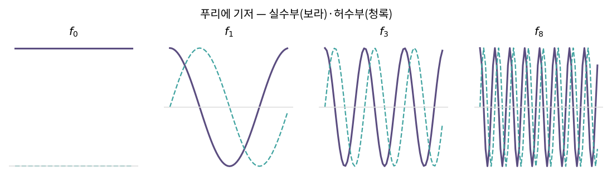
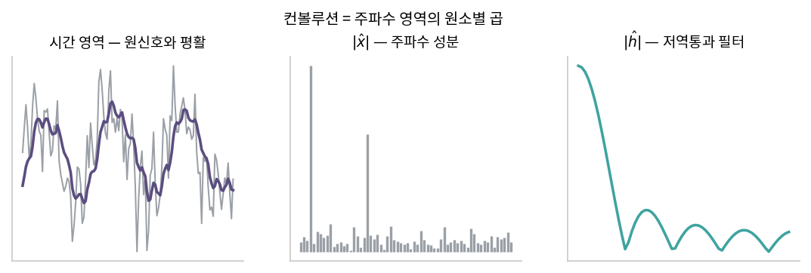

::: {.callout-note collapse="true"}
## 🎯 학습목표

- 푸리에 변환을 기저 변환으로 설명
- DFT 행렬이 직교(유니터리)임을 확인
- 컨볼루션을 행렬곱으로 쓰기
- 순환행렬의 고유벡터가 왜 푸리에 기저인지 말하기
- 컨볼루션 정리를 대각화로 설명
:::

> 🤔 **출발 질문**
>
> 신호를 주파수로 분해한다는 말은, 선형대수의 언어로 무엇인가?

------------------------------------------------------------------------

## 1. 푸리에 변환은 기저 변환이다 {#s1}

### 1) 신호는 벡터 {#s1-1}

- 길이 $N$의 샘플된 신호 $x = (x_0, x_1, \dots, x_{N-1})$
  - ⟹ $\mathbb{C}^N$의 벡터 하나 (🔗[1장](01_vector.qmd))
- 표준기저 … $e_k$ = "$k$번째 시점에만 1"
  - 우리가 늘 쓰는 시간 영역 표현이 곧 **표준기저에 대한 좌표** (🔗[5장](05_change_of_basis.qmd))

### 2) 푸리에 기저 {#s1-2}

- $\omega = e^{2\pi i/N}$ (1의 $N$제곱근)
- $k$번째 푸리에 기저벡터
  $$f_k = \frac{1}{\sqrt{N}}\bigl(1,\; \omega^{k},\; \omega^{2k},\; \dots,\; \omega^{(N-1)k}\bigr)^\top$$
  - $k$번 진동하는 복소 정현파
- **서로 직교** … $f_j^* f_k = \delta_{jk}$ (등비급수의 합으로 확인)
- ⟹ 푸리에 기저는 $\mathbb{C}^N$의 **정규직교기저** (🔗[3장](03_inner_product.qmd))

### 3) DFT = 좌표 계산 {#s1-3}

- DFT 행렬 $F$ … 행이 $f_k^*$
  $$X = Fx, \qquad x = F^*X$$
- $F^*F = I$ … **유니터리**(복소판 직교행렬)
- ⟹ 푸리에 계수 $X_k$는 **기저와의 내적**일 뿐 (🔗[14장](14_qr.qmd) §1)
  $$X_k = f_k^* x$$
- 파세발 정리 $\lVert x\rVert = \lVert X\rVert$ … 유니터리가 길이를 보존하기 때문 (🔗[3장](03_inner_product.qmd))

{fig-align="center" width="100%"}


> 푸리에 변환은 신기한 적분이 아니라, 좌표계를 시간축에서 주파수축으로 바꾸는 일이다.

------------------------------------------------------------------------

## 2. 컨볼루션과 순환행렬 {#s2}

### 1) 컨볼루션을 행렬곱으로 {#s2-1}

- 순환 컨볼루션
  $$(h * x)_n = \sum_{m=0}^{N-1} h_m\, x_{n-m \bmod N}$$
- 이것을 $Cx$ 형태로 쓰면 $C$는 **순환행렬**(circulant matrix)
  - 각 행이 이전 행을 한 칸씩 오른쪽으로 민 모양
  $$C = \begin{bmatrix} h_0 & h_{N-1} & \cdots & h_1 \\ h_1 & h_0 & \cdots & h_2 \\ \vdots & & \ddots & \vdots \\ h_{N-1} & h_{N-2} & \cdots & h_0 \end{bmatrix}$$
- ⟹ **필터링 = 행렬 곱** (🔗[2장](02_linear_transformation.qmd))

### 2) 치환행렬의 다항식 {#s2-2}

- 한 칸 미는 연산 = 치환행렬 $P$ (🔗[7장](07_gauss_elimination.qmd))
- 모든 순환행렬은
  $$C = h_0 I + h_1 P + h_2 P^2 + \cdots + h_{N-1}P^{N-1}$$
- ⟹ 순환행렬은 **$P$의 다항식**
  - 다항식이므로 $P$와 **고유벡터를 공유** (🔗[11장](11_eigen.qmd) $A^k$의 고유벡터는 $A$와 같음)

------------------------------------------------------------------------

## 3. 순환행렬의 고유벡터는 푸리에 기저 {#s3}

### 1) $P$의 고유벡터 {#s3-1}

- $f_k$에 $P$를 적용하면 성분이 한 칸 밀림
  $$P f_k = \omega^{-k} f_k$$
- ⟹ **푸리에 기저벡터가 곧 $P$의 고유벡터**, 고유값은 $\omega^{-k}$

### 2) 따라서 모든 순환행렬이 {#s3-2}

- $C = \sum_j h_j P^j$이므로 같은 고유벡터를 가지고
  $$C f_k = \Bigl(\sum_j h_j \omega^{-jk}\Bigr) f_k$$
- 이 장의 유니터리 DFT 규약 $\hat{h}=Fh$에서는 괄호 안이 $\sqrt{N}\,\hat{h}_k$
  - 고유값 $\lambda_k = \sum_j h_j\omega^{-jk} = \sqrt{N}\,\hat{h}_k$
- ⟹ 대각화 (🔗[12장](12_evd.qmd))
  $$\boxed{C = F^*\,\text{diag}(\sqrt{N}\,\hat{h})\,F}$$

| 인자 | 하는 일 |
|---|---|
| $F$ | 주파수 영역으로 회전 |
| $\text{diag}(\sqrt{N}\,\hat{h})$ | 각 주파수를 $\sqrt{N}\,\hat{h}_k$배 |
| $F^*$ | 시간 영역으로 되돌림 |

- ⟹ 🔗[12장](12_evd.qmd)의 "돌리고 · 늘이고 · 되돌리기"가 여기서도 그대로
  - 다만 **모든 순환행렬이 같은 $F$를 공유**한다는 점이 특별

### 3) 컨볼루션 정리 {#s3-3}

$$h * x = C x = F^*\,\text{diag}(\sqrt{N}\,\hat{h})\,Fx \quad\Longrightarrow\quad \widehat{h*x} = \sqrt{N}\,(\hat{h}\circ\hat{x})$$

- **시간 영역의 컨볼루션 = 주파수 영역의 원소별 곱 × $\sqrt{N}$** (유니터리 DFT 규약, 🔗[2장](02_linear_transformation.qmd) 하다마드 곱)
- 아래 코드의 R `fft()`와 NumPy 기본 `fft()`는 순변환에 $1/\sqrt{N}$을 곱하지 않음
  - 그 규약에서는 고유값이 `fft(h)`이고, 컨볼루션 정리에 별도의 $\sqrt{N}$ 계수가 없음
- 이것이 그 유명한 정리의 선형대수적 정체 … **컨볼루션 연산자를 대각화한 것**

{fig-align="center" width="100%"}


### 4) 왜 실용적인가 {#s3-4}

| 방식 | 계산량 |
|---|---|
| 직접 컨볼루션 | $O(N^2)$ |
| FFT → 곱 → 역FFT | $O(N\log N)$ |

- FFT는 $F$를 곱하는 빠른 방법일 뿐 … 구조는 위 식 그대로
- 필터 설계 = $\hat{h}$를 원하는 대로 정하는 일
  - 저역통과 = 높은 $k$의 $\hat{h}_k$를 0으로

::: {.callout-tip collapse="true"}
## 계산 확인

::: {.panel-tabset}
## R

```{r}
N <- 8
h <- c(1, 2, 0, 0, 0, 0, 0, 3)          # 필터
x <- rnorm(N)

# 순환행렬 만들기
C <- sapply(0:(N-1), function(j) h[((0:(N-1)) - j) %% N + 1])

# ① 행렬곱으로 컨볼루션
y1 <- C %*% x

# ② 푸리에로 (컨볼루션 정리)
y2 <- Re(fft(fft(x) * fft(h), inverse = TRUE) / N)

max(abs(y1 - y2))

# 순환행렬의 고유값 = 필터의 DFT
c(고유값 = sort(Mod(eigen(C)$values)),
  DFT   = sort(Mod(fft(h))))

# DFT 행렬은 유니터리
w <- exp(2i * pi / N)
F <- outer(0:(N-1), 0:(N-1), function(j, k) w^(-j * k)) / sqrt(N)
max(abs(Conj(t(F)) %*% F - diag(N)))
```

## Python

```{python}
import numpy as np
from scipy.linalg import circulant

N = 8
rng = np.random.default_rng(1)
h = np.array([1., 2, 0, 0, 0, 0, 0, 3])
x = rng.normal(size=N)

C = circulant(h)
y1 = C @ x
y2 = np.fft.ifft(np.fft.fft(x) * np.fft.fft(h)).real
np.allclose(y1, y2)

np.allclose(np.sort(np.abs(np.linalg.eigvals(C))),
            np.sort(np.abs(np.fft.fft(h))))

w = np.exp(2j*np.pi/N)
F = w**(-np.outer(np.arange(N), np.arange(N))) / np.sqrt(N)
np.allclose(F.conj().T @ F, np.eye(N))
```
:::
:::

::: {.callout-important}
## ⚠️ 흔한 오해

- **"푸리에 변환은 적분이라 선형대수와 무관"**
  - 이산 신호에서는 순수한 기저 변환. 연속에서도 무한차원 벡터공간의 같은 이야기
- **"FFT는 다른 변환"**
  - 같은 DFT를 빠르게 계산하는 **알고리즘**일 뿐
- **"컨볼루션은 항상 주파수 곱으로 바꿀 수 있다"**
  - **순환** 컨볼루션일 때. 선형 컨볼루션은 0을 덧대어(zero padding) 순환으로 만든 뒤 적용
- **"순환행렬은 특수한 예외"**
  - 시간 불변(shift-invariant) 선형 시스템은 전부 순환행렬 … 필터·CNN의 합성곱층이 모두 이 구조
:::

------------------------------------------------------------------------

::: {.callout-important collapse="true"}
## 🧬 생물정보학에서는 — 게놈도 신호다

- 좌표축이 유전체 위치인 데이터는 전부 신호
  - ChIP-seq·ATAC-seq 커버리지 트랙
  - 복제수(CNV) 프로파일
  - 공간전사체의 조직 절편 이미지

- 쓰이는 자리

| 작업 | 선형대수로는 |
|---|---|
| 커버리지 스무딩 | 저역통과 필터 = $\hat{h}$의 고주파를 0으로 |
| 피크 검출 전처리 | 밴드패스 필터 |
| 이미지 블러·에지 | 2D 컨볼루션 (순환행렬의 2차원판) |
| CNN의 합성곱층 | 학습되는 $h$를 가진 순환행렬 |
| 주기성 탐지 | 뉴클레오솜 ~147 bp, 코돈 3 bp 주기 |

- ⚠️ 유전체 신호는 **주기적이지 않음**
  - 순환 컨볼루션은 끝과 시작을 이어 붙임 ⟹ 염색체 양 끝이 섞임
  - ⟹ 0을 덧대거나(zero padding) 반사 경계(reflect)를 써야 함
- ⚠️ 커버리지는 균등 간격 샘플이 아님 (매핑 편향·GC 편향)
  - 스무딩 전에 정규화가 필요
:::

------------------------------------------------------------------------

## ✅ 정리와 연습 {#s4}

### 한 줄 요약 {#s4-1}

> 푸리에 변환은 시간축 좌표를 주파수축 좌표로 바꾸는 기저 변환이다.
> 모든 순환행렬은 그 푸리에 기저로 동시에 대각화되고,
> 그래서 컨볼루션은 주파수 영역에서 원소별 곱이 된다.

### 체크리스트 {#s4-2}

- [ ] 푸리에 계수를 내적으로 쓸 수 있다
- [ ] 컨볼루션을 순환행렬 곱으로 쓸 수 있다
- [ ] 순환행렬이 $P$의 다항식임을 보일 수 있다
- [ ] 컨볼루션 정리를 대각화로 설명할 수 있다

### 연습문제 {#s4-3}

1. $N=4$일 때 $\omega=i$임을 확인하고 $f_0,\dots,f_3$을 적으라.
2. $f_1^*f_2 = 0$을 직접 계산해 직교성을 확인하라.
3. $h=(1,1,0,0)/2$인 이동평균 필터의 순환행렬을 쓰고 고유값을 구하라. 어떤 주파수가 억제되는가?
4. $P$가 치환행렬일 때 $P^N = I$임을 보이고, 고유값이 1의 $N$제곱근임을 설명하라.
5. 직접 컨볼루션과 FFT 방식의 계산량을 $N=10^6$에서 비교하라.
6. **생각해 볼 것.** 길이 $10^8$인 염색체 커버리지를 1 kb 창으로 스무딩하려 한다.
   - 순환 컨볼루션을 그대로 쓰면 어디가 잘못되는가?
   - 어떻게 처리하겠는가?

------------------------------------------------------------------------

## 🔗 부록으로

- [A. 수치선형대수 노트](../appendix/a_numerical.qmd) — 본문에서 "자세히는 부록 A"로 미뤄둔 것들
- [B. 아핀 변환과 동차좌표](../appendix/b_affine.qmd)
- [C. R / Python 치트시트](../appendix/c_cheatsheet.qmd)

::: {.callout-note collapse="true"}
## 참고 자료

- [선형대수와 푸리에 변환](https://angeloyeo.github.io/2020/11/08/linear_algebra_and_Fourier_transform.html) — 공돌이의 수학정리노트
- [순환행렬과 컨볼루션](https://angeloyeo.github.io/2020/11/25/permutation_and_circulant_matrix.html) — 공돌이의 수학정리노트
- [순환행렬의 고유벡터, 그리고 푸리에 행렬](https://angeloyeo.github.io/2020/11/26/circulant_matrix_eigen_fourier.html) — 공돌이의 수학정리노트
:::
